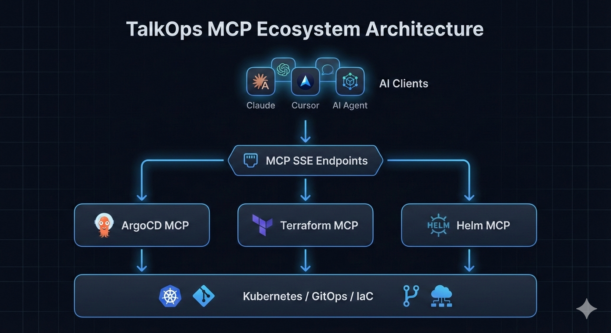

# TalkOps MCP Ecosystem

Model Context Protocol (MCP) Servers for AI-Driven DevOps

TalkOps MCP is a modular ecosystem of production-ready MCP servers that allow AI agents (Claude, Cursor, internal copilots) to securely interact with:

- Kubernetes via Helm
- GitOps via ArgoCD
- Infrastructure via Terraform
- Centralized Agent Registry

Each module runs independently and communicates via SSE (Server-Sent Events) following the Model Context Protocol specification.

## Architecture Overview
> ⚠️ This is a simplified logical architecture. Actual execution includes deterministic HITL gates and safe tool boundaries.



All services can run:

- Locally (development)
- In Docker
- In production environments
- Behind reverse proxies

## Choose Your Setup Path
| Use Case                   | Recommended Setup           |
| -------------------------- |-----------------------------|
| 🧪 Quick local testing     | Docker (pre-built images)   |
| 👩‍💻 Active development   | `uv` local environment      |
| 🏢 Production deployment   | Docker + managed DB + TLS   |
| 🤖 Claude Desktop / Cursor | SSE endpoints configuration |

## Global Prerequisites
For local development across all modules:

| Tool            | Version            |
| --------------- | ------------------ |
| Python          | 3.12+              |
| Package Manager | `uv` (recommended) |
| Docker          | Latest stable      |

Install uv:

```bash

curl -LsSf https://astral.sh/uv/install.sh | sh
```

## Security First
Before running any server in production, review:

- Never commit .env files 
- Mount SSH keys as read-only 
- Avoid ARGOCD_INSECURE=true in production 
- Do NOT expose Neo4j publicly 
- Restrict MCP ports via firewall 
- Use MCP_ALLOW_WRITE=false unless required 
- Store API keys in a secrets manager 

⚠️Enabling write access allows mutating infrastructure operations.

## Module 1: ArgoCD MCP Server
**Location**: src/argocd-mcp-server
**Default Port**: 8765

### 1️⃣ Authentication Setup
Generate an authentication token:

```bash

cd talkops-mcp/src/argocd-mcp-server/scripts

export ARGOCD_SERVER="https://localhost:8080"
export ARGOCD_USERNAME="admin"
export ARGOCD_PASSWORD="your-password"
export ARGOCD_VERIFY_TLS="false"

python fetch_argocd_token.py
```

### 2️⃣ Run via Docker (Recommended)
#### Read-Only Mode (Safe Default)
```bash

docker run --rm -it \
-p 8765:8765 \
-v ~/.ssh/id_ed25519:/app/.ssh/id_rsa:ro \
-e ARGOCD_SERVER_URL="https://argocd.example.com" \
-e SSH_PRIVATE_KEY_PATH=/app/.ssh/id_rsa \
-e ARGOCD_AUTH_TOKEN="your-token" \
sandeep2014/talkops-mcp:argocd-mcp-server-latest
```

#### Write Access Enabled
```bash

docker run --rm -it \
-p 8765:8765 \
-v ~/.ssh/id_ed25519:/app/.ssh/id_rsa:ro \
-e ARGOCD_SERVER_URL="https://host.docker.internal:8080" \
-e ARGOCD_AUTH_TOKEN="your-token" \
-e MCP_ALLOW_WRITE=true \
sandeep2014/talkops-mcp:argocd-mcp-server-latest
```

### 3️⃣ Local Development
```bash

cd talkops-mcp/src/argocd-mcp-server
uv venv --python=3.12
source .venv/bin/activate
uv pip install -e .
uv run argocd-mcp-server`
```

[Learn More](src/argocd-mcp-server/README.md)

## Module 2: Terraform MCP Server
**Location**: src/terraform-mcp-server
**Default Port**: 8000
**Requires**: Neo4j (v4.4+)

### 1️⃣ Neo4j Setup
```bash

docker run \
--publish=7474:7474 --publish=7687:7687 \
--volume=$HOME/neo4j_data:/data \
--env NEO4J_AUTH=neo4j/your-password \
--env NEO4J_PLUGINS='["apoc"]' \
neo4j
```

### 2️⃣ Create .env
```env

NEO4J_URI=bolt://localhost:7687
NEO4J_USERNAME=neo4j
NEO4J_PASSWORD=your-password

OPENAI_API_KEY=sk-...

HOST=0.0.0.0
PORT=8000
LOG_LEVEL=INFO
```

### 3️⃣ Run Locally
```bash

cd talkops-mcp/src/terraform-mcp-server
uv venv --python=3.12
source .venv/bin/activate
uv pip install -e .
uv run terraform_mcp_server
```

Runs via SSE on port 8000.

[Learn more](src/terraform-mcp-server/README.md)

## Module 3: Helm MCP Server
**Location**: src/helm-mcp-server
**Default Port**: 8765

### Run via Docker
```bash

docker run --rm -it \
-p 9000:9000 \
-v ~/.kube/config:/app/.kube/config:ro \
-e MCP_PORT=9000 \
-e MCP_ALLOW_WRITE=false \
sandeep2014/talkops-mcp:helm-mcp-server-latest
```

### Local Development
```bash

cd talkops-mcp/src/helm-mcp-server
uv venv --python=3.12
source .venv/bin/activate
uv pip install -e .
helm-mcp-server
```

### Write Access Control
| MCP_ALLOW_WRITE | Permissions                           |
| --------------- | ------------------------------------- |
| `false`         | Read-only (recommended)               |
| `true`          | Install, Upgrade, Rollback, Uninstall |

[Learn more](src/helm-mcp-server/README.md)

## Module 4: Agents MCP Registry
**Location**: src/agents-mcp-server
**Default Port**: 8080

### Adding New Agents
Add JSON files to:

```arduino

agents_mcp_server/static/agent_cards/
 agents_mcp_server/static/mcp_servers/
 ```

Example:
```json

{
"id": "terraform-mcp-server",
"name": "Terraform MCP Server",
"version": "1.0.0",
"capabilities": ["run_terraform_plan", "run_terraform_apply"]
}
```

### Run Server
```bash

cd talkops-mcp/src/agents-mcp-server
uv venv --python=3.12
source .venv/bin/activate
uv pip install -e .
uv run -m agents_mcp_server
```

## Unified Client Configuration
Example claude_desktop_config.json:
```json
{
"mcpServers": {
   "argocd-mcp": {
      "url": "http://127.0.0.1:8765/sse",
      "transport": "sse"
},
   "terraform-mcp": {
     "url": "http://127.0.0.1:8000/sse",
     "transport": "sse"
},
  "helm-mcp": {
     "url": "http://127.0.0.1:9000/sse",
     "transport": "sse"
},
   "agents-registry": {
      "url": "http://127.0.0.1:8080/sse",
      "transport": "sse"
    }
  }
}
```

[Learn more](src/agents-mcp-server/README.md)

## Quick Start (Minimal Example)
```bash

docker run -p 8765:8765 \
-e ARGOCD_AUTH_TOKEN=your-token \
sandeep2014/talkops-mcp:argocd-mcp-server-latest
```

Connect via:
```bash

http://localhost:8765/sse

```

## Production Recommendations
- Deploy behind NGINX or Traefik
- Enable TLS termination
- Use managed Neo4j (AuraDB recommended)
- Use Kubernetes secrets
- Enable structured logging
- Configure health checks
- Restrict ingress to internal network only

## Troubleshooting
| Issue                    | Resolution                             |
| ------------------------ | -------------------------------------- |
| Token invalid            | Regenerate via `fetch_argocd_token.py` |
| Neo4j connection refused | Verify port 7687                       |
| SSE not connecting       | Check firewall / reverse proxy         |
| Write operations blocked | Set `MCP_ALLOW_WRITE=true`             |


## Repository Structure
```pgsql
src/
├── argocd-mcp-server/
├── terraform-mcp-server/
├── helm-mcp-server/
└── agents-mcp-server/

```

## 🤝 Contributing
We welcome contributions.

1. Fork the repository
2. Create a feature branch
3. Submit a PR
4. Ensure tests pass

## 📜 License

This project is licensed under the Apache-2.0 License.

## TalkOps Vision
Secure. Modular. AI-native DevOps automation.

TalkOps MCP provides the foundation for AI agents to safely manage real-world infrastructure — with enterprise-grade controls and production-ready architecture.

## 📞 Support

For questions, issues, or feature requests:
- Open an issue on GitHub
- Join our [Discord server](https://discord.gg/tSN2Qn9uM8) to raise requests and get community support
- See each server's detailed README for specific documentation and guides

## 🌟Star Us
If you find TalkOps MCP helpful, please consider starring our repository:
https://github.com/talkops-ai/talkops-mcp


