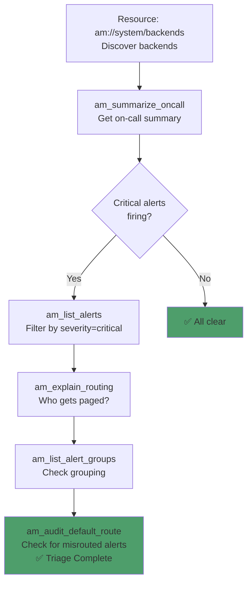
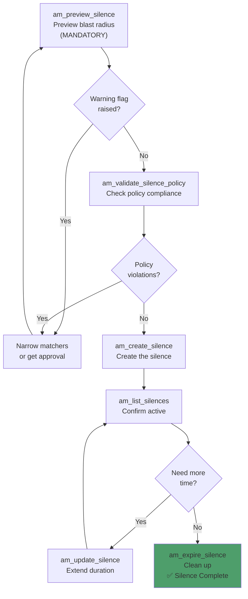
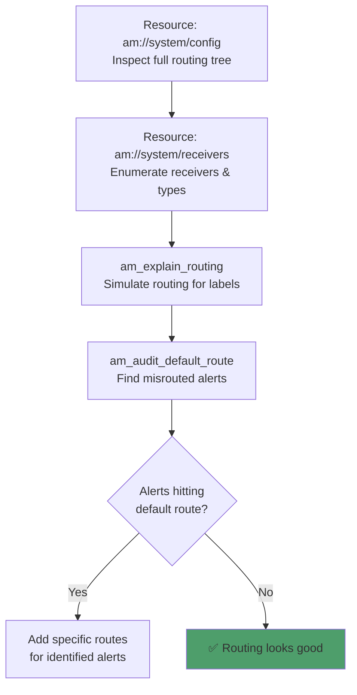
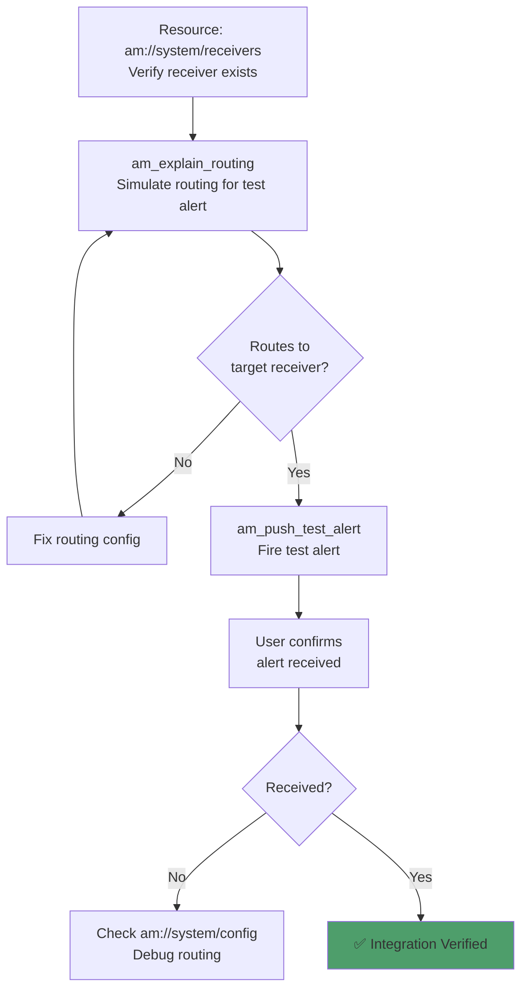
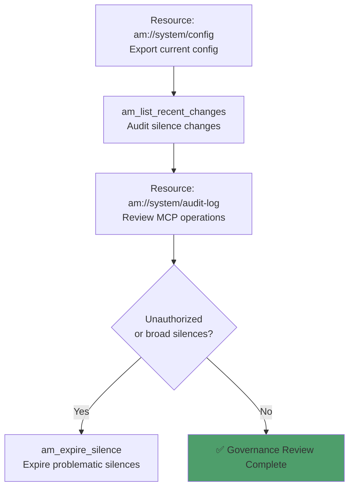

# Alertmanager MCP Server — Alert Management & Operations Journeys

**A comprehensive guide to how Tools, Resources, and Prompts coordinate across real-world Alertmanager workflows.**

> 💬 **New to the tools?** See the companion **[PROMPT_REFERENCE.md](PROMPT_REFERENCE.md)** — natural language prompts for every tool call in this guide.

---

## Table of Contents

1. [Prerequisites & Environment Setup](#1-prerequisites--environment-setup)
2. [Workflow 1: On-Call Alert Triage](#2-workflow-1-on-call-alert-triage)
3. [Workflow 2: Maintenance Silence Lifecycle](#3-workflow-2-maintenance-silence-lifecycle)
4. [Workflow 3: Routing & Notification Audit](#4-workflow-3-routing--notification-audit)
5. [Workflow 4: Integration Testing](#5-workflow-4-integration-testing)
6. [Workflow 5: Governance & Compliance Review](#6-workflow-5-governance--compliance-review)

---

## 1. Prerequisites & Environment Setup

### Infrastructure Requirements

| Component | Requirement | Notes |
|-----------|-------------|-------|
| **Alertmanager** | v0.25+ HTTP API v2 | Standalone or clustered |
| **Python** | 3.12+ | For running the MCP server |

### MCP Server Setup

```bash
git clone https://github.com/talkops-ai/talkops-mcp.git
cd talkops-mcp/src/alertmanager-mcp-server
uv venv && source .venv/bin/activate
uv pip install -e ".[dev]"

# Configure
export ALERTMANAGER_BASE_URL=http://localhost:9093
export MCP_TRANSPORT=http

# Run
uv run alertmanager-mcp-server
```

### MCP Client Configuration

```json
{
  "mcpServers": {
    "alertmanager": {
      "url": "http://localhost:8768/mcp",
      "description": "Alertmanager alert triage, silence management, and routing"
    }
  }
}
```

---

## 2. Workflow 1: On-Call Alert Triage

### Scenario

You're starting an on-call shift and need a quick understanding of the current alert landscape — what's firing, which services are affected, and who is being notified.

> **Guided Prompt**: Use `am-alert-triage-guided` for the full step-by-step flow.

### Journey Diagram



### Step-by-Step

| Step | Action | Tool / Resource | Key Parameters |
|------|--------|-----------------|----------------|
| 1 | Discover backends | **Resource**: `am://system/backends` | Confirms connectivity and health |
| 2 | Get on-call summary | **Tool**: `am_summarize_oncall(backend_id="default")` | Returns severity/service breakdown with narrative |
| 3 | Filter critical alerts | **Tool**: `am_list_alerts(backend_id="default", severity="critical")` | Returns paginated alert list |
| 4 | Check routing | **Tool**: `am_explain_routing(backend_id="default", labels={"alertname": "HighCPU", "service": "api", "env": "prod"})` | Returns matched receivers and explanation |
| 5 | Inspect alert groups | **Tool**: `am_list_alert_groups(backend_id="default")` | Returns Alertmanager's native grouping |
| 6 | Audit default route | **Tool**: `am_audit_default_route(backend_id="default")` | Finds misrouted alerts hitting the default receiver |

### Resources Used

| Resource | When | Purpose |
|----------|------|---------|
| `am://system/backends` | Before Step 1 | Quick overview of all backends |
| `am://alerts/active` | Any time | Fast snapshot without tool call |
| `am://alerts/groups` | Any time | Group snapshot without tool call |

### On-Call Summary Output Example

```text
🚨 **On-Call Summary** — 12 active alert(s)

  🔴 Critical: 3
  🟡 Warning: 7
  ⚪ info: 2

**Top affected services:**
  - api-server: 5 alert(s)
  - checkout: 3 alert(s)
  - payments: 2 alert(s)

**Top alert groups:**
  - [critical] api-server/HighLatency: 3
  - [warning] checkout/HighErrorRate: 2
```

---

## 3. Workflow 2: Maintenance Silence Lifecycle

### Scenario

You need to silence alerts for a planned maintenance window — deploy a new version of a service, perform infrastructure changes, or mute known-noisy alerts. The AI guides you through a safe silence lifecycle with mandatory preview, policy validation, and clean expiration.

> **Guided Prompt**: Use `am-maintenance-silence-guided` for the full step-by-step flow.

### Journey Diagram



### Step-by-Step

| Step | Action | Tool | Key Parameters |
|------|--------|------|----------------|
| 1 | **Preview blast radius** (mandatory) | `am_preview_silence(backend_id="default", matchers=[{"name": "service", "value": "checkout", "isRegex": false, "isEqual": true}])` | Returns affected_alert_count, receivers, warning_flag |
| 2 | Validate policy | `am_validate_silence_policy(backend_id="default", matchers=[...], duration_minutes=120, comment="Deploy v2.3", created_by="alice")` | Returns allowed/violations |
| 3 | Create silence | `am_create_silence(backend_id="default", matchers=[...], duration_minutes=120, comment="Deploy v2.3", created_by="alice")` | Returns silence_id |
| 4 | Confirm active | `am_list_silences(backend_id="default", state="active")` | Verify silence appears |
| 5 | Extend if needed | `am_update_silence(backend_id="default", silence_id="<id>", add_minutes=30)` | Returns new silence_id |
| 6 | Expire when done | `am_expire_silence(backend_id="default", silence_id="<id>")` | Reactivates notifications |

### Safety Guardrails

| Guardrail | Description | Configuration |
|-----------|-------------|---------------|
| **Duration Cap** | Max silence duration (default 24h) | `AM_MAX_SILENCE_MINUTES` |
| **Blast Radius Warning** | Warns if silence affects ≥ N alerts | `AM_SILENCE_WARNING_THRESHOLD` |
| **Duplicate Detection** | Blocks creating equivalent active silences | Built-in |
| **Policy Validation** | Checks comment, creator, matcher breadth | `am_validate_silence_policy` |
| **Preview Dry-Run** | Shows affected alerts/receivers before creation | `am_preview_silence` |

### Silence Scope Control (silence_alert helper)

The `am_silence_alert` helper provides an LLM-friendly way to silence a specific alert:

| Scope | Matchers Used | Use Case |
|-------|---------------|----------|
| `instance` | All alert labels | Narrowest — silences exactly this alert instance |
| `service` (default) | alertname + service + env | Recommended — silences this alert type for this service |
| `env` | env only | Broadest — silences everything in the environment |

---

## 4. Workflow 3: Routing & Notification Audit

### Scenario

You need to understand and verify the Alertmanager routing configuration — who gets paged for which alerts, what receivers are configured, and whether any alerts are falling through to the default route.

### Journey Diagram



### Step-by-Step

| Step | Action | Tool | Key Parameters |
|------|--------|------|----------------|
| 1 | Inspect routing tree | **Resource**: `am://system/config` | Returns nested route structure with matchers and receivers |
| 2 | List receivers | **Resource**: `am://system/receivers` | Returns receiver names with types (slack, pagerduty, email, webhook) |
| 3 | Simulate routing | `am_explain_routing(backend_id="default", labels={"alertname": "HighCPU", "service": "api", "severity": "critical"})` | Returns matched_route, receivers, group_labels, inhibited_by, explanation |
| 4 | Audit default route | `am_audit_default_route(backend_id="default")` | Returns alerts hitting the default receiver |

### Resources Used

| Resource | Purpose |
|----------|---------|
| `am://system/config` | Quick view of routing and inhibition rules |
| `am://system/receivers` | Receiver list without tool call |

### Common Routing Questions

| Question | Tool to Use |
|----------|-------------|
| "Who gets paged for this alert?" | `am_explain_routing` |
| "What Slack channels are configured?" | `am://system/receivers` |
| "Are any alerts falling through to the default?" | `am_audit_default_route` |
| "How is the routing tree structured?" | `am://system/config` |

---

## 5. Workflow 4: Integration Testing

### Scenario

You've configured a new receiver (Slack channel, PagerDuty service, email group) and need to verify the full notification pipeline — from Alertmanager routing to actual message delivery.

> **Guided Prompt**: Use `am-integration-test-guided` for the full step-by-step flow.

### Journey Diagram



### Step-by-Step

| Step | Action | Tool / Resource | Key Parameters |
|------|--------|-----------------|----------------|
| 1 | Check receivers | **Resource**: `am://system/receivers` | Verify target receiver is configured |
| 2 | Simulate routing | **Tool**: `am_explain_routing(backend_id="default", labels={"alertname": "MCPIntegrationTest", "team": "sre", "severity": "warning"})` | Confirm routing to target receiver |
| 3 | Push test alert | **Tool**: `am_push_test_alert(backend_id="default", alert_labels={"alertname": "MCPIntegrationTest", "team": "sre", "severity": "warning"}, annotations={"summary": "Test alert from MCP"})` | **MUTATES STATE** — fires real alert |
| 4 | Verify receipt | *(Manual)* — user confirms alert arrived in Slack/PagerDuty/email | — |
| 5 | Debug if needed | **Resource**: `am://system/config` | Check routing tree for misconfiguration |

### Important: Test Alerts Are Real

`am_push_test_alert` fires a **real alert** into Alertmanager. This means:
- Downstream integrations (Slack, PagerDuty, email, webhooks) **will receive notifications**.
- The alert will appear in the active alert list until it resolves.
- Use descriptive labels like `alertname: "MCPIntegrationTest"` to distinguish test alerts.

---

## 6. Workflow 5: Governance & Compliance Review

### Scenario

You need to audit Alertmanager operations for compliance — review who created or expired silences, export the effective configuration for Git diffing, and ensure silence policies are being followed.

### Journey Diagram



### Step-by-Step

| Step | Action | Tool / Resource | Key Parameters |
|------|--------|-----------------|----------------|
| 1 | Export config | **Resource**: `am://system/config` | Returns full routing config |
| 2 | Audit silence changes | **Tool**: `am_list_recent_changes(backend_id="default", hours=24)` | Returns created/expired silences with authors |
| 3 | Review MCP audit log | **Resource**: `am://system/audit-log` | Shows all MCP-initiated operations |
| 4 | Validate existing silences | **Tool**: `am_validate_silence_policy(backend_id="default", matchers=[...], duration_minutes=..., comment="...", created_by="...")` | Checks against policy rules |
| 5 | Expire bad silences | **Tool**: `am_expire_silence(backend_id="default", silence_id="<id>")` | **MUTATES STATE** — reactivates notifications |

### Governance Checklist

| Check | Tool/Resource | What to Look For |
|-------|---------------|------------------|
| Config drift | `am://system/config` | Compare with Git-stored config |
| Unauthorized silences | `am_list_recent_changes` | Unknown authors, missing comments |
| Overly broad silences | `am_validate_silence_policy` | Severity-only matchers, env-only matchers |
| MCP operation history | `am://system/audit-log` | Unexpected create/expire patterns |
| Default route leakage | `am_audit_default_route` | Alerts hitting the fallback receiver |

---

*Document Version: 1.0 | Companion to [PROMPT_REFERENCE.md](PROMPT_REFERENCE.md)*
