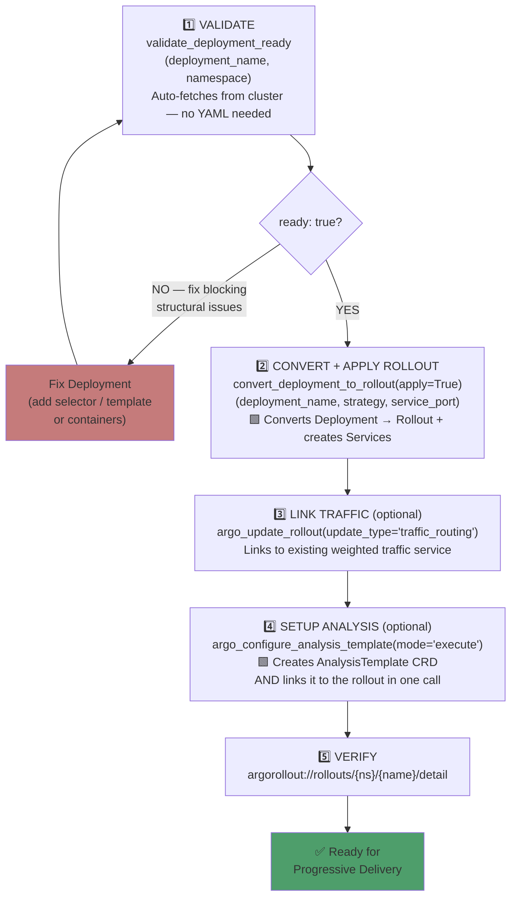
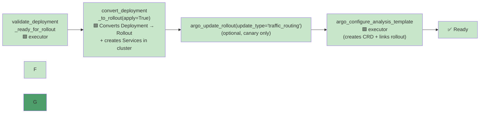
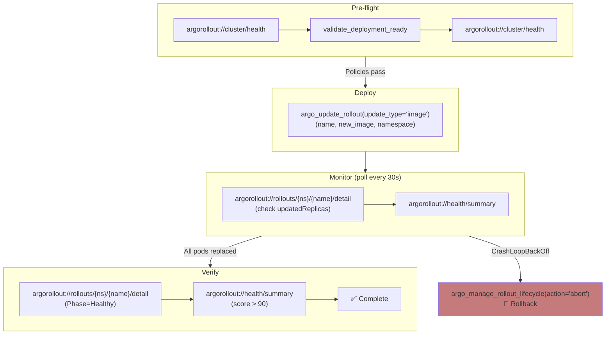
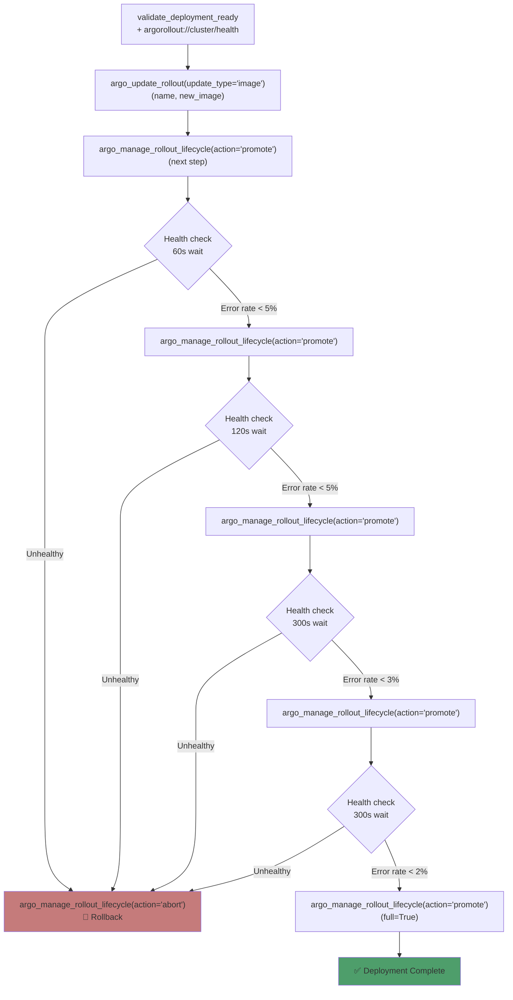
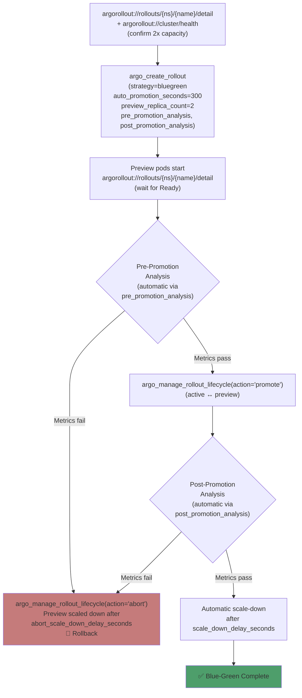
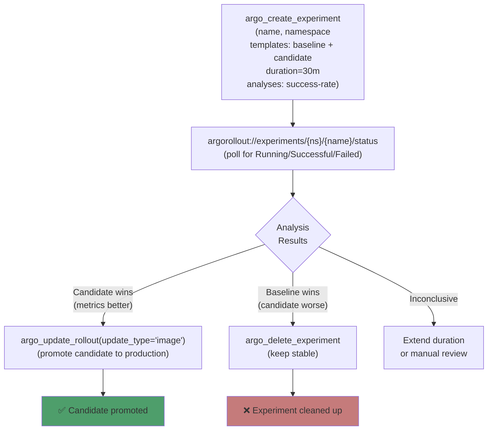
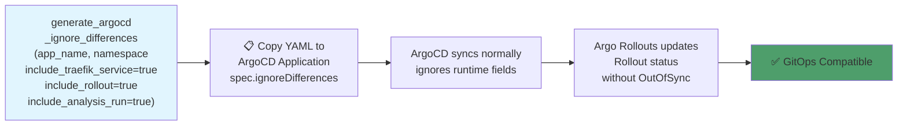
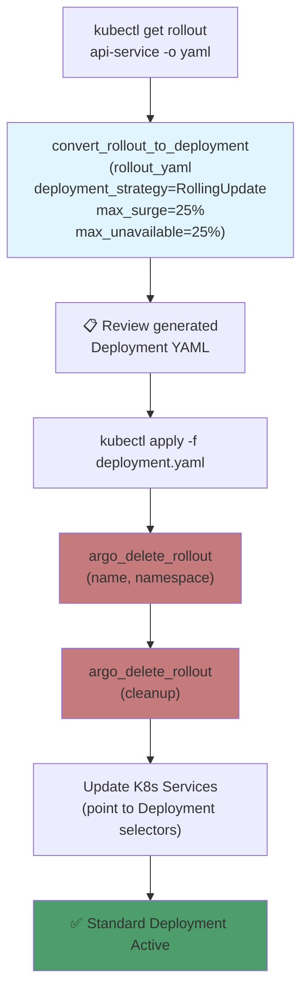
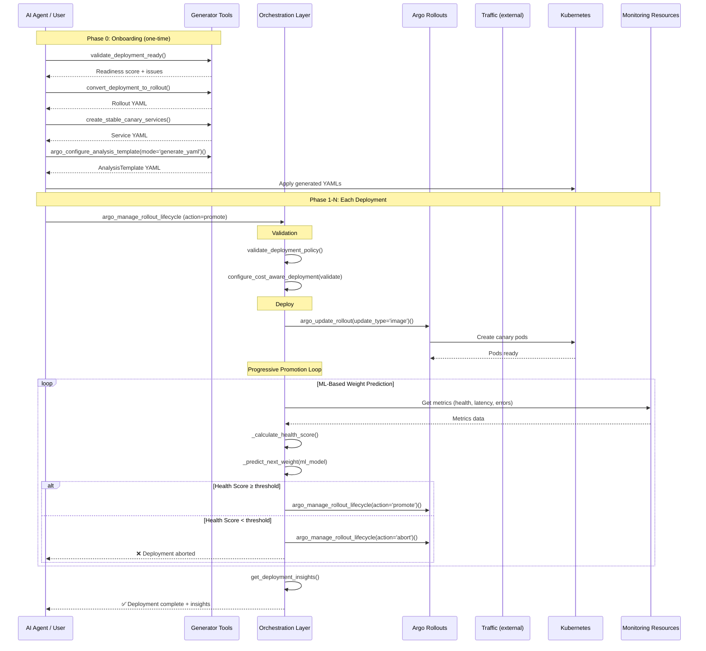

# Argo Rollout MCP Server — Application Workflow Journeys

**A comprehensive guide to how Tools, Resources, and Prompts coordinate across real-world progressive delivery scenarios.**

> 💬 **New to the tools?** See the companion **[PROMPT_REFERENCE.md](PROMPT_REFERENCE.md)** — natural language prompts for every tool call in this guide.

---

## Table of Contents

1. [Prerequisites & Environment Setup](#1-prerequisites--environment-setup)
2. [Workflow 1: Onboarding an Existing Application](#2-workflow-1-onboarding-an-existing-application-to-argo-rollouts)
3. [Workflow 2: Configuring Deployment Strategies](#3-workflow-2-configuring-deployment-strategies)
4. [Workflow 3: A/B Testing with Experiments](#4-workflow-3-ab-testing-with-experiments)
5. [Workflow 4: ArgoCD GitOps Integration](#5-workflow-4-argocd-gitops-integration)
6. [Workflow 5a: workloadRef Gradual Migration](#6-workflow-5a-workloadref-gradual-migration-deployment--rollout)
7. [Workflow 5b: Reverse Migration — Rollout → Deployment](#7-workflow-5b-reverse-migration--rollout--deployment)
8. [Workflow 6: Zero-Downtime Migration (Argo CD)](#8-workflow-6-zero-downtime-migration-argo-cd)
9. [End-to-End Orchestrated Deployment](#9-end-to-end-orchestrated-deployment)
10. [Monitoring & Observability During Workflows](#10-monitoring--observability-during-workflows)

---

## 1. Prerequisites & Environment Setup

### Infrastructure Requirements

| Component | Requirement | Notes |
|-----------|-------------|-------|
| **Kubernetes Cluster** | v1.24+ | Any managed (EKS, GKE, AKS) or self-managed |
| **Argo Rollouts** | Installed as CRD + Controller | `kubectl apply -n argo-rollouts -f https://github.com/argoproj/argo-rollouts/releases/latest/download/install.yaml` |
| **Ingress (optional)** | For canary traffic shifting | Traefik (TraefikService or Gateway API HTTPRoute), Istio, NGINX — create routes separately; link via `argo_update_rollout(update_type='traffic_routing')` with `traefik_service_name` or `gateway_api_config` |
| **Prometheus** | For AnalysisTemplate metrics | Required for automated analysis (error rate, latency) |
| **kubectl** | Configured with cluster access | `KUBECONFIG=~/.kube/config` |
| **Python** | 3.10+ | For running the MCP server |

### Application Requirements

Before onboarding, the existing application **must have**:

| Requirement | Details | Validated By |
|-------------|---------|-------------|
| **Container Image** | Pushed to a registry (DockerHub, ECR, GCR, etc.) | Manual |
| **Kubernetes Deployment** | Standard Deployment YAML available | `validate_deployment_ready` |
| **Health Probes** | Readiness and liveness probes defined | `validate_deployment_ready` |
| **Resource Requests** | CPU/memory requests and limits configured | `validate_deployment_ready` |
| **Replicas ≥ 2** | Minimum 2 replicas for HA | `validate_deployment_ready` |
| **Namespace** | Application deployed in a known namespace | Manual |
| **Service selectors** | No `pod-template-hash` in selectors | `validate_deployment_ready` |

### Argo Rollout MCP Server Setup (Docker — recommended)

```bash
# Pull and run the image
docker run --rm -it \
  -p 8768:8768 \
  -v ~/.kube:/app/.kube:ro \
  -e K8S_KUBECONFIG=/app/.kube/config \
  talkopsai/argo-rollout-mcp-server:latest
```

> **Tip:** Mount the full `~/.kube` directory (not just `config`) so certificate paths referenced in your kubeconfig (e.g. minikube, kind) are available inside the container.

### MCP Client Configuration

```json
{
  "mcpServers": {
    "argo-rollout": {
      "url": "http://localhost:8768/mcp",
      "description": "MCP Server for managing Argo Rollouts and K8s Progressive Delivery"
    }
  }
}
```

---

## 2. Workflow 1: Onboarding an Existing Application to Argo Rollouts

### Scenario

You have an application (e.g., `api-service`) running as a standard Kubernetes `Deployment` (potentially managed by ArgoCD). You want to migrate it to Argo Rollouts for progressive delivery.

### Journey Diagram



> **Zero manual kubectl steps.** Every resource — Services, Rollout, AnalysisTemplate — is applied directly to the cluster by the tools. Traffic routing (Traefik, Istio, etc.) is configured separately; use `argo_update_rollout(update_type='traffic_routing')` to link.

---

### Step-by-Step Journey

---


#### Step 1: Validate — Check Readiness Before Touching Anything

**Goal**: Confirm the Deployment is structurally sound and doesn't have issues that would cause the migration to fail. A single call validates both Deployment structure and Service selector compatibility.

```python
# Single call: fetches Deployment from cluster, validates structure + Service selector (no pod-template-hash)
validate_deployment_ready(
    deployment_name="api-service",
    namespace="production"
)
```

**What this checks and returns:**

| Check | Severity | Impact |
|-------|----------|--------|
| Missing `spec.selector` | 🔴 BLOCKING | `-25 points` |
| Missing `spec.template` | 🔴 BLOCKING | `-25 points` |
| No containers defined | 🔴 BLOCKING | `-25 points` |
| `replicas < 2` | 🟡 Warning | `-10 points` |
| Missing resource limits | 🟡 Warning | `-5 per container` |
| No readiness probe | 🟡 Warning | `-5 per container` |
| No liveness probe | 🟡 Warning | `-3 per container` |
| No `preStop` / `terminationGracePeriodSeconds` | 🟡 Recommendation | Zero-downtime best practice |
| `maxUnavailable > 0` | 🟡 Recommendation | Prefer `maxUnavailable: 0` for safe migrations |
| No PodDisruptionBudget | 🟡 Recommendation | PDB recommended for HA during migration |
| Service selector uses `pod-template-hash` | 🔴 BLOCKING | Remove for Rollout compatibility |
| No Service found | 🟡 Warning | `convert_deployment_to_rollout(mode='generate_services_only', app_name='...')` or `create_stable_canary_services` (legacy) will create required Services |

```json
{
  "ready": true,          // false if ANY blocking issue exists
  "score": 85,            // 0-100
  "issues": [],           // blocking problems — must fix before proceeding
  "warnings": ["replicas < 2"],
  "recommendations": ["Add resource limits for better QoS"],
  "deployment_checks": { "replicas": 1, "containers_count": 1 },
  "service_checks": { "service_found": true, "service_name": "hello-world", "selector_ok": true }
}
```

**Decision Gate**: `ready: true` → proceed. Warnings are informational — they don't block migration. Fix blocking `issues` before continuing.

Also optionally check insights and cost:
```python
# Orchestration tools (orch_*) excluded this release — use argorollout://cluster/health, argorollout://health/summary
```

---

#### Step 2: Convert and Apply the Rollout

**Goal**: Convert the existing Deployment to an Argo Rollout — preserving all its resource limits, probes, env vars, volumes — and apply it to the cluster, along with the prerequisite Services, in a single call.

> **`convert_deployment_to_rollout` is the right tool for onboarding an existing app.**  
> It auto-fetches your Deployment from the cluster, preserves every field (probes, resource limits, env vars, volume mounts), and generates the Rollout spec with the correct strategy. With `apply=True`, it applies the Rollout CRD + creates the stable/canary Services in one shot.

> **`argo_create_rollout` is for creating a brand-new rollout from scratch** (no existing Deployment to migrate from). It only has an image name to work with — it builds a minimal pod spec.

**Primary path — onboarding an existing Deployment** (preserves all config):

```python
# One call: fetches Deployment from cluster, converts it to Rollout YAML,
# applies the Rollout CRD, and creates stable+canary Services automatically
convert_deployment_to_rollout(
    deployment_name="api-service",   # auto-fetched from cluster — no YAML input needed
    namespace="production",
    strategy="canary",               # or "bluegreen"
    service_port=80,                 # port for auto-created Services
    apply=True                       # ← applies Rollout + Services to cluster, no kubectl
)
```

**Response confirms what was done automatically:**
```json
{
  "status": "success",
  "app_name": "api-service",
  "strategy": "canary",
  "rollout_yaml": "...",
  "applied": true,
  "rollout_applied": true,
  "rollout_already_existed": false,
  "services_created": ["api-service-stable", "api-service-canary"],
  "services_already_existed": [],
  "apply_summary": "✅ Rollout: created | Services created: [...] | Services skipped: none"
}
```

> **What `convert_deployment_to_rollout` preserves from your existing Deployment:**
> - `spec.template` (pod template with all containers, env vars, volumes, volume mounts)
> - `spec.selector` (pod label selectors)
> - `spec.replicas`
> - `metadata` (name, namespace, labels, annotations)

**For workloadRef mode** (zero pod overlap, recommended for production):
```python
# References the existing Deployment instead of duplicating its pod template.
# Argo Rollouts scales the Deployment to 0 automatically once Rollout is Healthy.
convert_deployment_to_rollout(
    deployment_name="api-service",
    namespace="production",
    strategy="canary",
    migration_mode="workload_ref",   # references existing Deployment, no pod conflicts
    scale_down="onsuccess",
    service_port=80,
    apply=True
)
```

**For blue-green** (auto-creates `api-service-active` + `api-service-preview`):
```python
convert_deployment_to_rollout(
    deployment_name="api-service",
    namespace="production",
    strategy="bluegreen",
    service_port=80,
    apply=True
)
```

**For Gateway API (HTTPRoute)** — pass `gateway_api_config` at convert time to embed traffic routing:
```python
convert_deployment_to_rollout(
    deployment_name="api-service",
    namespace="production",
    strategy="canary",
    gateway_api_config={"httpRoute": "api-http-route", "namespace": "production"},
    apply=True
)
```

**Review mode (no apply):**
```python
# Returns Rollout YAML only — nothing is applied to the cluster
convert_deployment_to_rollout(
    deployment_name="api-service",
    namespace="production",
    strategy="canary",
    apply=False    # default — YAML only
)
# Inspect the YAML, then re-run with apply=True
```

**Verify after applying:**
```python
argorollout://rollouts/production/api-service/detail
# Expected: phase="Healthy", readyReplicas=3
```

---

#### Step 3: Link Traffic Routing (Optional, Canary Only)

**Goal**: If using external traffic routing (Traefik, Istio, Gateway API, etc.), link the Rollout to your weighted traffic service. The traffic service must be created separately via your ingress controller or CI/CD.

**Option A — TraefikService (Traefik IngressRoute):**
```python
argo_update_rollout(
    name="api-service",
    namespace="production",
    update_type="traffic_routing",
    traefik_service_name="api-service-route-wrr"  # your existing TraefikService name
)
```

**Option B — Gateway API (HTTPRoute, Traefik 3.x / Envoy Gateway):**
```python
argo_update_rollout(
    name="api-service",
    namespace="production",
    update_type="traffic_routing",
    gateway_api_config={
        "httpRoute": "api-http-route",   # your existing HTTPRoute name
        "namespace": "production"         # optional; defaults to rollout namespace
    }
)
```

**Verify:**
```
Resource: argorollout://rollouts/production/api-service/detail
# Check status.canary.weights for traffic split (when traffic routing is linked)
```

---


#### Step 4: Set Up Analysis (Optional but Recommended)

**Goal**: Configure Prometheus-based health checks so Argo Rollouts can auto-abort on failures.

> Skip this step if you don't have Prometheus. Rollouts without analysis still work — operators just promote/abort manually.

**Single tool call — no kubectl needed:**

```python
# argo_configure_analysis_template(mode='execute') is a FULL EXECUTOR:
# Step 1 internally: Creates the AnalysisTemplate CRD in the cluster
# Step 2 internally: Patches the Rollout spec to reference it
# Both happen in a single tool call — nothing manual required.
argo_configure_analysis_template(mode='execute')(
    rollout_name="api-service",
    template_name="api-service-analysis",
    namespace="production",
    metrics=[
        {
            "name": "success-rate",
            "successCondition": ">= 99",
            "provider": {
                "prometheus": {
                    "address": "http://prometheus.monitoring:9090",
                    "query": 'sum(rate(http_requests_total{status=~"2.*"}[5m])) / sum(rate(http_requests_total[5m])) * 100'
                }
            }
        }
    ]
)
```

> **Or use `argo_configure_analysis_template(mode='generate_yaml')` if you want the generated Prometheus YAML first** (for review/GitOps), but then just pass the same metrics to `argo_configure_analysis_template(mode='execute')` directly — it handles the full create+link workflow in one shot.

```python
# Using pre-built Prometheus metrics (error rate, P99, P95):
argo_configure_analysis_template(mode='execute')(
    rollout_name="api-service",
    template_name="api-service-analysis",
    namespace="production"
    # metrics=None → uses default: success-rate >= 99% via Prometheus
)
```

**What gets created:**
```yaml
apiVersion: argoproj.io/v1alpha1
kind: AnalysisTemplate
metadata:
  name: api-service-analysis
spec:
  metrics:
    - name: error-rate
      interval: 60s
      failureLimit: 2
      successCondition: "result[0] < 0.05"   # < 5%
      provider:
        prometheus:
          address: http://prometheus.monitoring:9090
          query: sum(rate(http_requests_total{status=~"5.."}[5m])) / sum(rate(http_requests_total[5m]))

    - name: latency-p99
      interval: 60s
      failureLimit: 2
      successCondition: "result[0] < 2.0"    # < 2000ms
      provider:
        prometheus:
          query: histogram_quantile(0.99, sum(rate(http_request_duration_seconds_bucket[5m])) by (le))
```

---

#### Step 5: Verify

**Goal**: Confirm rollout is healthy before any traffic changes.

**Final verification:**

```python
argorollout://rollouts/production/api-service/detail
# Expect: phase="Healthy", readyReplicas=3, availableReplicas=3

# Pre-flight: argorollout://cluster/health
# Run AFTER rollout exists — checks strategy, replica count, security posture
```

**If using ArgoCD** — add `ignoreDifferences` to prevent OutOfSync alerts:
```python
generate_argocd_ignore_differences(
    include_rollout_status=True,
    include_analysis_run=True,
    include_traefik_service=True  # only if using Traefik traffic routing
)
# For workloadRef: add include_deployment_replicas=True, deployment_name="api-service"
# so Argo CD doesn't revert Rollout's scale-down of the referenced Deployment
# → Paste the returned snippet into your ArgoCD Application spec
```

---

### Onboarding Complete ✅

The application is now managed by Argo Rollouts. Future deployments use:
```python
argo_update_rollout(update_type='image')(name="api-service", new_image="api-service:v2.0", namespace="production")
# instead of: kubectl set image deployment/api-service ...
```

---

### Realistic Onboarding Tool Chain



> 🟩 **Green = Executor** (applies directly to cluster, no kubectl needed)

### Manual Steps Summary

> **There are no manual `kubectl` steps.** All resources are created directly by the tools:

| Resource | Tool | Mode |
|----------|------|------|
| Argo Rollout CRD | `convert_deployment_to_rollout(apply=True)` | 🟩 Executor |
| `{app}-stable` + `{app}-canary` Services | `convert_deployment_to_rollout(apply=True)` | 🟩 Executor |
| Traffic routing link | `argo_update_rollout(update_type='traffic_routing')` (links to existing service) | Optional |
| AnalysisTemplate + Rollout patch | `argo_configure_analysis_template(mode='execute')` | 🟩 Executor |

> For **new apps** (no existing Deployment): use `argo_create_rollout` instead of `convert_deployment_to_rollout`.  
> Use `apply=False` on either tool for GitOps / YAML-review-first mode.  
> Use `workloadRef` migration mode to eliminate pod overlap during the Deployment → Rollout transition.

---

## 3. Workflow 2: Configuring Deployment Strategies

Once onboarded, you can deploy new versions using any of three strategies. Each strategy uses a different combination of tools, resources, and prompts.

> **Changing strategy on an existing Rollout**: Use `argo_update_rollout(update_type='strategy')` to patch `canaryService`, `stableService`, or `canary_steps` on an existing canary Rollout without recreating it. Creates the canary Service automatically if `canaryService` is a new name (e.g. `canary-demo-preview`).

### Strategy Comparison

| Aspect | Rolling Update | Canary | Blue-Green |
|--------|---------------|--------|------------|
| **Speed** | Slow (pod-by-pod) | Medium (staged) | Fast (instant switch) |
| **Resource Cost** | Low (no overhead) | Medium (small canary) | High (2x resources) |
| **Risk** | Medium | Low | Low |
| **Rollback Speed** | Medium | Fast | Instant |
| **Traffic Control** | None (K8s native) | Precise (via linked traffic service) | Binary (all-or-nothing) |
| **Analysis Support** | No | Yes (via AnalysisTemplate) | Yes (via AnalysisTemplate) |
| **Best For** | Standard updates | Critical services | Zero-downtime critical |
| **Prompt** | `rolling_update_guided` | `canary_deployment_guided` | `blue_green_deployment_guided` |

---

### Strategy A: Rolling Update

> **Prompt**: `rolling_update_guided(app_name, new_image, namespace)`



**Tool & Resource Coordination**:

| Phase | Tools Used | Resources Polled | Decision Logic |
|-------|-----------|-----------------|----------------|
| Pre-flight | `validate_deployment_ready`, `argorollout://cluster/health` | — | All policies pass → proceed |
| Update | `argo_update_rollout(update_type='image')(name, new_image, namespace)` | — | Triggers K8s rolling update |
| Monitor | `argorollout://rollouts/{ns}/{name}/detail` (poll every 30s) | `argorollout://health/summary` | `updatedReplicas == replicas` → complete |
| Verify | `argorollout://rollouts/{ns}/{name}/detail` (resource) | `argorollout://health/summary` | Health score >90 → success |
| **Rollback** | `argo_manage_rollout_lifecycle(action='abort')` | — | On CrashLoopBackOff or error spike |

> **Note:** Use `argo_manage_rollout_lifecycle` with `action` = `promote`, `promote_full`, `abort`, `pause`, or `resume`.

---

### Strategy B: Canary Deployment

> **Prompt**: `canary_deployment_guided(app_name, new_image, namespace)`



**Resources polled at each health check:**
- `argorollout://rollouts/{ns}/{name}/detail` — verify rollout status and canary weights
- `argorollout://health/summary` — detect error/latency spikes
- `argorollout://health/{ns}/{name}/details` — per-app health score

**Tool & Resource Coordination**:

| Phase | Tools | Resources | Decision |
|-------|-------|-----------|----------|
| Pre-flight | `validate_deployment_ready`, `argorollout://cluster/health` | — | Policies pass, budget OK |
| Setup analysis | `argo_configure_analysis_template(mode='generate_yaml')` (if not done during onboarding) | — | Ensures automated health checks |
| Deploy canary | `argo_update_rollout(update_type='image')` | `argorollout://rollouts/{ns}/{name}/detail` | Phase="Progressing" |
| 5% traffic | `argo_manage_rollout_lifecycle(action='promote')` (next step) | `argorollout://rollouts/{ns}/{name}/detail`, `argorollout://health/summary` | Wait 60s, error rate <5%, P99 <2x |
| 10% traffic | `argo_manage_rollout_lifecycle(action='promote')` | Same as above | Wait 120s, same health checks |
| 25% traffic | `argo_manage_rollout_lifecycle(action='promote')` | Same + `argorollout://health/{ns}/{name}/details` | Wait 300s, error rate <3% |
| 50% traffic | `argo_manage_rollout_lifecycle(action='promote')` | Same | Wait 300s, error rate <2% |
| 100% (complete) | `argo_manage_rollout_lifecycle(action='promote_full')` or `argo_manage_rollout_lifecycle(action='promote_full')` | `argorollout://health/summary` | Full promotion |
| **Rollback** | `argo_manage_rollout_lifecycle(action='abort')` | — | Any health check failure |

**Automated Alternative** (future enhancement) — `orch_deploy_intelligent_promotion` is excluded from this release. Use `argo_manage_rollout_lifecycle(action='promote')` for manual step-by-step promotion.

---

### Strategy B Variant: Gateway API Canary (Traefik 3.x / Envoy Gateway)

When using **Gateway API** (HTTPRoute) instead of TraefikService, use `gateway_api_config` to link the Rollout to your HTTPRoute. The Argo Rollouts Gateway API plugin manages traffic weights during canary steps.

**Prerequisites:** Gateway API provider installed (e.g., Envoy Gateway, Traefik 3.x), HTTPRoute created with stable and canary service backends, Argo Rollouts with the [Gateway API plugin](https://github.com/argoproj-labs/rollouts-plugin-trafficrouter-gatewayapi) installed.

**Full workflow example:**

```python
# 1. Convert Deployment → Rollout with Gateway API routing
convert_deployment_to_rollout(
    deployment_name="api-service",
    namespace="production",
    strategy="canary",
    gateway_api_config={
        "httpRoute": "api-http-route",
        "namespace": "production"
    },
    apply=True
)

# 2. Or create a new Rollout with Gateway API from scratch
argo_create_rollout(
    name="api-service",
    image="api-service:v2.0",
    namespace="production",
    strategy="canary",
    gateway_api_config={
        "httpRoute": "api-http-route",
        "namespace": "production"
    },
    canary_steps=[
        {"setWeight": 20},
        {"pause": {"duration": "5m"}},
        {"setWeight": 50},
        {"pause": {"duration": "5m"}},
        {"setWeight": 100}
    ]
)

# 3. Link traffic routing on existing Rollout (if not set at create time)
argo_update_rollout(
    name="api-service",
    namespace="production",
    update_type="traffic_routing",
    gateway_api_config={
        "httpRoute": "api-http-route",
        "namespace": "production"
    }
)

# 4. Deploy new version — Argo Rollouts controller updates HTTPRoute weights at each step
argo_update_rollout(
    name="api-service",
    namespace="production",
    update_type="image",
    new_image="api-service:v2.1"
)

# 5. Promote through canary steps
argo_manage_rollout_lifecycle(name="api-service", namespace="production", action="promote")
```

**`gateway_api_config` parameters:**

| Parameter | Type | Description |
|-----------|------|-------------|
| `httpRoute` | `str` | HTTPRoute name (single route) |
| `httpRoutes` | `list` | For multiple routes: `[{"name": "route1", "namespace": "default"}]` |
| `namespace` | `str` | Namespace of HTTPRoute (optional; defaults to rollout namespace) |
| `inProgressLabelKey` | `str` | Custom label key for GitOps ignore (optional) |
| `inProgressLabelValue` | `str` | Custom label value (optional) |
| `disableInProgressLabel` | `bool` | Disable in-progress label (optional) |

**Resources:** `argorollout://rollouts/{ns}/{name}/detail` — verify canary weights and phase.

---

### Strategy C: Blue-Green Deployment

> **Prompt**: `blue_green_deployment_guided(app_name, new_image, namespace, auto_switch=True)`



**Blue-Green Parameters (via `argo_create_rollout`):**

| Parameter | Type | Description |
|-----------|------|-------------|
| `active_service` | `str` | K8s Service name for active pods |
| `preview_service` | `str` | K8s Service name for preview pods |
| `auto_promotion` | `bool` | Auto-promote after preview is ready |
| `auto_promotion_seconds` | `int` | Auto-promote after N seconds |
| `scale_down_delay_seconds` | `int` | Delay old RS scale-down after promotion |
| `abort_scale_down_delay_seconds` | `int` | Delay preview RS scale-down on abort |
| `preview_replica_count` | `int` | Number of preview pods (default: same as replicas) |
| `pre_promotion_analysis` | `dict` | AnalysisTemplate to run before promotion |
| `post_promotion_analysis` | `dict` | AnalysisTemplate to run after promotion |
| `anti_affinity` | `dict` | Anti-affinity between active and preview pods |
| `active_metadata` | `dict` | Labels/annotations for active pods |
| `preview_metadata` | `dict` | Labels/annotations for preview pods |

**Tool & Resource Coordination**:

| Phase | Tools | Resources | Decision |
|-------|-------|-----------|----------|
| Pre-flight | `argorollout://rollouts/{ns}/{name}/detail`, `argorollout://cluster/health` | — | Confirm 2x capacity available |
| Deploy preview | `argo_create_rollout(strategy="bluegreen", auto_promotion_seconds=300, preview_replica_count=2, pre_promotion_analysis={...})` or `argo_update_rollout(update_type='image')(name, new_image)` | `argorollout://rollouts/{ns}/{name}/detail` | Preview pods all ready |
| Pre-promotion analysis | Automatic via `pre_promotion_analysis` | `argorollout://health/{ns}/{name}/details` | Prometheus metrics pass thresholds |
| Switch traffic | `argo_manage_rollout_lifecycle(action='promote')` (active ↔ preview) | `argorollout://rollouts/{ns}/{name}/detail` | Instant 100% switch |
| Post-promotion analysis | Automatic via `post_promotion_analysis` | `argorollout://health/summary`, `argorollout://health/summary` | Validate after cutover |
| Scale-down old | Automatic after `scale_down_delay_seconds` | — | Old RS scaled to 0 |
| **Rollback** | `argo_manage_rollout_lifecycle(action='abort')` | — | Instant revert: preview scaled down after `abort_scale_down_delay_seconds` |

---

## 4. Workflow 3: A/B Testing with Experiments

### Scenario

You want to run two versions (e.g., v1 and v2) **side by side** and compare metrics before promoting one as the winner. Argo Rollouts Experiments create temporary ReplicaSets for each variant.

> ⚠️ **Note**: Experiments create separate ReplicaSets for metric comparison. Weighted traffic routing for experiments depends on your ingress (Traefik, Istio, etc.); this server does not manage ingress routes.

### Journey Diagram



> ⚠️ **Note**: Experiments run as separate ReplicaSets for metric comparison. For user-facing A/B tests with traffic splitting, configure your ingress (Traefik, Istio, etc.) separately.

### Step-by-Step

| Step | Action | Tool | Key Parameters |
|------|--------|------|----------------|
| 1 | **Create experiment** | `argo_create_experiment(name="api-ab-test", namespace="production", templates=[{"name": "baseline", "specRef": "stable"}, {"name": "candidate", "specRef": "canary"}], duration="30m", analyses=[{"name": "success-rate", "templateName": "api-success-rate"}])` | `name`, `templates`, `duration`, `analyses` |
| 2 | Monitor experiment status | `argorollout://experiments/production/api-ab-test/status` | Resource |
| 3 | Review analysis results | Check `template_statuses` and `analysis_runs` in response | — |
| 4a | If candidate wins → promote | `argo_update_rollout(update_type='image')(name="api-service", new_image="api:v2.0")` | `name`, `new_image` |
| 4b | If baseline wins → cleanup | `argo_delete_experiment(name="api-ab-test", namespace="production")` | `name`, `namespace` |

### Experiment Phases

| Phase | Meaning |
|-------|---------|
| `Pending` | Experiment created, pods not yet ready |
| `Running` | Both templates running, analysis in progress |
| `Successful` | All analysis passed, experiment complete |
| `Failed` | Analysis failed or pods unhealthy |
| `Error` | Configuration issue |

---

## 5. Workflow 4: ArgoCD GitOps Integration

### Scenario

Your application is managed by **ArgoCD**. You need to prevent ArgoCD from reporting `OutOfSync` when Argo Rollouts dynamically updates `Rollout` status fields (and optionally external traffic service weights) at runtime.

### Journey Diagram



**What gets ignored (runtime fields that Argo Rollouts mutates):**

### Step-by-Step

| Step | Action | Tool | Key Parameters |
|------|--------|------|----------------|
| 1 | **Generate ignoreDifferences** | `generate_argocd_ignore_differences(include_traefik_service=true, include_rollout_status=true, include_analysis_run=true)` | `include_traefik_service`, `include_rollout_status`, `include_analysis_run`, `traefik_api_group` |
| 2 | Add to ArgoCD Application spec | Paste output into `Application.spec.ignoreDifferences` | — |
| 3 | Verify sync status | ArgoCD UI or `argocd app get api-service` | — |

**What `generate_argocd_ignore_differences` generates:**

```yaml
ignoreDifferences:
  - group: traefik.io
    kind: TraefikService
    name: api-service-weighted
    namespace: production
    jsonPointers:
      - /spec/weighted/services/0/weight
      - /spec/weighted/services/1/weight
  - group: argoproj.io
    kind: Rollout
    name: api-service
    namespace: production
    jsonPointers:
      - /status
  - group: argoproj.io
    kind: AnalysisRun
    namespace: production
    jsonPointers:
      - /spec
      - /status
```

> **Why needed**: Without `ignoreDifferences`, ArgoCD will detect weight changes and status updates as drift, causing constant `OutOfSync` states and potentially reverting Argo Rollouts' runtime changes during automatic syncs.

### Tool Parameters Reference

| Parameter | Default | Description |
|-----------|---------|-------------|
| `app_name` | (required) | Application name |
| `namespace` | `"default"` | Kubernetes namespace |
| `include_traefik_service` | `true` | Include TraefikService weight ignores |
| `include_rollout` | `true` | Include Rollout status ignores |
| `include_analysis_run` | `false` | Include AnalysisRun ignores |
| `include_deployment_replicas` | `false` | **workloadRef only**: Ignore Deployment `spec.replicas` so Argo CD doesn't revert Rollout's scale-down |
| `deployment_name` | (optional) | **workloadRef only**: Deployment name for `include_deployment_replicas` (defaults to `app_name`) |
| `traefik_api_group` | `"traefik.io"` | Traefik API group (`traefik.io` for v3, `traefik.containo.us` for v2) |

---

## 6. Workflow 5a: workloadRef Gradual Migration (Deployment → Rollout)

### Scenario

You want to migrate to Argo Rollouts **without** an immediate resource swap. The Rollout references the existing Deployment via `workloadRef` and progressively scales it down as the Rollout becomes healthy. Ideal for large environments managed by Argo CD or Helm.

### Key Difference from Direct Conversion

| Aspect | Direct Conversion (Workflow 1) | workloadRef (This Workflow) |
|--------|-------------------------------|-----------------------------|
| Deployment | Scaled down, then replaced by Rollout | Kept; Rollout references it |
| Downtime | Brief gap during swap | None — Rollout and Deployment run in parallel |
| Scale-down | Manual `kubectl scale` | Automatic: `never`, `onsuccess`, or `progressively` |
| Use case | Simple swap | Argo CD / Helm-managed, cautious migration |

### Step-by-Step

| Step | Action | Tool | Key Parameters |
|------|--------|------|----------------|
| 1 | **Validate** | `validate_deployment_ready(deployment_name="...", namespace="...")` | Validates Deployment structure + Service selector compatibility |
| 2 | **Convert with workloadRef** | `convert_deployment_to_rollout(deployment_name="...", strategy="canary", migration_mode="workload_ref", scale_down="never", apply=True)` | Start with `scale_down="never"` for co-existence |
| 3 | **Argo CD ignoreDifferences** | `generate_argocd_ignore_differences(include_deployment_replicas=True, deployment_name="...")` | Prevents Argo CD from reverting Rollout's scale-down |
| 4 | Proceed with Analysis | Same as Workflow 1 Phases 4–5 | Link traffic routing (optional), create AnalysisTemplate |
| 5 | Trigger new version | `argo_update_rollout(update_type='image')(...)` | Rollout creates canary; on success, scales down original Deployment per `scale_down` |
| 6 | **Update scaleDown** | `argo_update_rollout(update_type='workload_ref')(name="...", scale_down="progressively")` | Change `never` → `onsuccess` or `progressively` when ready |
| 7 | **Scale down Deployment** | **GitOps**: `argo_manage_legacy_deployment(action='generate_scale_down_manifest', name="...")` or `deployment_yaml="..."` for review-only. **Non-GitOps**: `argo_manage_legacy_deployment(action='scale_cluster', name="...", replicas=0)` | Argo CD reverts cluster-direct scale; use Git for Argo CD-managed apps |

---

## 7. Workflow 5b: Reverse Migration — Rollout → Deployment

### Scenario

You need to **abandon Argo Rollouts** and return to standard Kubernetes Deployments — perhaps due to simplifying infrastructure, removing dependencies, or migrating to a different progressive delivery tool.

### Journey Diagram



> 🟦 Blue = Generator | 🟥 Red = Destructive (deletes resources) | 🟩 Green = Final state

### Step-by-Step

| Step | Action | Tool | Key Parameters |
|------|--------|------|----------------|
| 1 | Get current Rollout YAML | `kubectl get rollout api-service -o yaml` | — |
| 2 | **Convert Rollout → Deployment** | `convert_rollout_to_deployment(rollout_yaml="<yaml>", deployment_strategy="RollingUpdate", max_surge="25%", max_unavailable="25%")` | `rollout_yaml`, `deployment_strategy`, `max_surge`, `max_unavailable` |
| 3 | Review output | Check `deployment_yaml` in response | Verify apiVersion, kind, template, replicas |
| 4 | Apply new Deployment | `kubectl apply -f deployment.yaml` | — |
| 5 | Delete old Rollout | `argo_delete_rollout(name="api-service", namespace="production")` | `name`, `namespace` |
| 6 | Clean up | Delete rollout via `argo_delete_rollout`; clean up ingress routes via your ingress controller | — |
| 7 | Update Services | Point services back to standard selectors | — |

**What `convert_rollout_to_deployment` produces:**

```yaml
# INPUT: Argo Rollout
apiVersion: argoproj.io/v1alpha1
kind: Rollout
metadata:
  name: api-service
spec:
  strategy:
    canary: { ... }
  template: { ... }

# OUTPUT: Standard Deployment
apiVersion: apps/v1
kind: Deployment
metadata:
  name: api-service
spec:
  strategy:
    type: RollingUpdate
    rollingUpdate:
      maxSurge: "25%"
      maxUnavailable: "25%"
  template: { ... }   # Preserved from Rollout
  replicas: 3          # Preserved from Rollout
  selector: { ... }    # Preserved from Rollout
```

**What gets removed:**
- Argo strategy (canary/bluegreen steps, trafficRouting)
- Argo-specific annotations (`argoproj.io/*`)
- `managed-by: argoflow-mcp-server` label

---

## 8. Workflow 6: Zero-Downtime Migration (Argo CD)

### Scenario

You have a **Deployment managed by Argo CD** and want to migrate to Argo Rollouts **without downtime**. This workflow aligns with the detailed guide in [Zero-Downtime Migration from Kubernetes Deployment to Argo Rollouts under Argo CD](Zero-Downtime%20Migration%20from%20Kubernetes%20Deployment%20to%20Argo%20Rollouts%20under%20Argo%20CD.md).

### Key Principle

> **Argo CD reverts cluster-direct changes.** Scale-down of the Deployment must be done via **Git commits** (or `ignoreDifferences` for `workloadRef`). Use `argo_manage_legacy_deployment(action='generate_scale_down_manifest')` for the GitOps path; `argo_manage_legacy_deployment(action='scale_cluster'|'delete_cluster')` for non–Argo CD–managed workloads.

### Tool Mapping to Migration Steps

| Migration Step | Tool | Notes |
|----------------|------|-------|
| 1. Validate readiness | `validate_deployment_ready` | Structural + Service selector (no `pod-template-hash`), preStop, PDB, maxUnavailable recommendations |
| 2. Introduce Rollout (workloadRef) | `convert_deployment_to_rollout(migration_mode="workload_ref", scale_down="never", apply=True)` | Co-existence phase |
| 3. Argo CD ignoreDifferences | `generate_argocd_ignore_differences(include_deployment_replicas=True, deployment_name="...")` | Prevents revert of scale-down |
| 4. Switch traffic | Traffic MCP server (out of scope) | Traefik, Istio, etc. |
| 5. Update scaleDown | `argo_update_rollout(update_type='workload_ref')(scale_down="progressively")` | `never` → `onsuccess` or `progressively` |
| 6. Scale down Deployment | **GitOps**: `argo_manage_legacy_deployment(action='generate_scale_down_manifest')` → commit YAML. **Non-GitOps**: `argo_manage_legacy_deployment(action='scale_cluster', replicas=0)` | Argo CD reverts cluster-direct scale |
| 7. Delete Deployment (optional) | **Non-GitOps**: `argo_manage_legacy_deployment(action='delete_cluster')` | Only when not managed by Argo CD |

---

## 9. End-to-End Orchestrated Deployment

This shows how **all layers work together** for a fully automated deployment using the intelligent promotion orchestrator.



### Complete Tool Invocation Chain

```
┌─────────────────────────────────────────────────────┐
│  ONBOARDING (One-Time Setup)                        │
│  Generator/Conversion Tools                         │
├─────────────────────────────────────────────────────┤
│  validate_deployment_ready              │
│       ↓                                             │
│  convert_deployment_to_rollout                      │
│       ↓                                             │
│  create_stable_canary_services                       │
│       ↓                                             │
│  argo_configure_analysis_template(mode='generate_yaml')               │
│       ↓                                             │
│  argo_create_rollout + argo_update_rollout(update_type='traffic_routing')     │
└─────────────────────┬───────────────────────────────┘
                      ↓
┌─────────────────────────────────────────────────────┐
│  EACH DEPLOYMENT                                    │
│  Orchestration + Argo Tools                         │
├─────────────────────────────────────────────────────┤
│  validate_deployment_ready / argorollout://cluster/health │
│       ↓                                             │
│  (orch tools excluded this release)                 │
│       ↓                                             │
│  argo_update_rollout(update_type='image')                          │
│       ↓                                             │
│  ┌── Promotion Loop ──────────────────────────┐     │
│  │  (argo controller manages traffic when linked)   │ │
│  │  argo_manage_rollout_lifecycle(action='promote')                      │     │
│  │  monitor: health, traffic, anomalies       │     │
│  │  decision: promote / abort                 │     │
│  └────────────────────────────────────────────┘     │
│       ↓                                             │
│  argorollout://health/summary                       │
└─────────────────────────────────────────────────────┘
```

---

## 10. Monitoring & Observability During Workflows

### Resource Polling Schedule

| Resource | Poll Frequency | Used During | Purpose |
|----------|---------------|-------------|---------|
| `argorollout://rollouts/{ns}/{name}/detail` | Every 30s | All deployments | Track rollout phase, replica state, and canary weights |
| `argorollout://health/summary` | Every 60s | All deployments | Overall cluster health |
| `argorollout://health/{ns}/{name}/details` | Every 60s | All deployments | Per-app health score |
| `argorollout://metrics/{ns}/{service}/summary` | Every 60s | Canary with ML | Feed into health score |

### Health Score Calculation

The `OrchestrationService._calculate_health_score()` uses:

```
health = 1.0
health -= error_rate_pct × 2      (errors heavily penalized)
health -= latency_penalty          (high latency reduces score)
health += throughput_bonus          (high throughput is good)
health = clamp(0.0, 1.0)
```

### Decision Thresholds

| Health Score | Decision | Action |
|-------------|----------|--------|
| ≥ 0.95 | **Promote aggressively** | Large weight increment (+15-20%) |
| 0.85 – 0.95 | **Promote moderately** | Medium increment (+10%) |
| 0.70 – 0.85 | **Promote cautiously** | Small increment (+5%) |
| < 0.70 | **ABORT** | Rollback to stable immediately |

### AnalysisTemplate Auto-Validation

When configured via `argo_configure_analysis_template(mode='generate_yaml')`, Argo Rollouts automatically runs Prometheus queries at each canary step:

| Metric | Query Pattern | Default Threshold | Failure Limit |
|--------|--------------|-------------------|---------------|
| Error Rate | `sum(rate(http_requests_total{status=~"5.."}[5m])) / sum(rate(http_requests_total[5m]))` | < 5% | 2 consecutive failures |
| P99 Latency | `histogram_quantile(0.99, ...)` | < 2000ms | 2 consecutive failures |
| P95 Latency | `histogram_quantile(0.95, ...)` | < 1000ms | 2 consecutive failures |

---

