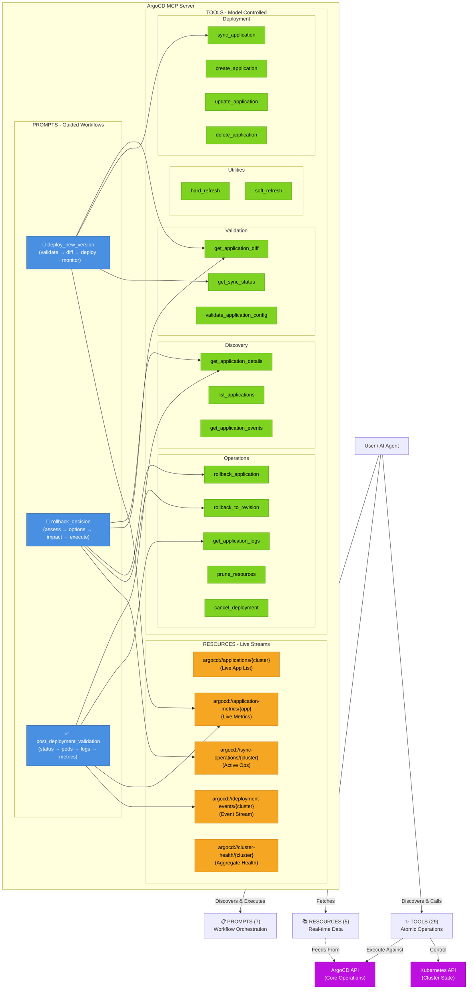

# ArgoCD MCP Server - Workflow Architecture

## Overview

This document outlines the **ArgoCD MCP Server** architecture, following the MCP standard three-component model. This architecture is designed to manage Kubernetes workloads using GitOps principles.

- **TOOLS (29 total)**: Atomic operations for discovery, deployment, repository management, and project management.
- **PROMPTS (7 total)**: Guided, step-by-step workflows for complex operations.
- **RESOURCES (5 total)**: Real-time data streams for monitoring and status tracking.

---

## 🏗️ LAYER 1: TOOLS (The Capabilities)

The server exposes 29 distinct tools categorized by function.

### 1. Application Management (7 tools)
*CRUD operations for ArgoCD Applications.*
- `list_applications`: Discover apps with filtering.
- `get_application_details`: Deep dive into app configuration and state.
- `create_application`: Register new apps in ArgoCD.
- `update_application`: Modify existing app config.
- `delete_application`: Remove apps.
- `validate_application_config`: Pre-deployment validation check.
- `get_application_events`: Specific history and events.

### 2. Deployment Executor (10 tools)
*Core sync and state operations.*
- `sync_application`: The primary deployment trigger.
- `get_application_diff`: Critical pre-sync check (what will change?).
- `get_sync_status`: Monitor ongoing operations.
- `rollback_application` / `rollback_to_revision`: Recovery mechanisms.
- `get_application_logs`: Debugging support with concise summaries and automatic error detection.
- `prune_resources`: Cleanup orphaned resources.
- `hard_refresh` / `soft_refresh`: Cache management.
- `cancel_deployment`: Emergency stop.

### 3. Repository Management (7 tools)
*Git repository onboarding and lifecycle management.*
- `onboard_repository_https`: Onboard Git repositories via HTTPS (credentials from env vars).
- `onboard_repository_ssh`: Onboard Git repositories via SSH (key from file path).
- `list_repositories`: List all registered repositories.
- `get_repository`: Get repository details and connection status.
- `validate_repository_connection`: Test repository connectivity.
- `delete_repository`: Remove registered repositories.
- `generate_repository_secret_manifest`: Generate Kubernetes Secret manifests for repo auth.

### 4. Project Management (5 tools)
*ArgoCD project administration and access control.*
- `create_project`: Create new ArgoCD projects with RBAC policies.
- `list_projects`: List all projects.
- `get_project`: Get project details and policies.
- `delete_project`: Remove projects.
- `generate_project_manifest`: Generate AppProject YAML manifests.

---

## 📋 LAYER 2: PROMPTS (The Workflows)

Prompts orchestrate multiple tools into cohesive, safe workflows.

### 1. `deploy_new_version`
**Goal:** Generic safe deployment wrapper.
**Flow:**
1.  **Validate**: Checks cluster connectivity and app existence.
2.  **Diff**: Calls `get_application_diff` to show pending changes.
3.  **Review**: Asks user to confirm changes.
4.  **Deploy**: Calls `sync_application`.
5.  **Monitor**: Polls status until completion.

### 2. `rollback_decision`
**Goal:** Guided recovery from failure.
**Flow:**
1.  **Assess**: Shows current version and history (`get_application_details`).
2.  **Options**: Presents choice between "Rollback 1 step" or "Specific Revision".
3.  **Impact**: Calls `get_application_diff` to show what reversions will happen.
4.  **Execute**: Runs the chosen rollback tool.

### 3. `post_deployment_validation`
**Goal:** Comprehensive health check.
**Flow:**
1.  **Status**: Checks `sync_status` and `health_status`.
2.  **Pods**: Verifies pod readiness and restart counts.
3.  **Logs**: Scans recent logs for errors.
4.  **Metrics**: Validates error rates and latency.

---

## 📡 LAYER 3: RESOURCES (The Data)

Real-time read-only streams for monitoring and context.

| URI Template | Description |
| :--- | :--- |
| `argocd://applications/{cluster_name}` | List of all apps with their live health/sync state. |
| `argocd://application-metrics/{cluster}/{app}` | Live metrics (CPU, Memory, Error Rates) for an app. |
| `argocd://sync-operations/{cluster_name}` | Active sync ops (good for finding stuck deployments). |
| `argocd://deployment-events/{cluster_name}` | Event stream (SyncStarted, SyncFailed, HealthChanged). |
| `argocd://cluster-health/{cluster_name}` | Aggregate health score of the cluster. |

---

## Workflow Diagram

