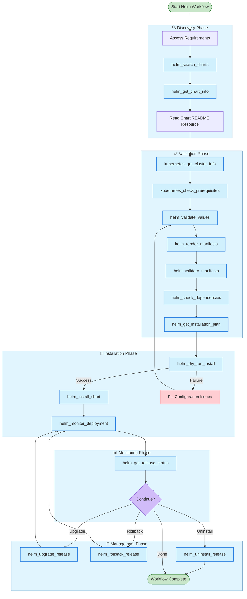
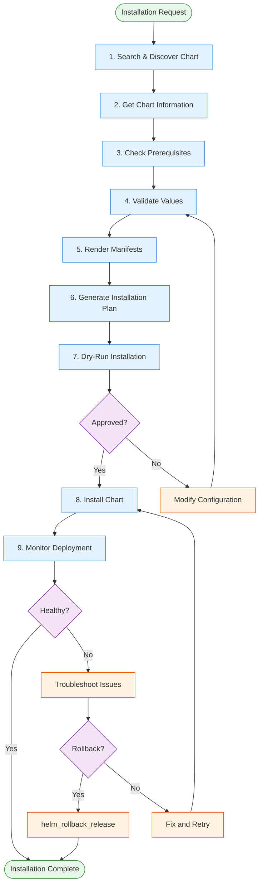

# Helm MCP Server Workflow Guide

## Overview

This comprehensive workflow guide provides structured approaches for managing Kubernetes workloads using Helm via the Helm MCP Server. As an AI coding assistant utilizing this MCP server, follow these workflows when helping users with Helm chart discovery, installation, upgrades, validation, monitoring, and troubleshooting.

---

## Table of Contents

1. [MCP Server Capabilities](#mcp-server-capabilities)
2. [Tools Reference](#tools-reference)
3. [Resources Reference](#resources-reference)
4. [Prompts Reference](#prompts-reference)
5. [Workflow Diagrams](#workflow-diagrams)
6. [Detailed Workflow Steps](#detailed-workflow-steps)
7. [Best Practices](#best-practices)

---

## MCP Server Capabilities

The Helm MCP Server provides five categories of functionality:

| Category | Purpose | Key Operations |
|----------|---------|----------------|
| **Discovery** | Find and explore Helm charts | Search charts, get chart info |
| **Installation** | Deploy and manage releases | Install, upgrade, rollback, uninstall |
| **Validation** | Ensure correctness before deployment | Validate values, render manifests, check dependencies |
| **Kubernetes** | Inspect cluster state | Cluster info, namespaces, releases, prerequisites |
| **Monitoring** | Track deployment health | Monitor deployments, get release status |

---

## Tools Reference

### Discovery Tools

| Tool | Description | Key Parameters |
|------|-------------|----------------|
| `helm_search_charts` | Search for Helm charts in repositories | `query`, `repository`, `limit` |
| `helm_get_chart_info` | Get detailed information about a specific chart | `chart_name`, `repository` |
| `helm_ensure_repository` | Ensure a Helm repository exists, adding it if necessary | `repo_name`, `repo_url` (optional) |

### Installation Tools

| Tool | Description | Key Parameters |
|------|-------------|----------------|
| `helm_install_chart` | Install a Helm chart to cluster | `chart_name`, `release_name`, `namespace`, `values`, `dry_run`, `skip_crds`, `extra_args` |
| `helm_upgrade_release` | Upgrade an existing Helm release | `release_name`, `chart_name`, `namespace`, `values` |
| `helm_rollback_release` | Rollback to a previous revision | `release_name`, `namespace`, `revision` |
| `helm_uninstall_release` | Uninstall a Helm release | `release_name`, `namespace` |
| `helm_dry_run_install` | Preview installation without deploying | `chart_name`, `release_name`, `namespace`, `values`, `skip_crds`, `extra_args` |

### Validation Tools

| Tool | Description | Key Parameters |
|------|-------------|----------------|
| `helm_validate_values` | Validate chart values against schema | `chart_name`, `values`, `json_schema` |
| `helm_render_manifests` | Render Kubernetes manifests from chart | `chart_name`, `values`, `values_files`, `version`, `namespace`, `kubeconfig_path`, `context_name`, `eks_cluster_name` |
| `helm_validate_manifests` | Validate rendered Kubernetes manifests | `manifests` |
| `helm_check_dependencies` | Check if chart dependencies are available | `chart_name`, `repository` |
| `helm_get_installation_plan` | Generate detailed installation plan with resource estimates | `chart_name`, `values`, `namespace` |

### Kubernetes Tools

| Tool | Description | Key Parameters |
|------|-------------|----------------|
| `kubernetes_get_cluster_info` | Get cluster information | *(none)* |
| `kubernetes_list_namespaces` | List all Kubernetes namespaces | *(none)* |
| `kubernetes_list_contexts` | List all available Kubernetes contexts from kubeconfig | *(none)* |
| `kubernetes_set_context` | Set/switch to a specific Kubernetes context | `context_name` |
| `kubernetes_get_helm_releases` | List all Helm releases in cluster | `namespace` (optional) |
| `kubernetes_check_prerequisites` | Check if cluster meets installation prerequisites | `required_api_version`, `required_resources` |

### Monitoring Tools

| Tool | Description | Key Parameters |
|------|-------------|----------------|
| `helm_monitor_deployment` | Monitor deployment health asynchronously | `release_name`, `namespace`, `max_wait_seconds`, `check_interval` |
| `helm_get_release_status` | Get current status of a Helm release | `release_name`, `namespace` |

---

## Resources Reference

### Helm Resources

| Resource URI | Description | Returns |
|--------------|-------------|---------|
| `helm://releases` | List all Helm releases in cluster | List of release resources |
| `helm://releases/{release_name}` | Get detailed release information | Release details (JSON) |

### Chart Resources

| Resource URI | Description | Returns |
|--------------|-------------|---------|
| `helm://charts` | List available charts in configured repositories | List of chart resources |
| `helm://charts/{repository}/{chart_name}` | Get chart metadata | Chart metadata (JSON) |
| `helm://charts/{repository}/{chart_name}/readme` | Get chart README | README (Markdown) |

### Kubernetes Resources

| Resource URI | Description | Returns |
|--------------|-------------|---------|
| `kubernetes://cluster-info` | Get Kubernetes cluster information | Cluster info (JSON) |
| `kubernetes://namespaces` | List all Kubernetes namespaces | List of namespace resources |

### Static Documentation Resources

| Resource URI | Description | Returns |
|--------------|-------------|---------|
| `helm://best_practices` | Helm Best Practices from official documentation | Best practices guide (Markdown) |

---

## Prompts Reference

### Available Prompts

| Prompt | Description | Arguments |
|--------|-------------|-----------|
| `helm_workflow_guide` | Complete workflow guide for Helm MCP Server (this document) | *(none)* |
| `helm_quick_start` | Quick start guide for common Helm operations | *(none)* |
| `helm_installation_guidelines` | Best practices for Helm chart installation | *(none)* |
| `helm_troubleshooting_guide` | Troubleshooting guide for common Helm issues | `error_type` (pod-crashloop, pending, connection, image-pull, helm-error) |
| `helm_security_checklist` | Security considerations for Helm deployments | *(none)* |
| `helm_upgrade_guide` | Guide for upgrading existing Helm releases | `chart_name` |
| `helm_rollback_procedures` | Step-by-step rollback procedures | `release_name` |

---

## Workflow Diagrams

### Complete Helm Lifecycle Workflow



### Installation Workflow (Detailed)



---

## Detailed Workflow Steps

### Phase 1: Discovery & Assessment

**Objective:** Find the right Helm chart and understand its requirements

#### Step 1.1: Ensure Repository (Optional)
```
Tool: helm_ensure_repository
Parameters:
  - repo_name: "bitnami" (or your preferred repository)
  - repo_url: null (optional, auto-detected for known repos)
```
**Note:** This step is optional as `helm_search_charts` and `helm_get_chart_info` automatically ensure repositories exist. Use this tool explicitly if you want to add a custom repository or verify repository availability beforehand.

#### Step 1.2: Search for Charts
```
Tool: helm_search_charts
Parameters:
  - query: "postgresql" (or your target application)
  - repository: "bitnami" (or your preferred repository)
  - limit: 10
```

#### Step 1.3: Get Chart Details
```
Tool: helm_get_chart_info
Parameters:
  - chart_name: "postgresql"
  - repository: "bitnami"
```

#### Step 1.4: Review Chart README
```
Resource: helm://charts/{repository}/{chart_name}/readme
```

---

### Phase 2: Cluster Preparation & Validation

**Objective:** Ensure cluster is ready and configuration is valid

#### Step 2.1: List Available Contexts (Multi-Cluster)
```
Tool: kubernetes_list_contexts
```
**Note:** Use this step when working with multiple Kubernetes clusters to see all available contexts.

#### Step 2.2: Set Cluster Context (Multi-Cluster)
```
Tool: kubernetes_set_context
Parameters:
  - context_name: "production-cluster" (or your target cluster context)
```
**Note:** Use this step to switch to a specific Kubernetes cluster context before performing operations.

#### Step 2.3: Check Cluster Information
```
Tool: kubernetes_get_cluster_info
```

#### Step 2.4: Check Prerequisites
```
Tool: kubernetes_check_prerequisites
Parameters:
  - required_api_version: "v1.28.0" (optional)
  - required_resources: ["Deployment", "Service", "ConfigMap"]
```

#### Step 2.5: Validate Values
```
Tool: helm_validate_values
Parameters:
  - chart_name: "bitnami/postgresql"
  - values: { ... your values ... }
  - json_schema: null (optional, will use chart's schema)
```

#### Step 2.6: Render Manifests
```
Tool: helm_render_manifests
Parameters:
  - chart_name: "bitnami/postgresql"
  - values: { ... your values ... }
  - namespace: "production"
  - version: "15.5.0" (optional)
```

#### Step 2.7: Check Dependencies
```
Tool: helm_check_dependencies
Parameters:
  - chart_name: "postgresql"
  - repository: "bitnami"
```

#### Step 2.8: Generate Installation Plan
```
Tool: helm_get_installation_plan
Parameters:
  - chart_name: "bitnami/postgresql"
  - values: { ... your values ... }
  - namespace: "production"
```

---

### Phase 3: Installation

**Objective:** Deploy the Helm chart safely

#### Step 3.1: Dry-Run Installation
```
Tool: helm_dry_run_install
Parameters:
  - chart_name: "bitnami/postgresql"
  - release_name: "my-postgresql"
  - namespace: "production"
  - values: { ... your values ... }
```

#### Step 3.2: Install Chart
```
Tool: helm_install_chart
Parameters:
  - chart_name: "bitnami/postgresql"
  - release_name: "my-postgresql"
  - namespace: "production"
  - values: { ... your values ... }
  - dry_run: false
  - skip_crds: false
  - extra_args: ["--wait", "--timeout", "10m"]
```

---

### Phase 4: Monitoring & Verification

**Objective:** Ensure deployment is healthy and functioning

#### Step 4.1: Monitor Deployment
```
Tool: helm_monitor_deployment
Parameters:
  - release_name: "my-postgresql"
  - namespace: "production"
  - max_wait_seconds: 600
  - check_interval: 5
```

#### Step 4.2: Get Release Status
```
Tool: helm_get_release_status
Parameters:
  - release_name: "my-postgresql"
  - namespace: "production"
```

---

### Phase 5: Lifecycle Management

**Objective:** Manage upgrades, rollbacks, and uninstallation

#### Upgrade Release
```
Tool: helm_upgrade_release
Parameters:
  - release_name: "my-postgresql"
  - chart_name: "bitnami/postgresql"
  - namespace: "production"
  - values: { ... updated values ... }
```

#### Rollback Release
```
Tool: helm_rollback_release
Parameters:
  - release_name: "my-postgresql"
  - namespace: "production"
  - revision: 1 (optional, defaults to previous)
```

#### Uninstall Release
```
Tool: helm_uninstall_release
Parameters:
  - release_name: "my-postgresql"
  - namespace: "production"
```

---

## Best Practices

### Pre-Installation Checklist

- [ ] **Repository Setup**: Use `helm_ensure_repository` if working with custom or new repositories
- [ ] **Cluster Context**: Use `kubernetes_list_contexts` and `kubernetes_set_context` for multi-cluster setups
- [ ] **Search and Research**: Use `helm_search_charts` and review chart documentation
- [ ] **Validate Cluster**: Use `kubernetes_get_cluster_info` and `kubernetes_check_prerequisites`
- [ ] **Validate Configuration**: Use `helm_validate_values` before any installation
- [ ] **Preview Manifests**: Use `helm_render_manifests` to see what will be deployed
- [ ] **Check Dependencies**: Use `helm_check_dependencies` to ensure all requirements are met
- [ ] **Dry-Run First**: Always use `helm_dry_run_install` before actual installation
- [ ] **Review Plan**: Use `helm_get_installation_plan` for resource estimates

### Installation Guidelines

1. **Version Pinning**: Always specify chart versions for reproducibility
2. **Namespace Isolation**: Use dedicated namespaces for different environments
3. **Values Files**: Store values in version-controlled files
4. **Dry-Run Testing**: Never skip dry-run in production environments
5. **Monitoring**: Always monitor deployments after installation

### Security Considerations

Use the `helm_security_checklist` prompt for comprehensive security guidance:

- Use specific image tags (avoid 'latest')
- Never hardcode secrets in values files
- Configure network policies
- Follow principle of least privilege
- Enable Pod Security Standards
- Set resource limits and requests

### Troubleshooting

Use the `helm_troubleshooting_guide` prompt with appropriate error types:

| Error Type | When to Use |
|------------|-------------|
| `pod-crashloop` | Pod enters CrashLoopBackOff state |
| `pending` | Pod stuck in Pending state |
| `connection` | Service connectivity issues |
| `image-pull` | Container image pull failures |
| `helm-error` | Helm operation failures |

### Upgrade Best Practices

Use the `helm_upgrade_guide` prompt for comprehensive upgrade guidance:

1. Review release notes and changelog
2. Check breaking changes between versions
3. Backup current configuration
4. Test in non-production first
5. Use dry-run before actual upgrade
6. Monitor closely after upgrade
7. Have rollback plan ready

### Rollback Procedures

Use the `helm_rollback_procedures` prompt for step-by-step rollback guidance:

1. Review release history with `kubernetes_get_helm_releases`
2. Identify target revision
3. Execute rollback with `helm_rollback_release`
4. Verify rollback with `helm_get_release_status`
5. Document rollback reason and outcome

---

## Multi-Cluster Support

The Helm MCP Server supports multi-cluster operations through:

### Context Management Tools

| Tool | Purpose |
|------|---------|
| `kubernetes_list_contexts` | List all available Kubernetes contexts from kubeconfig |
| `kubernetes_set_context` | Switch to a specific Kubernetes context for subsequent operations |

### Workflow for Multi-Cluster Operations

1. **List Available Contexts**: Use `kubernetes_list_contexts` to see all configured contexts
2. **Switch Context**: Use `kubernetes_set_context(context_name="target-cluster")` to switch to the desired cluster
3. **Verify Connection**: Use `kubernetes_get_cluster_info` to confirm you're connected to the correct cluster
4. **Proceed with Operations**: All subsequent Helm operations will use the selected context

### Additional Multi-Cluster Parameters

| Parameter | Description |
|-----------|-------------|
| `kubeconfig_path` | Path to kubeconfig file |
| `context_name` | Kubeconfig context name |
| `eks_cluster_name` | AWS EKS cluster name |

These parameters are available in the `helm_render_manifests` tool and can be extended to other tools as needed.

---

## Quick Reference

### Common Workflows

| Workflow | Primary Tools |
|----------|---------------|
| **New Installation** | `helm_ensure_repository` (optional) → `helm_search_charts` → `helm_get_chart_info` → `helm_validate_values` → `helm_dry_run_install` → `helm_install_chart` → `helm_monitor_deployment` |
| **Upgrade Existing** | `helm_get_release_status` → `helm_validate_values` → `helm_upgrade_release` → `helm_monitor_deployment` |
| **Troubleshoot Issues** | `helm_get_release_status` → `kubernetes_get_helm_releases` → Use `helm_troubleshooting_guide` prompt |
| **Rollback** | `kubernetes_get_helm_releases` → `helm_rollback_release` → `helm_monitor_deployment` |
| **Cleanup** | `kubernetes_get_helm_releases` → `helm_uninstall_release` |
| **Multi-Cluster Switch** | `kubernetes_list_contexts` → `kubernetes_set_context` → `kubernetes_get_cluster_info` → Proceed with operations |

### Key Resources

| Resource | Use Case |
|----------|----------|
| `helm://releases` | View all deployed releases |
| `helm://charts/{repo}/{name}` | Get chart metadata |
| `helm://charts/{repo}/{name}/readme` | Read chart documentation |
| `kubernetes://cluster-info` | Verify cluster connectivity |
| `kubernetes://namespaces` | List available namespaces |

---

*This workflow guide is designed to help you deliver reliable, secure, and production-ready Helm deployments using the Helm MCP Server. Always leverage the available tools, resources, and prompts for comprehensive Helm operations management.* 