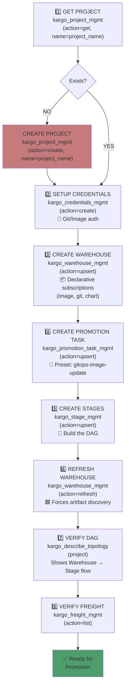
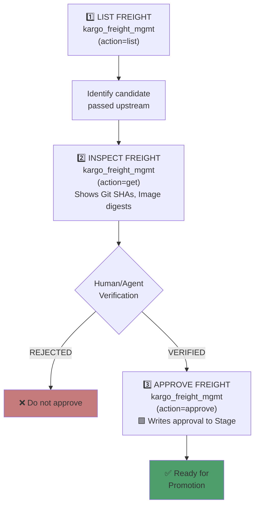
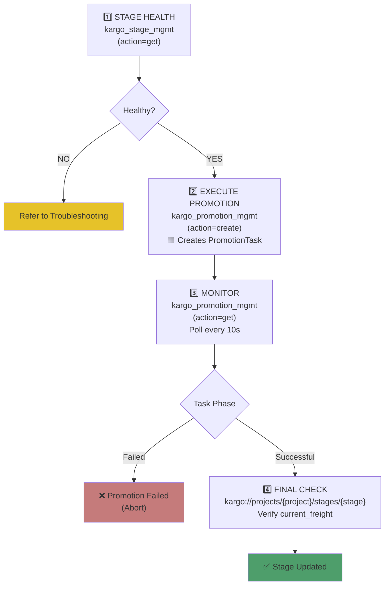
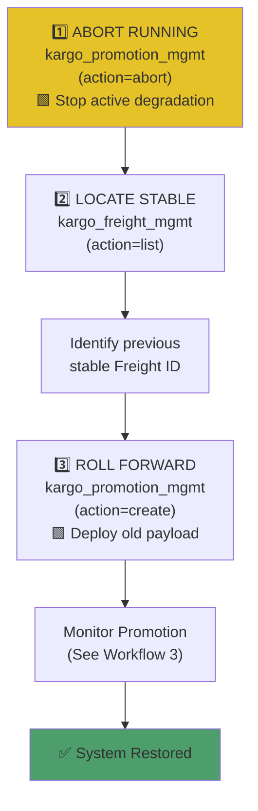
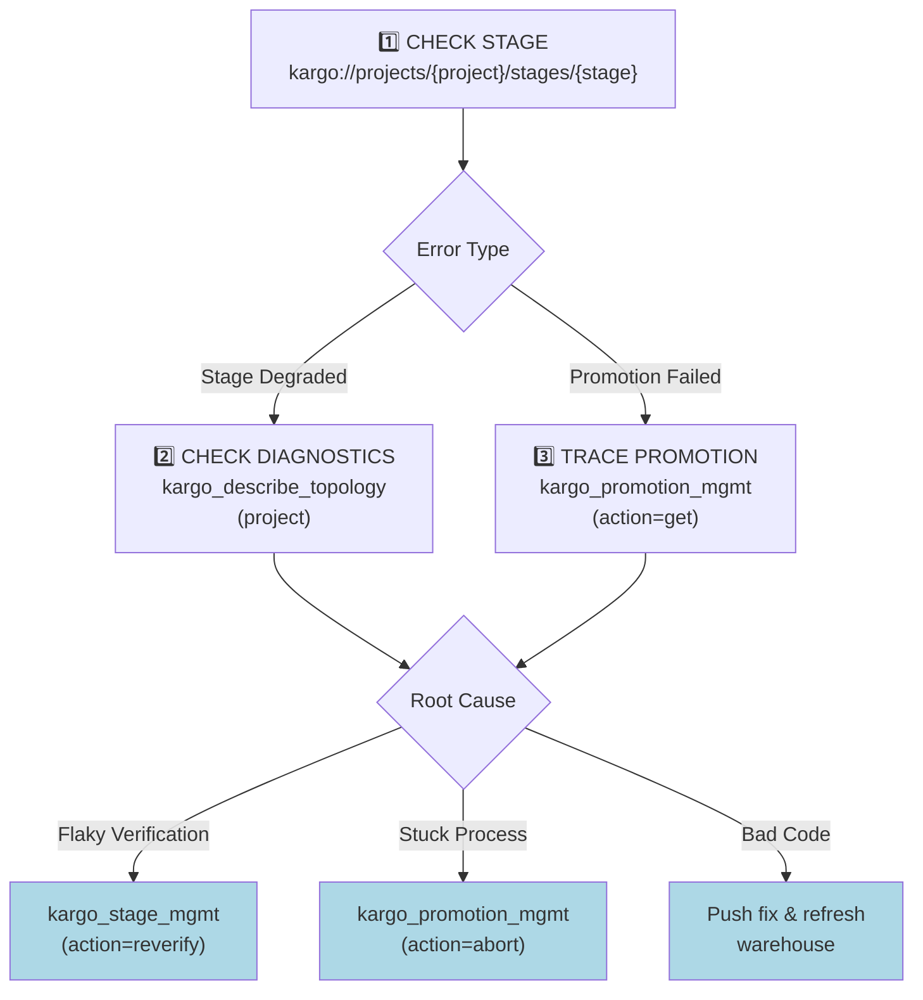

# Kargo MCP Server — Application Workflow Journeys

**A comprehensive guide to how Tools, Resources, and Prompts coordinate across real-world continuous promotion scenarios.**

> 💬 **New to the tools?** See the **[README.md](../../README.md)** for an overview of all tools and resources available in this server.

---

## Table of Contents

1. [Workflow 1: Pipeline Onboarding](#1-workflow-1-pipeline-onboarding)
2. [Workflow 2: Manual Approval](#2-workflow-2-manual-approval)
3. [Workflow 3: Promotion Execution](#3-workflow-3-promotion-execution)
4. [Workflow 4: Emergency Rollback](#4-workflow-4-emergency-rollback)
5. [Workflow 5: Troubleshooting](#5-workflow-5-troubleshooting)

---

## 1. Workflow 1: Pipeline Onboarding

### Scenario

You have a new Kargo project and want to set up the full continuous promotion pipeline from scratch — including warehouse, promotion task, stages, and credentials.

### Journey Diagram

### Tool & Resource Coordination

| Phase | Tools Used | Resources Polled | Purpose |
|-------|-----------|-----------------|---------|
| Pre-flight | `kargo_project_mgmt` | `kargo://projects/{project}` | Verify or create the namespace |
| Credentials | `kargo_credentials_mgmt(action="create")` | — | Authenticate Kargo to Git/Image repos |
| Warehouse | `kargo_warehouse_mgmt(action="upsert")` | — | Create warehouse with image/git/chart subscriptions |
| PromotionTask | `kargo_promotion_task_mgmt(action="upsert")` | — | Create promotion steps using a preset (e.g., `gitops-image-update`) or custom steps |
| Stages | `kargo_stage_mgmt(action="upsert")` | — | Build the promotion DAG |
| Discovery | `kargo_warehouse_mgmt(action="refresh")` | — | Force Kargo to pull new Git/Image artifacts |
| Verification | `kargo_describe_topology`, `kargo_freight_mgmt(action="list")` | — | Validate that Freight was generated and the DAG is correct |

**Detailed Guide:** [ONBOARDING_TEST_GUIDE.md](ONBOARDING_TEST_GUIDE.md)

---

## 2. Workflow 2: Manual Approval

### Scenario

A high-risk stage (e.g., Production) requires human or external verification before a payload can enter.

### Journey Diagram

### Tool & Resource Coordination

| Phase | Tools Used | Resources Polled | Purpose |
|-------|-----------|-----------------|---------|
| Identify | `kargo_freight_mgmt(action="list")` | `kargo://projects/{project}/freight/{freight_id}` | Find payloads verified in upstream stages |
| Verify | `kargo_freight_mgmt(action="get")` | — | Check exact artifact content (Git/Image) |
| Approve | `kargo_freight_mgmt(action="approve")` | `kargo://projects/{project}/stages/{stage}` | Gate the payload for promotion |

**Detailed Guide:** [APPROVAL_TEST_GUIDE.md](APPROVAL_TEST_GUIDE.md)

---

## 3. Workflow 3: Promotion Execution

### Scenario

You want to move an approved Freight payload into a Stage.

### Journey Diagram

### Tool & Resource Coordination

| Phase | Tools Used | Resources Polled | Purpose |
|-------|-----------|-----------------|---------|
| Pre-flight | `kargo_stage_mgmt(action="get")`, `kargo_freight_mgmt(action="list")` | — | Ensure stage is ready to receive Freight |
| Execution | `kargo_promotion_mgmt(action="create")` | — | Trigger Kargo Promotion |
| Monitor | `kargo_promotion_mgmt(action="get")` | `kargo://projects/{project}/promotions/{promotion_name}` | Track Promotion steps (Git clone, Kustomize, ArgoCD sync) |
| Verify | — | `kargo://projects/{project}/stages/{stage}` | Confirm `current_freight` is updated |

**Detailed Guide:** [PROMOTION_TEST_GUIDE.md](PROMOTION_TEST_GUIDE.md)

---

## 4. Workflow 4: Emergency Rollback

### Scenario

A promotion caused an outage. You need to roll back immediately using Kargo's "Roll Forward" paradigm.

### Journey Diagram

### Tool & Resource Coordination

| Phase | Tools Used | Resources Polled | Purpose |
|-------|-----------|-----------------|---------|
| Halt | `kargo_promotion_mgmt(action="abort")` | `kargo://projects/{project}/promotions/{promotion_name}` | Stop broken state transitions |
| Locate | `kargo_freight_mgmt(action="list")` | — | Find the last known good configuration |
| Restore | `kargo_promotion_mgmt(action="create")` | — | Trigger the roll-forward operation |

**Detailed Guide:** [ROLLBACK_TEST_GUIDE.md](ROLLBACK_TEST_GUIDE.md)

---

## 5. Workflow 5: Troubleshooting

### Scenario

A stage is degraded or a promotion is stuck.

### Journey Diagram

### Tool & Resource Coordination

| Phase | Tools Used | Resources Polled | Purpose |
|-------|-----------|-----------------|---------|
| Diagnosis | `kargo_promotion_mgmt(action="get")`, `kargo_project_mgmt(action="get")` | `kargo://projects/{project}/stages/{stage}` | Read raw K8s conditions and error messages |
| Remediation | `kargo_stage_mgmt(action="reverify")`, `kargo_promotion_mgmt(action="abort")` | — | Retry flaky tests or kill stuck processes |

**Detailed Guide:** [TROUBLESHOOTING_TEST_GUIDE.md](TROUBLESHOOTING_TEST_GUIDE.md)
