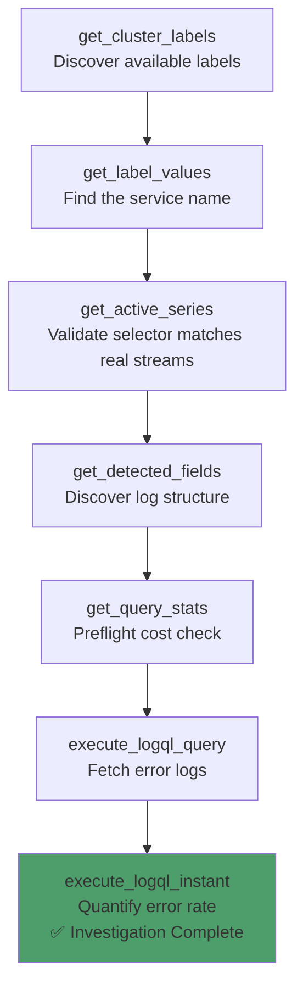
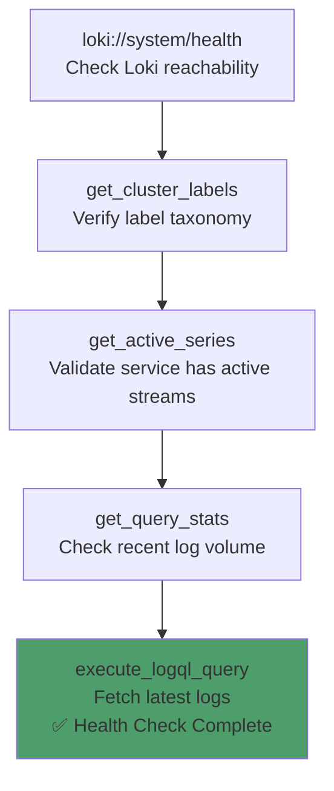
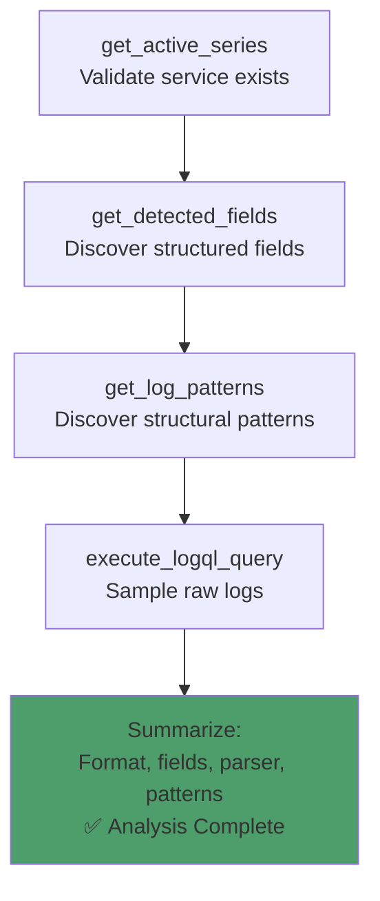
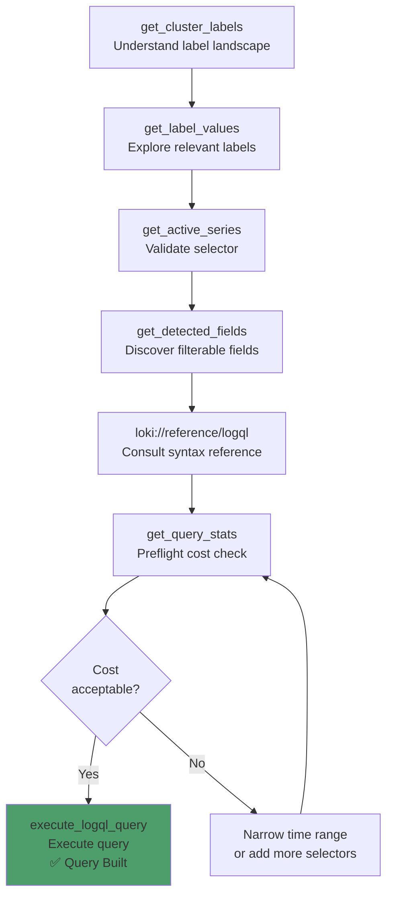
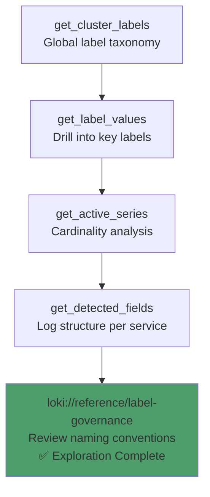
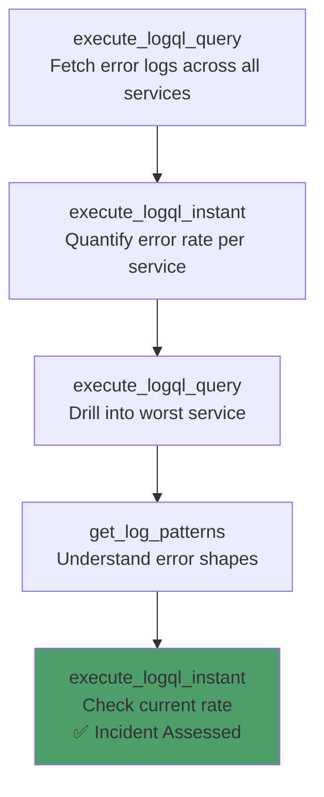
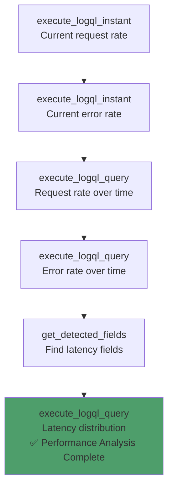

# Loki MCP Server — Observability Journeys

**A comprehensive guide to how Tools, Resources, and Prompts coordinate across real-world Grafana Loki log observability workflows.**

> 💬 **New to the tools?** See the companion **[PROMPT_REFERENCE.md](PROMPT_REFERENCE.md)** — natural language prompts for every tool call in this guide.

---

## Table of Contents

1. [Prerequisites & Environment Setup](#1-prerequisites--environment-setup)
2. [Workflow 1: Error Investigation](#2-workflow-1-error-investigation)
3. [Workflow 2: Service Health Check](#3-workflow-2-service-health-check)
4. [Workflow 3: Log Structure Analysis](#4-workflow-3-log-structure-analysis)
5. [Workflow 4: LogQL Query Builder](#5-workflow-4-logql-query-builder)
6. [Workflow 5: Schema Exploration](#6-workflow-5-schema-exploration)
7. [Workflow 6: Incident Response](#7-workflow-6-incident-response)
8. [Workflow 7: Performance Analysis](#8-workflow-7-performance-analysis)

---

## 1. Prerequisites & Environment Setup

### Infrastructure Requirements

| Component | Requirement | Notes |
|-----------|-------------|-------|
| **Grafana Loki** | Accessible via HTTP | Single-binary, simple-scalable, or microservices mode |
| **Python** | 3.12+ | For running the MCP server |
| **Pattern Ingester** | Optional | Required for `get_log_patterns` |
| **Loki 3.0+** | Optional | Required for `get_detected_fields` |

### MCP Server Setup

```bash
git clone https://github.com/talkops-ai/talkops-mcp.git
cd talkops-mcp/src/loki-mcp-server
uv venv && source .venv/bin/activate
uv pip install -e ".[dev]"

# Configure
export LOKI_URL=http://localhost:3100
export MCP_TRANSPORT=http

# Run
uv run loki-mcp-server
```

### MCP Client Configuration

```json
{
  "mcpServers": {
    "loki": {
      "url": "http://localhost:8769/mcp",
      "description": "Grafana Loki log observability MCP server"
    }
  }
}
```

---

## 2. Workflow 1: Error Investigation

### Scenario

A service is producing errors in production. You need to discover the environment, find error logs, quantify the error rate, and understand the log structure to build effective filter pipelines. The AI follows a **discovery-first** approach: learn the environment, then drill into errors.

> **Guided Prompt**: Use `investigate_errors` for the full step-by-step flow.

### Journey Diagram



### Step-by-Step

| Step | Action | Tool / Resource | Key Parameters |
|------|--------|-----------------|----------------|
| 1 | Discover labels | **Tool**: `get_cluster_labels()` | Returns all label names |
| 2 | Find the service | **Tool**: `get_label_values(label="app")` | Returns valid app names |
| 3 | Validate selector | **Tool**: `get_active_series(match='{app="checkout"}')` | Confirms streams exist, shows cardinality |
| 4 | Discover fields | **Tool**: `get_detected_fields(query='{app="checkout"}')` | Returns JSON/logfmt keys, types, parsers |
| 5 | Check cost | **Tool**: `get_query_stats(query='{app="checkout"}', start="now-1h")` | Returns streams, chunks, bytes |
| 6 | Fetch error logs | **Tool**: `execute_logql_query(query='{app="checkout"} |= "error" | json', start="now-1h", limit=100)` | Returns log streams |
| 7 | Quantify error rate | **Tool**: `execute_logql_instant(query='sum(rate({app="checkout"} |= "error" [5m]))')` | Returns scalar rate |

### Resources Used

| Resource | When | Purpose |
|----------|------|---------|
| `loki://system/health` | Before Step 1 | Verify Loki is reachable |
| `loki://reference/logql` | Step 6 | LogQL syntax reference for building queries |
| `loki://reference/query-templates` | Step 6 | Common error investigation query patterns |

### Key Concepts

**Discovery-First Workflow:**
The recommended tool call order ensures the AI never halluccinates labels, never guesses at log structure, and always pre-checks cost before executing expensive queries.

| Step | Purpose | Tool |
|------|---------|------|
| Labels first | Know what dimensions exist | `get_cluster_labels` |
| Values second | Know valid values for those dimensions | `get_label_values` |
| Validate third | Confirm the selector matches real data | `get_active_series` |
| Structure fourth | Know what fields can be filtered on | `get_detected_fields` |
| Preflight fifth | Estimate query cost | `get_query_stats` |
| Execute last | Run the actual query | `execute_logql_query` |

---

## 3. Workflow 2: Service Health Check

### Scenario

You want to verify that Loki is healthy and that a specific service is producing logs. This is the first thing to do when setting up monitoring for a new service, or when investigating why logs aren't appearing.

> **Guided Prompt**: Use `check_health` for the full step-by-step flow.

### Journey Diagram



### Step-by-Step

| Step | Action | Tool / Resource | Key Parameters |
|------|--------|-----------------|----------------|
| 1 | System health | **Resource**: `loki://system/health` | Returns reachable status and label count |
| 2 | Label taxonomy | **Tool**: `get_cluster_labels()` | Returns all available labels |
| 3 | Service validation | **Tool**: `get_active_series(match='{app="payment-service"}')` | Confirms active streams |
| 4 | Recent volume | **Tool**: `get_query_stats(query='{app="payment-service"}', start="now-1h")` | Streams, entries, bytes |
| 5 | Latest logs | **Tool**: `execute_logql_query(query='{app="payment-service"}', start="now-15m", limit=10)` | Sample log lines |

### Health Check Interpretation

| Outcome | Meaning | Next Action |
|---------|---------|-------------|
| Health reachable, labels present, streams active | ✅ Healthy — logs are flowing | Proceed with analysis |
| Health reachable, labels present, no streams | ⚠️ Service not found — label may be wrong | Try `get_label_values(label="app")` to find correct name |
| Health reachable, no labels | ⚠️ No data ingested | Check ingestion pipeline (OTel Collector → Loki) |
| Health unreachable | ❌ Loki is down | Check `LOKI_URL` and Loki deployment |

---

## 4. Workflow 3: Log Structure Analysis

### Scenario

You want to understand the log format for a service — is it JSON? Logfmt? Plain text? What fields are available? What parser should you use? This is essential before building any LogQL pipelines with `| json`, `| logfmt`, or `| pattern`.

> **Guided Prompt**: Use `analyze_log_structure` for the full step-by-step flow.

### Journey Diagram



### Step-by-Step

| Step | Action | Tool / Resource | Key Parameters |
|------|--------|-----------------|----------------|
| 1 | Validate service | **Tool**: `get_active_series(match='{app="api-gateway"}')` | Confirms streams exist |
| 2 | Discover fields | **Tool**: `get_detected_fields(query='{app="api-gateway"}')` | Returns fields, types, parsers |
| 3 | Discover patterns | **Tool**: `get_log_patterns(query='{app="api-gateway"}', start="now-3h")` | Returns structural patterns |
| 4 | Sample raw logs | **Tool**: `execute_logql_query(query='{app="api-gateway"}', start="now-15m", limit=5)` | Raw log lines for validation |

### Detected Fields Output

Each detected field includes:

| Field | Description |
|-------|-------------|
| `label` | Field name (e.g., `level`, `status_code`, `latency_ms`) |
| `type` | Inferred type: `string`, `int`, `float` |
| `cardinality` | Estimated number of unique values |
| `parsers` | Parser(s) needed to extract: `["json"]`, `["logfmt"]`, `["json", "logfmt"]` |

### Recommended Parser Decision Tree

| Log Format | How to Detect | LogQL Parser |
|------------|---------------|-------------|
| JSON | Fields show `parsers: ["json"]` | `| json` |
| Logfmt | Fields show `parsers: ["logfmt"]` | `| logfmt` |
| Mixed | Fields show both parsers | Try `| json` first, fallback to `| logfmt` |
| Unstructured | No fields detected | Use `| pattern "<pattern>"` from `get_log_patterns` |

---

## 5. Workflow 4: LogQL Query Builder

### Scenario

You want to build a LogQL query from natural language intent — for example, *"find slow HTTP requests with status 500 in the checkout service"*. The AI discovers available labels and fields, consults the reference, constructs the query, pre-checks cost, and executes.

> **Guided Prompt**: Use `build_logql_query` for the full step-by-step flow.

### Journey Diagram



### Step-by-Step

| Step | Action | Tool / Resource | Key Parameters |
|------|--------|-----------------|----------------|
| 1 | Discover labels | **Tool**: `get_cluster_labels()` | Available label dimensions |
| 2 | Explore values | **Tool**: `get_label_values(label="app")` | Valid service names |
| 3 | Validate selector | **Tool**: `get_active_series(match='{app="checkout"}')` | Confirm streams exist |
| 4 | Discover fields | **Tool**: `get_detected_fields(query='{app="checkout"}')` | Filterable fields |
| 5 | Load references | **Resource**: `loki://reference/logql`, `loki://reference/query-templates` | Syntax and examples |
| 6 | Preflight | **Tool**: `get_query_stats(query='{app="checkout"}', start="now-1h")` | Cost estimate |
| 7 | Execute | **Tool**: `execute_logql_query(query='{app="checkout"} | json | status_code=500 | latency_ms > 500', start="now-1h")` | Results |

### LogQL Quick Reference

| Concept | Syntax | Example |
|---------|--------|---------|
| Stream selector | `{label="value"}` | `{app="checkout"}` |
| Line filter | `|= "text"`, `!= "text"` | `{app="checkout"} |= "error"` |
| Regex filter | `|~ "pattern"`, `!~ "pattern"` | `{app="checkout"} |~ "status=[45]\\d\\d"` |
| JSON parser | `| json` | `{app="checkout"} | json` |
| Logfmt parser | `| logfmt` | `{app="checkout"} | logfmt` |
| Pattern parser | `| pattern "<pattern>"` | `{app="checkout"} | pattern "<_> status=<status>"` |
| Label filter | `| label op value` | `| status_code >= 400` |
| Metric rate | `rate({...} [interval])` | `rate({app="checkout"} [5m])` |
| Count | `count_over_time({...} [interval])` | `count_over_time({app="checkout"} |= "error" [5m])` |

### Resources Used

| Resource | When | Purpose |
|----------|------|---------|
| `loki://reference/logql` | Step 5 | Full LogQL syntax reference |
| `loki://reference/query-templates` | Step 5 | Common query patterns |
| `loki://config/guardrails` | Step 6 | Current safety thresholds |

---

## 6. Workflow 5: Schema Exploration

### Scenario

You want a complete picture of the Loki cluster's label taxonomy, service inventory, cardinality health, and log formats across services. This is the recommended starting workflow when connecting to a new Loki instance for the first time.

> **Guided Prompt**: Use `explore_schema` for the full step-by-step flow.

### Journey Diagram



### Step-by-Step

| Step | Action | Tool / Resource | Key Parameters |
|------|--------|-----------------|----------------|
| 1 | Global labels | **Tool**: `get_cluster_labels()` | All label names |
| 2 | Service inventory | **Tool**: `get_label_values(label="app")` | All services sending logs |
| 3 | Namespace inventory | **Tool**: `get_label_values(label="namespace")` | All namespaces |
| 4 | Cardinality analysis | **Tool**: `get_active_series(match='{namespace="production"}')` | Per-label cardinality + warnings |
| 5 | Log structure | **Tool**: `get_detected_fields(query='{app="checkout"}')` | Fields for a representative service |
| 6 | Governance review | **Resource**: `loki://reference/label-governance` | Naming conventions, cardinality rules |

### Cardinality Health Assessment

The `get_active_series` tool returns per-label cardinality and warnings for labels exceeding the configured threshold:

| Cardinality Level | Unique Values | Assessment |
|-------------------|--------------|------------|
| Low | < 100 | ✅ Safe for stream selectors |
| Medium | 100 – 1,000 | ⚠️ Acceptable but monitor growth |
| High | 1,000 – 10,000 | ⚠️ Consider structured metadata |
| Very High | > 10,000 | ❌ Move to structured metadata or line filters |

### Resources Used

| Resource | When | Purpose |
|----------|------|---------|
| `loki://config/guardrails` | Step 4 | Understand current thresholds |
| `loki://reference/label-governance` | Step 6 | Naming conventions, cardinality rules |
| `loki://reference/best-practices` | After exploration | Best practices for label design |

---

## 7. Workflow 6: Incident Response

### Scenario

There's an active incident — you need to see error logs across all services immediately. No time for full discovery — this workflow skips the leisurely exploration and goes straight to execution, using the broadest possible selectors and the most recent time windows.

### Journey Diagram



### Step-by-Step

| Step | Action | Tool / Resource | Key Parameters |
|------|--------|-----------------|----------------|
| 1 | Broad error search | **Tool**: `execute_logql_query(query='{namespace="production"} |= "error"', start="now-15m", limit=100)` | All errors across production |
| 2 | Error rate by service | **Tool**: `execute_logql_instant(query='sum by (app) (rate({namespace="production"} |= "error" [5m]))')` | Error rate per service |
| 3 | Drill into worst service | **Tool**: `execute_logql_query(query='{app="<worst_service>"} |= "error" | json', start="now-15m", limit=50)` | Detailed error logs |
| 4 | Error patterns | **Tool**: `get_log_patterns(query='{app="<worst_service>"}', start="now-3h")` | Structural patterns |
| 5 | Current state | **Tool**: `execute_logql_instant(query='sum(rate({app="<worst_service>"} |= "error" [1m]))')` | Live error rate |

### Incident Response Quick Reference

| Query Pattern | Purpose |
|--------------|---------|
| `{namespace="production"} |= "error"` | All error logs in production |
| `{namespace="production"} |= "panic" or |= "fatal"` | Critical errors only |
| `sum by (app) (rate({namespace="production"} |= "error" [5m]))` | Error rate per service |
| `topk(5, sum by (app) (rate({namespace="production"} |= "error" [5m])))` | Top 5 error-producing services |

---

## 8. Workflow 7: Performance Analysis

### Scenario

You want to understand the performance characteristics of a service — request rate, error rate, and latency distribution — using LogQL metric queries. This is the Loki equivalent of a RED (Rate, Errors, Duration) analysis using log data.

### Journey Diagram



### Step-by-Step

| Step | Action | Tool / Resource | Key Parameters |
|------|--------|-----------------|----------------|
| 1 | Current request rate | **Tool**: `execute_logql_instant(query='sum(rate({app="order-service"} [5m]))')` | Requests per second |
| 2 | Current error rate | **Tool**: `execute_logql_instant(query='sum(rate({app="order-service"} |= "error" [5m]))')` | Errors per second |
| 3 | Request rate trend | **Tool**: `execute_logql_query(query='sum(rate({app="order-service"} [5m]))', start="now-6h", step="5m")` | Rate time series |
| 4 | Error rate trend | **Tool**: `execute_logql_query(query='sum(rate({app="order-service"} |= "error" [5m]))', start="now-6h", step="5m")` | Error time series |
| 5 | Discover latency field | **Tool**: `get_detected_fields(query='{app="order-service"}')` | Find `latency_ms` or `duration` field |
| 6 | Latency analysis | **Tool**: `execute_logql_query(query='avg_over_time({app="order-service"} | json | unwrap latency_ms [5m])', start="now-6h", step="5m")` | Average latency over time |

### LogQL Metric Functions Reference

| Function | Purpose | Example |
|----------|---------|---------|
| `rate({...} [interval])` | Log lines per second | `rate({app="checkout"} [5m])` |
| `count_over_time({...} [interval])` | Total log lines in window | `count_over_time({app="checkout"} [5m])` |
| `avg_over_time({...} | unwrap field [interval])` | Average value | `avg_over_time({app="checkout"} | json | unwrap latency_ms [5m])` |
| `sum_over_time({...} | unwrap field [interval])` | Sum of values | `sum_over_time({app="checkout"} | json | unwrap bytes_sent [5m])` |
| `max_over_time({...} | unwrap field [interval])` | Maximum value | `max_over_time({app="checkout"} | json | unwrap latency_ms [5m])` |
| `quantile_over_time(q, {...} | unwrap field [interval])` | Quantile (e.g., P99) | `quantile_over_time(0.99, {app="checkout"} | json | unwrap latency_ms [5m])` |

### Resources Used

| Resource | When | Purpose |
|----------|------|---------|
| `loki://reference/logql` | Before Step 1 | Metric function syntax |
| `loki://config/guardrails` | Before Step 3 | Understand time window limits |

---

*Document Version: 1.0 | Companion to [PROMPT_REFERENCE.md](PROMPT_REFERENCE.md)*
