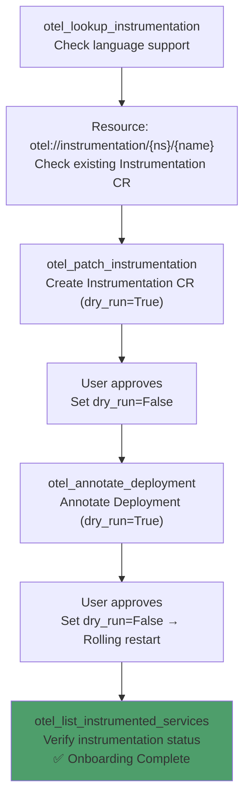
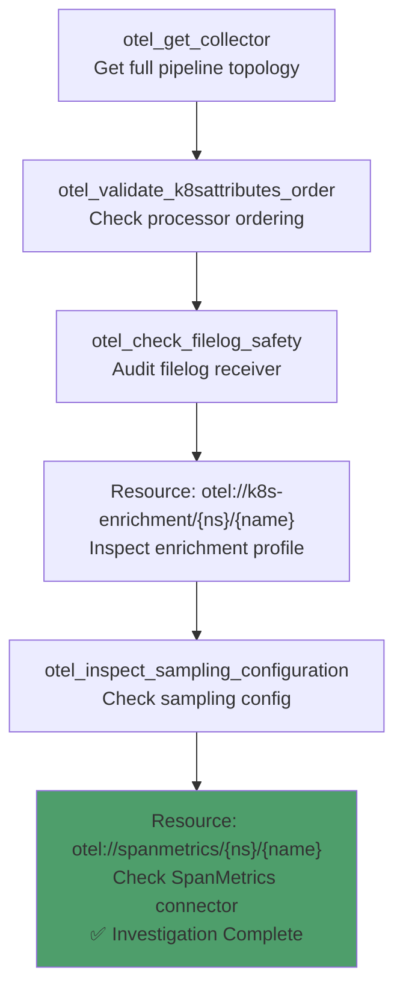
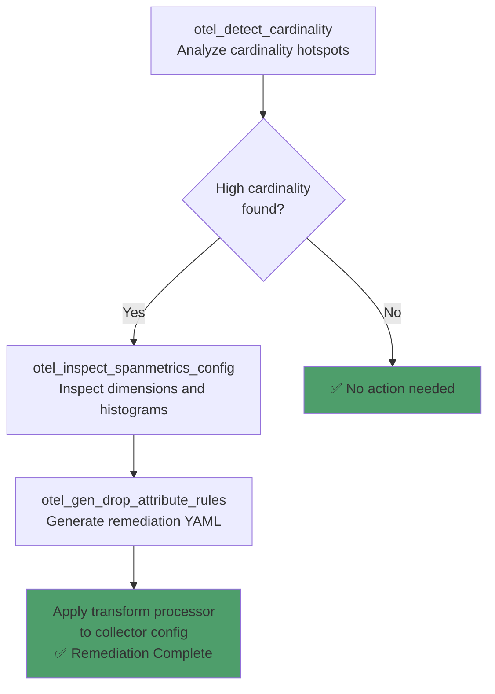
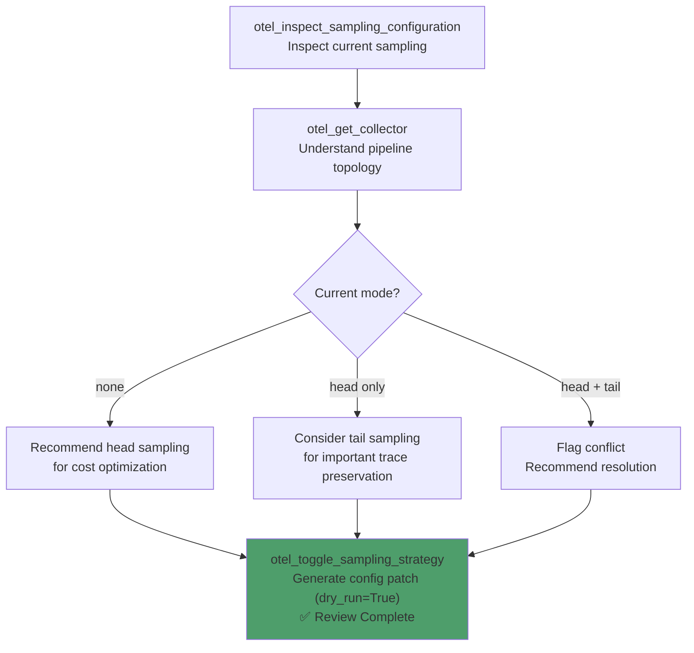
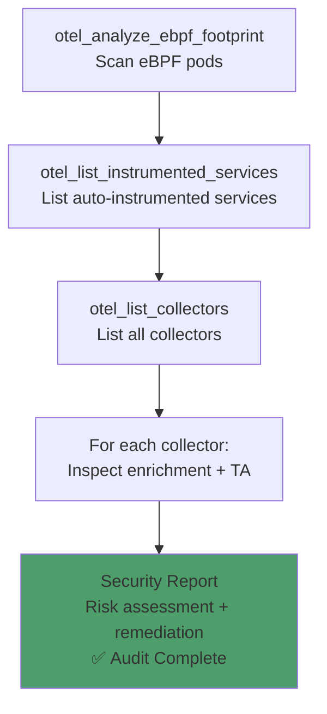
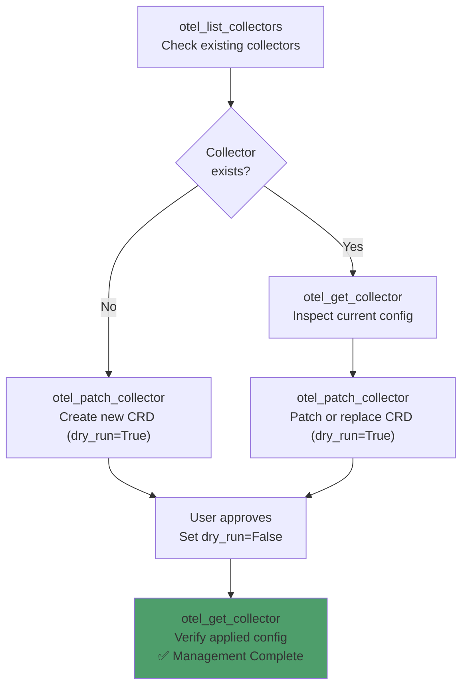
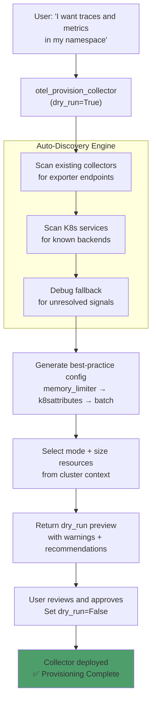

# OpenTelemetry MCP Server — Observability Journeys

**A comprehensive guide to how Tools, Resources, and Prompts coordinate across real-world OpenTelemetry workflows.**

> 💬 **New to the tools?** See the companion **[PROMPT_REFERENCE.md](PROMPT_REFERENCE.md)** — natural language prompts for every tool call in this guide.

---

## Table of Contents

1. [Prerequisites & Environment Setup](#1-prerequisites--environment-setup)
2. [Workflow 1: Service Onboarding (Zero-to-Instrumented)](#2-workflow-1-service-onboarding-zero-to-instrumented)
3. [Workflow 2: Pipeline Investigation & Validation](#3-workflow-2-pipeline-investigation--validation)
4. [Workflow 3: Metric Cardinality Audit & Remediation](#4-workflow-3-metric-cardinality-audit--remediation)
5. [Workflow 4: Sampling Strategy Review & Optimization](#5-workflow-4-sampling-strategy-review--optimization)
6. [Workflow 5: Security Posture Audit](#6-workflow-5-security-posture-audit)
7. [Workflow 6: Collector CRD Management (Expert)](#7-workflow-6-collector-crd-management-expert)
8. [Workflow 7: Intent-Driven Collector Provisioning (Smart)](#8-workflow-7-intent-driven-collector-provisioning-smart)
9. [Workflow 8: OTel Demo — Live-Tested Walkthrough](#9-workflow-8-otel-demo--live-tested-walkthrough)
10. [Visualization & Observability Access](#10-visualization--observability-access)

---

## 1. Prerequisites & Environment Setup

### Infrastructure Requirements

| Component | Requirement | Notes |
|-----------|-------------|-------|
| **Kubernetes** | v1.24+ | Required for all workflows |
| **OTel Operator** | Installed | Required for Instrumentation CRDs and auto-instrumentation |
| **OTel Collectors** | Deployed via CRDs | OpenTelemetryCollector custom resources |
| **Python** | 3.12+ | For running the MCP server |
| **kubectl** | Configured | For Kubernetes features |

### MCP Server Setup

```bash
git clone https://github.com/talkops-ai/talkops-mcp.git
cd talkops-mcp/src/opentelemetry-mcp-server
uv venv && source .venv/bin/activate
uv pip install -e ".[dev]"

# Configure
export MCP_TRANSPORT=http
export K8S_ENABLED=true

# Run
uv run opentelemetry-mcp-server
```

### MCP Client Configuration

```json
{
  "mcpServers": {
    "opentelemetry": {
      "url": "http://localhost:8768/mcp",
      "description": "OpenTelemetry Kubernetes observability management"
    }
  }
}
```

---

## 2. Workflow 1: Service Onboarding (Zero-to-Instrumented)

### Scenario

You have a custom application (Java, Python, Node.js, .NET, or Go) running on Kubernetes that needs OpenTelemetry auto-instrumentation. The AI guides you from zero to fully instrumented with traces, metrics, and logs.

> **Guided Prompt**: Use `otel_onboard_service` for the full step-by-step flow.

### Journey Diagram



### Step-by-Step

| Step | Action | Tool / Resource | Key Parameters |
|------|--------|-----------------|----------------|
| 1 | Check language support | **Tool**: `otel_lookup_instrumentation(language="python")` | Returns `auto_instrumentation_available`, `annotation_key`, `sdk_package`, frameworks |
| 2 | Check existing Instrumentation CR | **Resource**: `otel://instrumentation/{namespace}/default` | Returns exporter endpoint, propagators, sampler config, per-language specs |
| 3 | Create Instrumentation CR (preview) | **Tool**: `otel_patch_instrumentation(namespace="default", name="default", endpoint="http://otel-collector:4317", dry_run=True)` | Returns spec YAML for review |
| 4 | Apply Instrumentation CR | **Tool**: `otel_patch_instrumentation(..., dry_run=False)` | **MUTATES CLUSTER** — creates the Instrumentation CRD |
| 5 | Annotate Deployment (preview) | **Tool**: `otel_annotate_deployment(namespace="default", name="api-server", language="python", dry_run=True)` | Returns annotation preview |
| 6 | Apply annotation | **Tool**: `otel_annotate_deployment(..., dry_run=False)` | **MUTATES CLUSTER** — triggers rolling restart |
| 7 | Verify instrumentation | **Tool**: `otel_list_instrumented_services(namespace="default")` | Confirms init container injected, OTEL_* env vars present, detected language via 4-tier cascade |

### Resources Used

| Resource | When | Purpose |
|----------|------|---------|
| `otel://system/health` | Before Step 1 | Verify K8s connectivity and CRD availability |
| `otel://lang/{language}` | Step 1 | Detailed language capabilities (alternative to tool) |
| `otel://registry/languages` | Any time | Full language support catalog |
| `otel://instrumentation/{ns}/{name}` | Step 2 | Check if Instrumentation CR already exists |

### Language Support Matrix

| Language | Auto-Instrumentation | Annotation Key |
|----------|---------------------|----------------|
| Java | ✅ Available | `instrumentation.opentelemetry.io/inject-java` |
| Python | ✅ Available | `instrumentation.opentelemetry.io/inject-python` |
| Node.js | ✅ Available | `instrumentation.opentelemetry.io/inject-nodejs` |
| .NET | ✅ Available | `instrumentation.opentelemetry.io/inject-dotnet` |
| Go | ✅ Available | `instrumentation.opentelemetry.io/inject-go` |
| Rust | ❌ Not available | — (manual SDK only) |

### Language Detection Cascade

`otel_list_instrumented_services` uses a 4-tier cascade to detect the programming language of each service:

| Tier | Method | Example |
|------|--------|---------|
| 1 | **OTel Operator annotations** | `instrumentation.opentelemetry.io/inject-java: "true"` |
| 2 | **Container image patterns** | Image name suffix (`-python:latest`), base image (`openjdk:17`), tag suffix (`demo:latest-java`) |
| 3 | **Container/deployment names** | Keywords like `spring-*`, `flask-*`, `express-*`, `gin-*` |
| 4 | **Runtime environment variables** | `JAVA_HOME`, `JAVA_TOOL_OPTIONS`, `PYTHONPATH`, `NODE_VERSION`, `DOTNET_RUNNING_IN_CONTAINER`, `GOPATH`, `RUBY_VERSION`, `RUSTUP_HOME` |

> **Tier 4** resolves language for manually-instrumented services (e.g., OTel Demo) where image names don't contain language hints but containers have runtime env vars injected by base images.

---

## 3. Workflow 2: Pipeline Investigation & Validation

### Scenario

An OTel Collector is deployed but you suspect pipeline misconfiguration — processors out of order, filelog self-collection, or enrichment gaps. The AI investigates systematically.

> **Guided Prompt**: Use `otel_investigate_pipeline` for the full step-by-step flow.

### Journey Diagram



### Step-by-Step

| Step | Action | Tool / Resource | Key Parameters |
|------|--------|-----------------|----------------|
| 1 | Get collector details | **Tool**: `otel_get_collector(namespace="monitoring", name="otel-gateway", detail_level="full")` | Returns full pipeline topology, receivers, processors, exporters, raw YAML config |
| 2 | Validate processor ordering | **Tool**: `otel_validate_k8sattributes_order(namespace="monitoring", name="otel-gateway")` | Checks all pipelines against recommended order; returns `{all_valid, validations, recommended_order}` |
| 3 | Audit filelog safety | **Tool**: `otel_check_filelog_safety(namespace="monitoring", name="otel-gateway")` | Detects: missing checkpoint storage, self-collection loops, missing resource detection |
| 4 | Inspect enrichment profile | **Resource**: `otel://k8s-enrichment/monitoring/otel-gateway` | Shows k8sattributes extracted metadata, labels, annotations, pod association |
| 5 | Check sampling config | **Tool**: `otel_inspect_sampling_configuration(namespace="monitoring", collector_name="otel-gateway")` | Cross-references head + tail sampling; detects conflicts |
| 6 | Check SpanMetrics | **Resource**: `otel://spanmetrics/monitoring/otel-gateway` | Shows dimensions, histogram config, pipeline wiring, cardinality estimates |

### Processor Ordering Reference

The recommended processor order (validated by `otel_validate_k8sattributes_order`):

| Position | Processor | Purpose |
|----------|-----------|---------|
| 1 | `memory_limiter` | Prevent OOM — must be first |
| 2 | `k8sattributes` | Enrich with K8s metadata |
| 3 | `resourcedetection` | Auto-detect cloud/host resources |
| 4 | `resource` | Static resource attribute manipulation |
| 5 | `transform` | OTTL-based transformation |
| 6 | `filter` | Drop unwanted data |
| 7 | `attributes` | Attribute manipulation |
| 8 | `tail_sampling` | Sampling decisions (traces) |
| 9 | `batch` | Batch for export — must be last |

### Resources Used

| Resource | When | Purpose |
|----------|------|---------|
| `otel://collector/{ns}/{name}` | Step 1 | Alternative to tool for collector details |
| `otel://k8s-enrichment/{ns}/{name}` | Step 4 | k8sattributes enrichment profile |
| `otel://logs-profile/{ns}/{name}` | Step 3 | Detailed filelog config (alternative to tool) |
| `otel://spanmetrics/{ns}/{name}` | Step 6 | SpanMetrics connector profile |

### Common Issues

| Issue | Cause | Fix |
|-------|-------|-----|
| `k8sattributes after batch` | Enrichment happens after batching | Move k8sattributes before batch |
| `memory_limiter not first` | OOM risk during load spikes | Move memory_limiter to position 1 |
| Filelog self-collection | Collector ingests its own logs | Add exclude pattern for collector log paths |
| Missing checkpoint storage | Data loss on collector restart | Add `storage` extension with file_storage |

---

## 4. Workflow 3: Metric Cardinality Audit & Remediation

### Scenario

SpanMetrics or other connectors are generating high-cardinality metrics. The AI detects the hotspots, estimates series counts, and generates transform processor YAML to remediate.

> **Guided Prompt**: Use `otel_cardinality_audit` for the full step-by-step flow.

### Journey Diagram



### Step-by-Step

| Step | Action | Tool / Resource | Key Parameters |
|------|--------|-----------------|----------------|
| 1 | Detect cardinality issues | **Tool**: `otel_detect_cardinality(namespace="monitoring", name="otel-metrics")` | Returns `{issues, total_estimated_series, severity, spanmetrics_enabled, existing_remediation}` |
| 2 | Inspect SpanMetrics | **Tool**: `otel_inspect_spanmetrics_config(namespace="monitoring", name="otel-metrics")` | Returns full profile: dimensions, histogram config, pipeline wiring |
| 3 | Generate remediation | **Tool**: `otel_gen_drop_attribute_rules(attributes=["http.user_agent", "url.full"], signal="metrics")` | Returns `{yaml_snippet, instructions}` for transform processor |
| 4 | Apply (manual) | User adds YAML to collector config | Follow `instructions` from Step 3 |

### Cardinality Detection Rules

| Condition | Severity | Recommendation |
|-----------|----------|----------------|
| SpanMetrics dimensions > 10 | `critical` | Reduce dimensions to ≤5 using exclude_dimensions or transform processor |
| SpanMetrics dimensions > 5 | `warning` | Review and remove non-essential dimensions |
| Histogram buckets > 20 | `warning` | Reduce to ≤15 buckets; consider exponential histograms |

### Resources Used

| Resource | Purpose |
|----------|---------|
| `otel://spanmetrics/{ns}/{name}` | Detailed SpanMetrics profile (alternative to tool) |
| `otel://collector/{ns}/{name}` | Full collector config for manual inspection |

---

## 5. Workflow 4: Sampling Strategy Review & Optimization

### Scenario

You need to optimize trace sampling to reduce costs without losing important traces. The AI cross-references head sampling (Instrumentation CRDs) and tail sampling (collector config) to recommend the best strategy.

> **Guided Prompt**: Use `otel_sampling_review` for the full step-by-step flow.

### Journey Diagram



### Step-by-Step

| Step | Action | Tool / Resource | Key Parameters |
|------|--------|-----------------|----------------|
| 1 | Inspect current sampling | **Tool**: `otel_inspect_sampling_configuration(namespace="monitoring", collector_name="otel-traces")` | Returns `{mode, head_sampling, tail_sampling, warnings}` |
| 2 | Inspect with Instrumentation CR | **Tool**: `otel_inspect_sampling_configuration(namespace="monitoring", collector_name="otel-traces", instrumentation_cr_name="default")` | Cross-references head sampling from Instrumentation CR with tail sampling from collector |
| 3 | Get collector topology | **Tool**: `otel_get_collector(namespace="monitoring", name="otel-traces")` | Understand pipeline topology for sampling placement |
| 4 | Generate head sampling patch | **Tool**: `otel_toggle_sampling_strategy(namespace="monitoring", collector_name="otel-traces", target_mode="head", sample_rate=0.25, dry_run=True)` | Returns Instrumentation CRD spec patch |
| 5 | Generate tail sampling patch | **Tool**: `otel_toggle_sampling_strategy(namespace="monitoring", collector_name="otel-traces", target_mode="tail", dry_run=True)` | Returns collector config patch with default policies: error-sampling, slow-traces, probabilistic-fallback |
| 6 | Generate disable patch | **Tool**: `otel_toggle_sampling_strategy(namespace="monitoring", collector_name="otel-traces", target_mode="none", dry_run=True)` | Returns removal instructions for both head and tail |

### Sampling Modes

| Mode | Where | How |
|------|-------|-----|
| `head` | Instrumentation CRD | `sampler.type: parentbased_traceidratio` with `sampler.argument: "0.25"` |
| `tail` | Collector config | `tail_sampling` processor with policies (error, latency, probabilistic) |
| `none` | Neither | No sampling — all traces forwarded |

### Default Tail Sampling Policies

When `target_mode="tail"` is used without custom `tail_policies`, these defaults are generated:

| Policy | Type | Config |
|--------|------|--------|
| `error-sampling` | `status_code` | Keep all `ERROR` traces |
| `slow-traces` | `latency` | Keep traces with latency > 5000ms |
| `probabilistic-fallback` | `probabilistic` | Sample 10% of remaining traces |

> **Important:** Tail sampling requires all spans for a trace to arrive at the same collector instance. Use trace-ID-aware routing or a Gateway deployment.

---

## 6. Workflow 5: Security Posture Audit

### Scenario

You need to audit the security posture of all OTel components in a namespace — eBPF agents with elevated privileges, auto-instrumentation init containers, and collector RBAC.

> **Guided Prompt**: Use `otel_security_audit` for the full step-by-step flow.

### Journey Diagram



### Step-by-Step

| Step | Action | Tool / Resource | Key Parameters |
|------|--------|-----------------|----------------|
| 1 | Scan eBPF pods | **Tool**: `otel_analyze_ebpf_footprint(namespace="production")` | Returns `{risk_level, total_privileged, total_host_pid, unique_capabilities, pods, recommendations}` |
| 2 | List instrumented services | **Tool**: `otel_list_instrumented_services(namespace="production")` | Returns services with annotation status, init containers, OTEL_* env vars, and detected language (4-tier cascade) |
| 3 | List collectors | **Tool**: `otel_list_collectors(namespace="production")` | Returns all collectors in the namespace |
| 4 | Inspect each collector | **Resource**: `otel://k8s-enrichment/{ns}/{name}` | Check RBAC requirements for k8sattributes |
| 5 | Inspect Target Allocator | **Tool**: `otel_inspect_target_allocator_state(namespace="production", name="otel-metrics")` | Check TA security: selectors, prometheusCR |

### eBPF Risk Assessment

| Condition | Risk Level |
|-----------|------------|
| `SYS_ADMIN` capability | `critical` |
| Privileged containers | `high` |
| `hostPID` enabled | `medium` |
| No security concerns | `low` |

### eBPF Agent Labels Scanned

The tool scans for pods matching these label selectors:

- `app.kubernetes.io/name=otel-ebpf`
- `app.kubernetes.io/name=beyla`
- `app=grafana-beyla`
- `app=opentelemetry-ebpf`

### Remediation Priorities

| Finding | Recommendation |
|---------|----------------|
| `SYS_ADMIN` capability | Replace with fine-grained capabilities (`BPF`, `PERFMON`) |
| Privileged mode | Replace with minimal capabilities (`BPF`, `PERFMON`, `SYS_PTRACE`) |
| `hostPID` access | Review requirement — newer eBPF agents may not need it |

---

## 7. Workflow 6: Collector CRD Management (Expert)

### Scenario

You need expert-level control over an OpenTelemetryCollector CRD — creating with full config YAML, replacing with new pipeline config, mode changes, or scaling adjustments. Use this when you need precise control. For a guided, intent-driven experience, see [Workflow 7](#8-workflow-7-intent-driven-collector-provisioning-smart) instead.

### Journey Diagram



### Step-by-Step

| Step | Action | Tool / Resource | Key Parameters |
|------|--------|-----------------|----------------|
| 1 | Check existing collectors | **Tool**: `otel_list_collectors(namespace="monitoring")` | See if the target collector already exists |
| 2 | Inspect current config (if exists) | **Tool**: `otel_get_collector(namespace="monitoring", name="otel-gateway", detail_level="full")` | Get full pipeline topology and raw YAML |
| 3 | Create/patch collector (preview) | **Tool**: `otel_patch_collector(namespace="monitoring", name="otel-gateway", spec={...}, dry_run=True)` | Returns CRD spec for review |
| 4 | Replace collector (preview) | **Tool**: `otel_patch_collector(namespace="monitoring", name="otel-gateway", spec={...}, overwrite=True, dry_run=True)` | Full replace with `resourceVersion` |
| 5 | Apply changes | **Tool**: `otel_patch_collector(..., dry_run=False)` | **MUTATES CLUSTER** — creates or updates the CRD |
| 6 | Verify applied config | **Tool**: `otel_get_collector(namespace="monitoring", name="otel-gateway", detail_level="full")` | Confirm config was applied correctly |

### Key Parameters

| Parameter | Type | Description |
|-----------|------|-------------|
| `namespace` | string | Target namespace for the collector CRD |
| `name` | string | Name of the collector CRD |
| `spec` | dict | CRD spec: `mode`, `config`, `image`, `replicas`, `serviceAccount`, `targetAllocator` |
| `labels` | dict | Optional metadata labels (fully dynamic — any key/value pairs) |
| `annotations` | dict | Optional metadata annotations (fully dynamic) |
| `overwrite` | bool | `False` (default) = merge patch; `True` = full replace (includes `resourceVersion`) |
| `dry_run` | bool | `True` (default) = preview only; `False` = apply to cluster |

### Valid Collector Modes

| Mode | Use Case |
|------|----------|
| `daemonset` | Node-level collection (logs, node metrics, host metrics) |
| `deployment` | Centralized gateway (traces, aggregated metrics) |
| `statefulset` | Stateful workloads (Target Allocator, tail sampling with trace-ID routing) |
| `sidecar` | Per-pod collection (application-specific telemetry) |

### Overwrite vs. Patch

| Mode | Behavior | When to Use |
|------|----------|-------------|
| `overwrite=False` (patch) | Merges supplied fields into existing CRD | Adding/changing specific fields without affecting others |
| `overwrite=True` (replace) | Replaces entire CRD (fetches `resourceVersion` first) | Full config replacement, mode changes, or config restructuring |

---

---

## 8. Workflow 7: Intent-Driven Collector Provisioning (Smart)

### Scenario

A developer or SRE needs a collector in their namespace but doesn't want to write CRD YAML or know the OTel Collector config syntax. They just describe what they want — *"I need traces and metrics"* — and the AI auto-discovers backends, generates configs, and deploys.

> **Key Differentiator**: Unlike `otel_patch_collector` (which requires full config YAML), `otel_provision_collector` auto-discovers everything from the cluster.

### Journey Diagram



### Step-by-Step

| Step | Action | Tool / Resource | Key Parameters |
|------|--------|-----------------|----------------|
| 1 | Provision collector (preview) | **Tool**: `otel_provision_collector(namespace="payments", signals=["traces", "metrics"], dry_run=True)` | Returns generated config, auto-discovered endpoints, mode rationale, resource sizing, warnings, and recommendations |
| 2 | Review auto-discovered targets | *Inspect `auto_discovered` and `exporter_targets` in response* | Verify the discovered backends are correct |
| 3 | Apply collector | **Tool**: `otel_provision_collector(namespace="payments", signals=["traces", "metrics"], dry_run=False)` | **MUTATES CLUSTER** — creates the OpenTelemetryCollector CRD |
| 4 | Verify deployment | **Tool**: `otel_get_collector(namespace="payments", name="payments-collector")` | Confirm collector is running and config is correct |

### Auto-Discovery Strategies

The tool uses a three-strategy cascade to find where to send telemetry:

| Priority | Strategy | How It Works |
|----------|----------|--------------|
| 1st | **Existing collector configs** | Parses exporter endpoints from existing `OpenTelemetryCollector` CRDs in scanned namespaces |
| 2nd | **K8s service name matching** | Matches service names against 10 known backend patterns (Jaeger, Tempo, Prometheus, Mimir, Loki, OpenSearch, etc.) |
| 3rd | **Debug fallback** | Uses `debug` exporter for signals with no discoverable backend — telemetry goes to collector stdout |

### Supported Backend Patterns

| Pattern | Signal | Exporter Type | Default Port |
|---------|--------|---------------|--------------|
| `jaeger` | traces | otlp (gRPC) | 4317 |
| `tempo` | traces | otlp (gRPC) | 4317 |
| `zipkin` | traces | zipkin | 9411 |
| `prometheus` | metrics | otlphttp | 9090 |
| `thanos` | metrics | otlphttp | 9090 |
| `mimir` | metrics | otlphttp | 9009 |
| `victoriametrics` | metrics | otlphttp | 8428 |
| `opensearch` | logs | opensearch | 9200 |
| `elasticsearch` | logs | elasticsearch | 9200 |
| `loki` | logs | loki | 3100 |

### Smart Mode Selection

| User Input | Auto-Selected Mode | Rationale |
|------------|--------------------|-----------|
| `enable_filelog=True` | `daemonset` | filelog receiver requires node-level access to `/var/log/pods` |
| `prometheus_scrape=True` | `statefulset` | Target Allocator needs stable collector identities |
| Default (OTLP signals) | `deployment` | OTLP receivers don't require node-level access |

### Advanced Options

| Parameter | Default | Description |
|-----------|---------|-------------|
| `namespace` | *(required)* | Target namespace |
| `signals` | *(required)* | `["traces"]`, `["traces", "metrics"]`, `["traces", "metrics", "logs"]` |
| `name` | `{namespace}-collector` | Collector name (auto-generated if omitted) |
| `exporter_targets` | *(auto-discovered)* | Override auto-discovery: `{"traces": "jaeger:4317", "metrics": "prometheus:9090"}` |
| `scan_namespaces` | *(well-known)* | Additional namespaces to scan for backends |
| `mode` | *(auto-selected)* | Override mode: `daemonset`, `deployment`, `statefulset` |
| `enable_spanmetrics` | `False` | Generate RED metrics from traces via spanmetrics connector |
| `enable_filelog` | `False` | Collect container logs via filelog receiver (forces DaemonSet) |
| `prometheus_scrape` | `False` | Scrape Prometheus targets (recommends StatefulSet + Target Allocator) |
| `dry_run` | `True` | Preview only; set `False` to apply |

### When to Use Which Tool

| Need | Tool | Input Complexity |
|------|------|------------------|
| "I want traces and metrics" | `otel_provision_collector` | `namespace` + `signals` |
| "I need to set a specific OTLP config with exact processor settings" | `otel_patch_collector` | Full `spec` dict with `config` YAML |
| "Scale my collector to 5 replicas" | `otel_patch_collector` | `spec={"replicas": 5}` |

---

*Document Version: 1.3 | Updated for OTel Demo live walkthrough (Workflow 8, Visualization access) | Companion to [PROMPT_REFERENCE.md](PROMPT_REFERENCE.md)*

---

## 9. Workflow 8: OTel Demo — Live-Tested Walkthrough

> This section documents a **real, validated** end-to-end walkthrough using tools and resources against the
> [OpenTelemetry Demo](https://opentelemetry.io/docs/demo/) deployed on Kubernetes. Every call below was
> executed live and cross-validated against `kubectl` ground-truth.

### Environment Tested

| Component | Version / Detail |
|-----------|-----------------|
| **Kubernetes** | v1.35.1 (Docker Desktop) |
| **OTel Operator** | Installed (`opentelemetry-operator-system` namespace) |
| **OTel Collector** | `otel/opentelemetry-collector-contrib:0.151.0` |
| **OTel Demo** | Helm chart → `otel-demo` namespace |
| **Collector CRD** | `otel-demo-collector` (daemonset, 3 pipelines) |
| **Backends** | Jaeger v2.17.0 (traces), Prometheus (metrics), OpenSearch (logs) |
| **MCP Transport** | HTTP (`http://localhost:8768/mcp`) |

---

### Step 1: System Health Check

> **Resource:** `otel://system/health`

**Prompt:**
```
Check if the OTel MCP server can connect to Kubernetes and see OTel CRDs.
```

**What it does internally:**
1. Checks that the MCP server process is running (`server.status = "healthy"`)
2. Calls `kubernetes.client.VersionApi().get_code()` to verify K8s API connectivity
3. Returns the K8s server version, git version, and kube-context name

**Expected output:**
```json
{
  "server": { "name": "opentelemetry-mcp-server", "status": "healthy" },
  "kubernetes": {
    "status": "healthy",
    "server_version": "1.35",
    "git_version": "v1.35.1",
    "context": "docker-desktop"
  }
}
```

**Manual validation:**
```bash
kubectl version --short
# Server Version: v1.35.1  ← must match resource output
kubectl config current-context
# docker-desktop  ← must match "context" field
```

---

### Step 2: Discover All Collectors

> **Tool:** `otel_list_collectors`

**Prompt:**
```
List all OTel collectors in the cluster.
```

**Parameters:** `{}` (no filters — cluster-wide scan)

**What it does internally:**
1. Calls K8s `CustomObjectsApi.list_cluster_custom_object()` for `opentelemetrycollectors` CRD
2. For each collector found, parses `spec.config` (inline YAML or dict)
3. Extracts pipelines, receivers, processors, exporters from `service.pipelines`
4. Detects features: spanmetrics (via connectors), target allocator (`spec.targetAllocator.enabled`), sampling mode
5. Reads `status.version` and `status.image` for version/distribution info
6. Returns paginated list with `total_count`, `items[]`, and optional `next_cursor`

**Expected output fields per item:**

| Field | Expected Value (OTel Demo) |
|-------|---------------------------|
| `name` | `otel-demo-collector` |
| `namespace` | `otel-demo` |
| `mode` | `daemonset` |
| `version` | `0.151.0` |
| `otel_distribution` | `otel/opentelemetry-collector-contrib` |
| `pipelines` | 3 items: `logs`, `metrics`, `traces` |
| `spanmetrics_enabled` | `true` |
| `target_allocator_enabled` | `false` |
| `sampling_mode` | `none` |

**Manual validation:**
```bash
kubectl get opentelemetrycollectors -A -o custom-columns=\
"NAME:.metadata.name,NS:.metadata.namespace,MODE:.spec.mode,VERSION:.status.version"
# NAME                  NS         MODE        VERSION
# otel-demo-collector   otel-demo  daemonset   0.151.0
```

---

### Step 3: Get Full Collector Details

> **Tool:** `otel_get_collector`

**Prompt:**
```
Show me the full configuration of the collector "otel-demo-collector" in the "otel-demo" namespace.
```

**Parameters:**
```json
{
  "name": "otel-demo-collector",
  "namespace": "otel-demo",
  "detail_level": "full"
}
```

**What it does internally:**
1. Calls K8s `get_namespaced_custom_object()` for the specific collector
2. Parses `spec.config` into a structured dict
3. Builds `CollectorInstance` model with pipeline topology, status, and labels
4. When `detail_level=full`, includes `raw_config_yaml` (the full YAML config string)

**Key output sections:**

| Section | Content |
|---------|---------|
| **Pipelines** | 3 pipelines with full receiver → processor → exporter chains |
| **Traces pipeline** | `otlp` → `memory_limiter → k8sattributes → resourcedetection → resource → transform → batch` → `otlp/jaeger, spanmetrics` |
| **Metrics pipeline** | `otlp, spanmetrics` → same processor chain → `otlphttp/prometheus` |
| **Logs pipeline** | `otlp, filelog` → same processor chain (no transform) → `opensearch, debug` |
| **raw_config_yaml** | Full YAML including connectors, extensions, telemetry config |

**Manual validation:**
```bash
kubectl get opentelemetrycollectors -n otel-demo otel-demo-collector -o yaml
# Compare spec.config, spec.mode, status.version against tool output
```

---

### Step 4: Inspect K8s Enrichment Profile

> **Resource:** `otel://k8s-enrichment/otel-demo/otel-demo-collector`

**Prompt:**
```
Show me the k8sattributes enrichment profile for collector "otel-demo-collector" in "otel-demo".
```

**What it does internally:**
1. Fetches the collector CRD and parses its config
2. Finds all `k8sattributes` processors in the config
3. Extracts: metadata fields, pod association sources, filter settings
4. Determines pipeline positions (which pipelines use this processor, at what index)
5. Sets `requires_cluster_role = true` if metadata like `k8s.deployment.name` is extracted

**Expected output:**

| Field | Value |
|-------|-------|
| `enabled` | `true` |
| `extract_metadata` | 13 fields: `k8s.namespace.name`, `k8s.pod.name`, `k8s.pod.uid`, `k8s.node.name`, `k8s.pod.start_time`, `k8s.deployment.name`, `k8s.replicaset.name`, `k8s.daemonset.name`, `k8s.container.name`, `container.image.tag`, `container.image.name`, `service.name`, `service.version` |
| `filter_node` | `K8S_NODE_NAME` (env var for node-level filtering) |
| `pod_association` | `["resource_attribute", "resource_attribute", "connection"]` |
| `pipeline_positions` | `["logs[1]", "metrics[1]", "traces[1]"]` — index 1 (after memory_limiter) in all 3 pipelines |
| `requires_cluster_role` | `true` |

**Manual validation:**
```bash
kubectl get opentelemetrycollectors -n otel-demo otel-demo-collector \
  -o jsonpath='{.spec.config.processors.k8sattributes.extract.metadata}' | python3 -m json.tool
# Compare the list of metadata fields

kubectl get opentelemetrycollectors -n otel-demo otel-demo-collector \
  -o jsonpath='{.spec.config.processors.k8sattributes.filter}'
# Expected: {"node_from_env_var":"K8S_NODE_NAME"}
```

---

### Step 5: Inspect Logs Collection Profile

> **Resource:** `otel://logs-profile/otel-demo/otel-demo-collector`

**Prompt:**
```
Show me the filelog receiver configuration for collector "otel-demo-collector" in "otel-demo".
```

**What it does internally:**
1. Finds all `filelog` receivers in the config via `find_receivers_of_type(cfg, "filelog")`
2. For each filelog receiver, extracts include/exclude paths, storage, operators
3. Checks safety: `has_storage_checkpoint` (persistence), `has_exclude_self` (avoids feedback loop)
4. Checks if `resourcedetection` processor exists in the logs pipeline
5. Generates warnings if storage or self-exclusion is missing

**Expected output:**

| Field | Value |
|-------|-------|
| `enabled` | `true` |
| `filelog_receivers[0].include_paths` | `["/var/log/pods/otel-demo_*/*/*.log"]` |
| `filelog_receivers[0].exclude_paths` | `["/var/log/pods/otel-demo_otel-collector*/*/*.log"]` |
| `filelog_receivers[0].storage` | `file_storage` |
| `has_storage_checkpoint` | `true` ✅ |
| `has_exclude_self` | `true` ✅ |
| `has_resource_detection` | `true` ✅ |
| `log_processors` | `["memory_limiter", "k8sattributes", "resourcedetection", "resource", "batch"]` |
| `log_exporters` | `["opensearch", "debug"]` |
| `warnings` | `[]` (none — all best practices met) |

**Manual validation:**
```bash
kubectl get opentelemetrycollectors -n otel-demo otel-demo-collector \
  -o jsonpath='{.spec.config.receivers.filelog}' | python3 -m json.tool
# Verify include, exclude, storage fields match
```

---

### Step 6: Inspect SpanMetrics Connector

> **Resource:** `otel://spanmetrics/otel-demo/otel-demo-collector`

**Prompt:**
```
Show me the SpanMetrics connector profile for "otel-demo-collector" in "otel-demo".
```

**What it does internally:**
1. Finds `spanmetrics` connectors via `find_connectors_of_type(cfg, "spanmetrics")`
2. Extracts dimensions, histogram config (explicit/exponential), and namespace
3. Traces pipeline wiring: which pipeline uses spanmetrics as an *exporter* (source) vs *receiver* (target)
4. Estimates cardinality: `100 × len(dimensions)` series per service
5. Warns if dimension count > 5 (cardinality explosion risk)

**Expected output:**

| Field | Value |
|-------|-------|
| `enabled` | `true` |
| `dimensions` | `[{name: "http.method"}, {name: "http.status_code"}, {name: "rpc.method"}, {name: "rpc.service"}, {name: "http.target"}]` |
| `histogram.type` | `explicit` |
| `histogram.explicit_buckets` | 16 buckets: `["2ms", "4ms", ..., "10s", "15s"]` (parsed to ms floats) |
| `source_pipeline` | `traces` (spanmetrics is an exporter in traces) |
| `target_pipeline` | `metrics` (spanmetrics is a receiver in metrics) |
| `estimated_series_per_service` | `500` (5 dimensions × 100) |

**Manual validation:**
```bash
kubectl get opentelemetrycollectors -n otel-demo otel-demo-collector \
  -o jsonpath='{.spec.config.connectors.spanmetrics}' | python3 -m json.tool
# Verify dimensions array and histogram buckets
```

**Verify metrics are flowing to Prometheus:**
```bash
kubectl port-forward svc/prometheus 9090:9090 -n otel-demo
# Open http://localhost:9090 → query: calls_total or duration_milliseconds_bucket
```

---

### Step 7: Inspect Target Allocator

> **Resource:** `otel://target-allocator/otel-demo/otel-demo-collector`

**Prompt:**
```
Show me the Target Allocator configuration for "otel-demo-collector" in "otel-demo".
```

**What it does internally:**
1. Reads `spec.targetAllocator` from the collector CRD
2. Extracts allocation strategy, filter strategy, replicas, and PrometheusCR settings
3. Checks `enabled` flag (defaults to `false` if section exists but flag is absent)

**Expected output:**

| Field | Value |
|-------|-------|
| `enabled` | `false` |
| `allocation_strategy` | `consistent-hashing` |
| `filter_strategy` | `relabel-config` |
| `replicas` | `1` |
| `prometheus_cr_enabled` | `false` |

> **Note:** The OTel Demo includes a TA config section in the CRD but does not explicitly enable it.

**Manual validation:**
```bash
kubectl get opentelemetrycollectors -n otel-demo otel-demo-collector \
  -o jsonpath='{.spec.targetAllocator}' | python3 -m json.tool
# Confirm enabled is not set to true
```

---

### Step 8: List Collectors by Namespace

> **Tool:** `otel_list_collectors`

**Prompt:**
```
List OTel collectors in the "otel-demo" namespace.
```

**Parameters:**
```json
{ "namespace": "otel-demo" }
```

**What it does internally:**
Same as Step 2 but scoped to a single namespace via `list_namespaced_custom_object()`.

**Expected output:** 1 collector found (`otel-demo-collector`)

**Label search example:**
```
List OTel collectors with label "talkops.ai/provisioned=true"
```
```json
{ "label_selector": "talkops.ai/provisioned=true" }
```
> **Note:** The demo's collector CRD has `labels: {}` — label search returns 0 results.
> Collectors created via `otel_provision_collector` auto-get labels like `talkops.ai/provisioned=true`.

---

### Step 9: Language Instrumentation Lookup

> **Tool:** `otel_lookup_instrumentation`

**Prompt:**
```
How do I instrument a Python service with OpenTelemetry?
```

**Parameters:**
```json
{ "language": "python" }
```

**What it does internally:**
1. Reads the static language registry (`otel://registry/languages` resource)
2. Returns: auto-instrumentation annotation key, supported libraries, and setup instructions

**Expected output includes:**
- `auto_instrumentation_available: true`
- `annotation_key: "instrumentation.opentelemetry.io/inject-python"`
- Runtime and library support details

**Also available as resource:**
```
otel://lang/python
otel://registry/languages   (all 5 supported languages)
```

---

### Step 10: Cross-Validation Summary

All tool/resource outputs were cross-validated against raw `kubectl` data. Summary:

| Resource / Tool | Fields Checked | Result |
|----------------|---------------|--------|
| `otel://system/health` | server status, K8s version, context | ✅ 3/3 match |
| `otel://collector/{ns}/{name}` | mode, version, distribution, 3 pipelines (receivers, processors, exporters), features | ✅ 17/17 match |
| `otel://k8s-enrichment/{ns}/{name}` | 13 metadata fields, filter_node, pod_association, pipeline positions | ✅ 7/7 match |
| `otel://logs-profile/{ns}/{name}` | include/exclude paths, storage, safety checks, processors, exporters | ✅ 11/11 match |
| `otel://spanmetrics/{ns}/{name}` | dimensions, buckets, pipeline wiring, cardinality estimate | ✅ 8/8 match |
| `otel://target-allocator/{ns}/{name}` | enabled, strategy, filter, replicas, PromCR | ✅ 5/5 match |
| `otel://lang/{language}` | annotation key, auto-instrumentation support | ✅ verified |
| `otel://registry/languages` | 5 languages with metadata | ✅ verified |
| `otel_list_collectors` | count, filtering by namespace and label | ✅ verified |
| `otel_get_collector` | summary vs full detail levels | ✅ verified |

---

## 10. Visualization & Observability Access

### OTel Demo Visualization Backends

The OTel Demo ships with three built-in backends for visualizing collected telemetry:

| Backend | Signal | Port | UI Path |
|---------|--------|------|---------|
| **Jaeger** (v2.17.0) | Traces | 16686 | `/jaeger/ui` |
| **Grafana** | Metrics (dashboards) | 80 | `/grafana` |
| **Prometheus** | Metrics (raw) | 9090 | `/` |
| **OpenSearch** | Logs | 9200 | API only |

> **⚠️ Important:** Jaeger v2 uses `base_path: /jaeger/ui`. The root path `/` returns 404.

### Access Method 1: Frontend Proxy (Recommended)

The `frontend-proxy` service (Envoy) routes all UIs on a single port:

```bash
kubectl port-forward svc/frontend-proxy 8080:8080 -n otel-demo
```

| UI | URL |
|----|-----|
| 🌐 OTel Demo Store | http://localhost:8080/ |
| 🔍 Jaeger Traces | http://localhost:8080/jaeger/ui |
| 📊 Grafana | http://localhost:8080/grafana |
| 📈 Load Generator | http://localhost:8080/loadgen |

### Access Method 2: Direct Port-Forwards

```bash
# Jaeger (traces)
kubectl port-forward svc/jaeger 16686:16686 -n otel-demo
# → http://localhost:16686/jaeger/ui

# Grafana (metric dashboards)
kubectl port-forward svc/grafana 3000:80 -n otel-demo
# → http://localhost:3000

# Prometheus (raw metrics)
kubectl port-forward svc/prometheus 9090:9090 -n otel-demo
# → http://localhost:9090
```

### What to Verify in Each UI

**Jaeger** (http://localhost:8080/jaeger/ui):
- Select a service (e.g., `frontend`, `checkout`, `cartservice`)
- Click **Find Traces** — should see distributed traces across services
- Click a trace to see the span waterfall with k8s-enriched attributes

**Grafana** (http://localhost:8080/grafana):
- Navigate to **Dashboards** in the left sidebar
- Look for OTel Demo pre-built dashboards
- SpanMetrics RED metrics visible: `calls_total`, `duration_milliseconds_*`

**Prometheus** (http://localhost:9090):
- Query `calls_total` — request rates per service and operation
- Query `duration_milliseconds_bucket` — latency histograms from spanmetrics
- Query `up` — collector health targets

---
