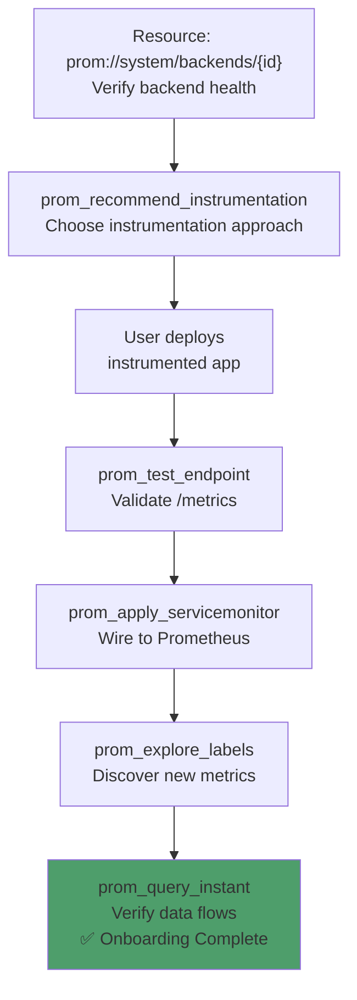
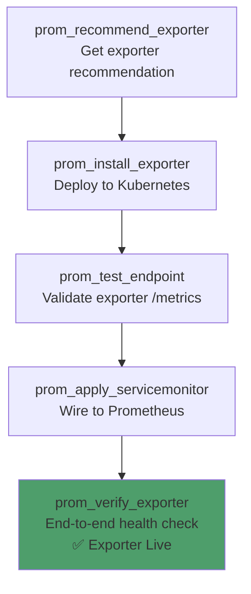
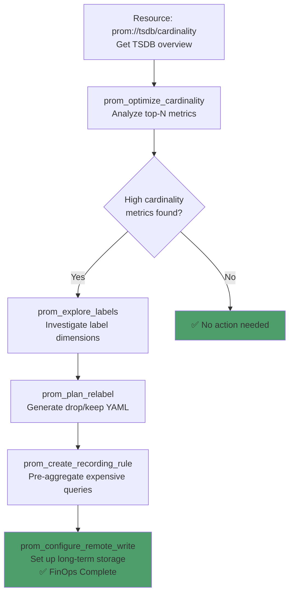
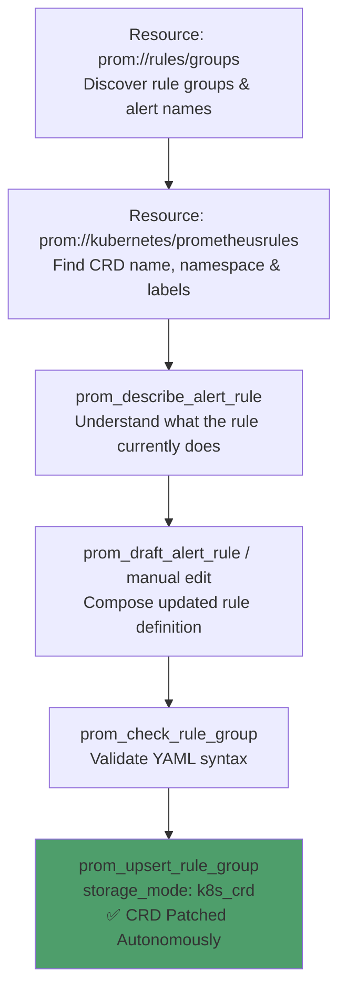
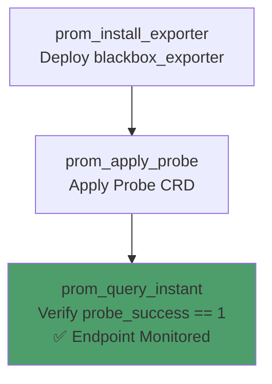

# Prometheus MCP Server — Monitoring & Observability Journeys

**A comprehensive guide to how Tools, Resources, and Prompts coordinate across real-world Prometheus workflows.**

> 💬 **New to the tools?** See the companion **[PROMPT_REFERENCE.md](PROMPT_REFERENCE.md)** — natural language prompts for every tool call in this guide.

---

## Table of Contents

1. [Prerequisites & Environment Setup](#1-prerequisites--environment-setup)
2. [Workflow 1: Kubernetes App Onboarding](#2-workflow-1-kubernetes-app-onboarding)
3. [Workflow 2: Exporter Onboarding (Third-Party Systems)](#3-workflow-2-exporter-onboarding-third-party-systems)
4. [Workflow 3: VM/Legacy Onboarding](#4-workflow-3-vmlegacy-onboarding)
5. [Workflow 4: PromQL Querying](#5-workflow-4-promql-querying)
6. [Workflow 5: TSDB FinOps & Cardinality Optimization](#6-workflow-5-tsdb-finops--cardinality-optimization)
7. [Workflow 6: Rule Management & Simulation](#7-workflow-6-rule-management--simulation)
8. [Workflow 7: Troubleshooting Failed Targets](#8-workflow-7-troubleshooting-failed-targets)
9. [Workflow 8: Autonomous K8s Rule CRD Upsert](#9-workflow-8-autonomous-k8s-rule-crd-upsert)
10. [Workflow 9: Synthetic Endpoint Monitoring (Probes)](#10-workflow-9-synthetic-endpoint-monitoring-probes)

---

## 1. Prerequisites & Environment Setup

### Infrastructure Requirements

| Component | Requirement | Notes |
|-----------|-------------|-------|
| **Prometheus** | v2.x+ HTTP API | Any compatible backend (Thanos, Mimir, Cortex, VictoriaMetrics) |
| **Kubernetes** | v1.24+ (optional) | Required for exporter deployment, ServiceMonitor & CRD features |
| **Prometheus Operator** | Installed (optional) | Required for `apply_servicemonitor`, CRD upsert & `prom://kubernetes/prometheusrules` |
| **Python** | 3.12+ | For running the MCP server |
| **kubectl** | Configured (optional) | For Kubernetes features |

### MCP Server Setup

```bash
git clone https://github.com/talkops-ai/talkops-mcp.git
cd talkops-mcp/src/prometheus-mcp-server
uv venv && source .venv/bin/activate
uv pip install -e ".[dev]"

# Configure
export PROMETHEUS_BASE_URL=http://localhost:9090
export MCP_TRANSPORT=http

# Run
uv run prometheus-mcp-server
```

### MCP Client Configuration

```json
{
  "mcpServers": {
    "prometheus": {
      "url": "http://localhost:8767/mcp",
      "description": "Prometheus observability and monitoring management"
    }
  }
}
```

---

## 2. Workflow 1: Kubernetes App Onboarding

### Scenario

You have a custom application (Go, Java, Python, or Node.js) running on Kubernetes that needs Prometheus monitoring. The AI guides you from zero instrumentation to fully scraped metrics.

> **Guided Prompt**: Use `prom-k8s-app-onboarding-guided` for the full step-by-step flow.

### Journey Diagram



### Step-by-Step

| Step | Action | Tool / Resource | Key Parameters |
|------|--------|-----------------|----------------|
| 1 | Verify backend health | **Resource**: `prom://system/backends/{backend_id}` | Confirms connectivity, features, storage retention |
| 2 | Choose instrumentation strategy | **Tool**: `prom_recommend_instrumentation(workload_type="custom_app", language="python", environment="kubernetes")` | Returns: direct_instrumentation / exporter / builtin_metrics |
| 3 | User deploys instrumented app | *(Manual)* — add instrumentation to app, build, deploy to K8s | — |
| 4 | Validate /metrics endpoint | **Tool**: `prom_test_endpoint(endpoint_url="http://my-app.default:8080/metrics")` | Returns: ok, metrics_count, format, errors |
| 5 | Apply ServiceMonitor | **Tool**: `prom_apply_servicemonitor(namespace="default", service_name="my-app")` | Auto-detects Prometheus Operator selector labels |
| 6 | Discover new metrics | **Tool**: `prom_explore_labels(backend_id="default", metric_name="http_requests_total")` | Shows all label names and top values |
| 7 | Verify data flows | **Tool**: `prom_query_instant(backend_id="default", query="rate(http_requests_total[5m])")` | Confirms metrics are being ingested |

### Resources Used

| Resource | When | Purpose |
|----------|------|---------|
| `prom://system/backends` | Before Step 1 | Quick overview of all backends |
| `prom://metadata/catalog` | After Step 6 | Verify new metrics appear in catalog |
| `prom://onboarding-guide` | Any time | Static onboarding reference |

### Strategy Decision Matrix

| Workload | Language | Framework | Recommended Strategy |
|----------|----------|-----------|---------------------|
| Custom app | Go/Java/Python/Node | — | `direct_instrumentation` |
| Custom app | Java | Spring Boot | `builtin_metrics` (Actuator/Micrometer) |
| PostgreSQL | — | — | `exporter` (postgres_exporter) |
| Redis | — | — | `exporter` (redis_exporter) |
| NGINX | — | — | `exporter` (nginx_exporter) |

---

## 3. Workflow 2: Exporter Onboarding (Third-Party Systems)

### Scenario

You need to monitor a third-party system (database, message queue, web server) that doesn't natively expose Prometheus metrics. The AI recommends, deploys, and verifies an exporter on Kubernetes.

> **Guided Prompt**: Use `prom-k8s-exporter-onboarding-guided` for the full step-by-step flow.

### Journey Diagram



### Step-by-Step

| Step | Action | Tool / Resource | Key Parameters |
|------|--------|------|----------------|
| 1 | Browse exporter catalog | **Resource**: `prom://exporters/catalog` | Returns all exporters with ports, images, scopes |
| 2 | Get recommendation | `prom_recommend_exporter(service_type="postgres")` | Returns matching exporters + notes |
| 3 | Install exporter | `prom_install_exporter(exporter_type="postgres_exporter", namespace="monitoring")` | Creates Deployment + Service (+ RBAC/ConfigMap if needed). **MUTATES CLUSTER** |
| 4 | Test endpoint | `prom_test_endpoint(endpoint_url="http://postgres-exporter.monitoring:9187/metrics")` | Validates Prometheus format |
| 5 | Apply ServiceMonitor | `prom_apply_servicemonitor(namespace="monitoring", service_name="postgres-exporter")` | Wires to Prometheus Operator |
| 6 | Verify end-to-end | `prom_verify_exporter(backend_id="default", endpoint_url="http://postgres-exporter.monitoring:9187/metrics", job="postgres_exporter")` | Polls endpoint + checks `up{}` series |

### Supported Exporters (19 total)

| Exporter | Default Port | Scope | K8s Nuances |
|----------|-------------|-------|-------------|
| `node_exporter` | 9100 | DaemonSet | — |
| `kube-state-metrics` | 8080 | Deployment | Requires RBAC |
| `postgres_exporter` | 9187 | Sidecar | Sidecar support |
| `mysqld_exporter` | 9104 | Sidecar | Sidecar support |
| `mongodb_exporter` | 9216 | Deployment | Sidecar support |
| `redis_exporter` | 9121 | Sidecar | Sidecar support |
| `nginx_exporter` | 9113 | Sidecar | Sidecar support |
| `kafka_exporter` | 9308 | Deployment | — |
| `rabbitmq_exporter` | 9419 | Deployment | — |
| `elasticsearch_exporter` | 9114 | Deployment | — |
| `blackbox_exporter` | 9115 | Deployment | Requires ConfigMap |
| `snmp_exporter` | 9116 | Deployment | Requires ConfigMap |
| `statsd_exporter` | 9102 | Deployment | UDP Service + ConfigMap |
| `jmx_exporter` | 5556 | Sidecar | ConfigMap + Sidecar |
| `aws_cloudwatch_exporter` | 5000 | Deployment | ConfigMap |
| `apache_exporter` | 9117 | Sidecar | Sidecar support |
| `php_fpm_exporter` | 9253 | Sidecar | Sidecar support |
| `memcached_exporter` | 9150 | Deployment | — |
| `windows_exporter` | 9182 | DaemonSet | VM only |

### Uninstall Flow

```python
prom_uninstall_exporter(exporter_type="postgres_exporter", namespace="monitoring")
# Removes: Deployment + DaemonSet + Service (tries all resource types)
```

---

## 4. Workflow 3: VM/Legacy Onboarding

### Scenario

You need to monitor an application running on a VM or bare-metal server (not Kubernetes). Uses `file_sd_configs` instead of ServiceMonitor.

> **Guided Prompt**: Use `prom-vm-legacy-onboarding-guided` for the full step-by-step flow.

### Step-by-Step

| Step | Action | Tool | Key Parameters |
|------|--------|------|----------------|
| 1 | Recommend strategy | `prom_recommend_instrumentation(workload_type="custom_app", language="python", environment="vm")` | Returns VM-specific guidance |
| 2 | Deploy on VM | *(Manual)* — install exporter binary or deploy instrumented app | — |
| 3 | Test endpoint | `prom_test_endpoint(endpoint_url="http://10.0.1.5:8080/metrics")` | Validates remote endpoint |
| 4 | Add to file_sd | `prom_manage_file_sd(file_sd_path="/etc/prometheus/file_sd/targets.json", targets=["10.0.1.5:8080"], target_labels={"job": "my-app"}, backend_id="default")` | Appends target + triggers /-/reload |
| 5 | Verify | `prom_query_instant(backend_id="default", query="up{job='my-app'}")` | Confirms target is up |

### file_sd Sub-Actions

| Sub-Action | Description |
|------------|-------------|
| `add` (default) | Append targets to the JSON file |
| `remove` | Remove matching targets from the JSON file |

Both sub-actions optionally trigger `POST /-/reload` if `backend_id` is provided and Prometheus has `--web.enable-lifecycle`.

---

## 5. Workflow 4: PromQL Querying

### Scenario

An AI assistant needs to help a user query Prometheus metrics safely, respecting counter semantics and context window limits.

> **Guided Prompt**: Use `prom-query-guided` for the full step-by-step flow.

### Safety Guardrails

| Guardrail | Description | Override |
|-----------|-------------|---------|
| **Counter Enforcement** | Counters must use `rate()` or `increase()` | `allow_raw_counters=true` |
| **Auto-Downsampling** | Range queries capped at ~200 points/series | `max_points_per_series` param |
| **Query Validation** | Syntax checked before execution | Use `action=validate` first |
| **Timeout** | Default 30s query timeout | `timeout` param |

### Step-by-Step

| Step | Action | Tool / Resource | Key Parameters |
|------|--------|-----------------|----------------|
| 1 | Discover service metrics | **Resource**: `prom://topology/services/{job}/metrics` | Returns all metrics emitted by a specific service, including `type` and `help` text |
| 2 | Explore metric labels | **Tool**: `prom_explore_labels(backend_id="default", metric_name="<metric_name>")` | Returns label keys (e.g., `code`, `status`) and their top values to help construct accurate queries |
| 3 | Validate query syntax | **Tool**: `prom_validate_promql(backend_id="default", query="rate(...)")` | Returns `{valid: true/false, error: ...}` |
| 4 | Run instant query | **Tool**: `prom_query_instant(backend_id="default", query="rate(...)")` | Point-in-time vector result |
| 5 | Run range query | **Tool**: `prom_query_range(backend_id="default", query="rate(...)", start=<unix>, end=<unix>)` | Auto-computes step, downsamples to ~200 pts |
| 6 | Calculate Latency (Histograms) | **Tool**: `prom_query_range` | Calculate average duration: `sum(rate(duration_sum[5m])) / sum(rate(duration_count[5m]))` |

### Auto-Step Computation

When `step` is omitted from range queries, the server auto-computes it:

```
step = (end - start) / max_points_per_series
```

This ensures LLM context windows are protected from massive data payloads.

---

## 6. Workflow 5: TSDB FinOps & Cardinality Optimization

### Scenario

Prometheus storage costs are growing. The AI analyzes cardinality hotspots and generates optimization configurations (relabeling, recording rules, remote-write).

### Journey Diagram



### Step-by-Step

| Step | Action | Tool / Resource | Key Parameters |
|------|--------|------|----------------|
| 1 | Get cardinality overview | **Resource**: `prom://tsdb/cardinality` | Returns total_series + top-N metrics |
| 2 | Analyze hotspots | `prom_optimize_cardinality(backend_id="default", top_n=10)` | Returns recommendations with severity |
| 3 | Investigate labels | `prom_explore_labels(backend_id="default", metric_name="<hot_metric>")` | Find high-cardinality label dimensions |
| 4 | Generate relabel config | `prom_plan_relabel(backend_id="default", metric_name="<metric>", labels_to_drop=["pod_id"])` | Returns YAML for metric_relabel_configs |
| 5 | Create recording rule | `prom_create_recording_rule(backend_id="default", rule_name="job:http_requests:rate5m", rule_expr="sum by (job) (rate(http_requests_total[5m]))")` | Returns rule group YAML |
| 6 | Configure remote-write | `prom_configure_remote_write(backend_id="default", remote_url="http://thanos-receive:19291/api/v1/receive")` | Returns remote_write YAML with queue config |

### Important: YAML Output Only

All FinOps generation tools generate configuration YAML — they do **NOT** apply changes to a running Prometheus instance. Users must manually add the YAML to their Prometheus configuration files.

### Resources Used

| Resource | Purpose |
|----------|---------|
| `prom://tsdb/cardinality` | Quick cardinality overview without tool call |
| `prom://config/runtime` | Current scrape interval, retention, TSDB stats |
| `prom://best-practices` | Labeling and cardinality best practices |

---

## 7. Workflow 6: Rule Management & Simulation

### Scenario

You need to create a new alerting rule, validate its syntax, test it synthetically, and simulate if it would have fired historically before applying it to the cluster.

### Step-by-Step

| Step | Action | Tool | Key Parameters |
|------|--------|------|----------------|
| 1 | Draft rule | `prom_draft_alert_rule(intent="alert when 5xx errors exceed 5%")` | Returns PromQL and YAML definition |
| 2 | Check syntax | `prom_check_rule_group(rules_yaml="...")` | Validates YAML and PromQL syntax |
| 3 | Run tests | `prom_run_rule_tests(rules_yaml="...", test_yaml="...")` | Runs synthetic unit tests |
| 4 | Simulate historical | `prom_simulate_firing_historical(backend_id="default", expr="...", for_duration="5m")` | Checks against real historical data |
| 5 | Apply rule | `prom_upsert_rule_group(backend_id="default", group_name="api_errors", rules=[...])` | Creates the rule group in the backend |

---

## 8. Workflow 7: Troubleshooting Failed Targets

### Scenario

A scrape target is showing as down. The AI diagnoses the issue by checking failed targets, validating endpoints, and inspecting cardinality.

> **Guided Prompt**: Use `prom-troubleshoot-guided` for the full step-by-step flow.

### Step-by-Step

| Step | Action | Tool / Resource | Key Parameters |
|------|--------|-----------------|----------------|
| 1 | Check failed targets | **Resource**: `prom://topology/failed_targets` | Aggregated view of all failed targets |
| 2 | Check up status | `prom_query_instant(backend_id="default", query="up{job='api-server'}")` | Shows target health |
| 3 | Check scrape duration | `prom_query_instant(backend_id="default", query="scrape_duration_seconds{job='api-server'}")` | Detect slow endpoints |
| 4 | Validate endpoint directly | `prom_test_endpoint(endpoint_url="http://api-server.default:8080/metrics")` | Bypasses Prometheus — direct HTTP check |
| 5 | Check cardinality | **Resource**: `prom://tsdb/cardinality` | High cardinality can cause performance issues |

### Common Scenarios

| Scenario | Cause | Fix |
|----------|-------|-----|
| **Connection Refused** | Pod/VM not running or wrong port | Verify Deployment is healthy, check port in ServiceMonitor |
| **Context Deadline Exceeded** | Scrape timeout exceeded | Increase `scrape_timeout` or optimize the metrics endpoint |
| **401 Unauthorized** | Endpoint requires authentication | Configure bearer token or basic auth in ServiceMonitor |
| **High Cardinality** | Too many label dimensions | Use `prom_plan_relabel` to drop labels |
| **No metrics found** | Endpoint doesn't expose Prometheus format | Use `prom_test_endpoint` to validate format |

### Resources for Troubleshooting

| Resource | Purpose |
|----------|---------|
| `prom://topology/failed_targets` | Quick triage of all down targets |
| `prom://topology/services` | Service catalog with health status |
| `prom://system/backends` | Backend connectivity check |
| `prom://config/runtime` | Verify scrape intervals and retention |

---

## 9. Workflow 8: Autonomous K8s Rule CRD Upsert

### Scenario

An AI agent needs to safely update an existing alerting rule that is stored as a `PrometheusRule` CRD in Kubernetes. Previously this required the operator to manually run `kubectl get prometheusrule` to discover the exact CRD name and namespace before the agent could call `prom_upsert_rule_group`. The `prom://kubernetes/prometheusrules` resource closes this gap, enabling fully autonomous rule patching.

> **Use case**: Autonomous incident remediation — an agent discovers a noisy alert via `prom://rules/groups`, finds the owning CRD via `prom://kubernetes/prometheusrules`, and patches the threshold — all without human kubectl fallback.

### Journey Diagram



### Step-by-Step

| Step | Action | Tool / Resource | Key Parameters |
|------|--------|-----------------|----------------|
| 1 | Inventory all loaded rule groups | **Resource**: `prom://rules/groups` | Returns group names, rule counts per backend — find the group you want to modify |
| 2 | Discover CRD metadata | **Resource**: `prom://kubernetes/prometheusrules` | Returns `name`, `namespace`, `labels`, and `groups` for every PrometheusRule CRD in the cluster |
| 3 | Understand the target rule | **Tool**: `prom_describe_alert_rule(backend_id="default", group_name="<group>", alert_name="<alert>")` | Human-readable explanation of current expr, for duration, and severity |
| 4 | Compose updated rule | **Tool**: `prom_draft_alert_rule(intent="...")` or manual YAML edit | Produce the new rule definition |
| 5 | Validate syntax | **Tool**: `prom_check_rule_group(rules_yaml="...")` | Confirm YAML and PromQL are valid before applying |
| 6 | Apply to cluster | **Tool**: `prom_upsert_rule_group(backend_id="default", group_name="<group>", rules=[...], storage_mode="k8s_crd", namespace="<ns>")` | Uses the `name` and `namespace` discovered in Step 2 |

### Why prom://kubernetes/prometheusrules is Required for Step 6

`prom_upsert_rule_group` with `storage_mode: k8s_crd` requires the exact Kubernetes `namespace` (and optionally `crd_labels`) to patch the correct resource. The `prom://rules/groups` resource fetches rule data from the Prometheus evaluation API, which **does not expose** this Kubernetes metadata. `prom://kubernetes/prometheusrules` bridges this gap by querying the Kubernetes API directly.

> [!IMPORTANT]
> Always cross-reference `prom://rules/groups` (group names) with `prom://kubernetes/prometheusrules` (CRD name + namespace) before calling `prom_upsert_rule_group`. An incorrect namespace will silently create a duplicate CRD instead of patching the existing one.

### Response Shape Reference

```json
{
  "prometheus_rules": [
    {
      "name": "kube-prometheus-stack-alertmanager.rules",
      "namespace": "monitoring",
      "labels": { "release": "kube-prometheus-stack" },
      "annotations": {},
      "groups": [
        {
          "name": "alertmanager.rules",
          "interval": "30s",
          "alert_rules": 5,
          "recording_rules": 0,
          "total_rules": 5
        }
      ],
      "total_groups": 1,
      "total_alert_rules": 5,
      "total_recording_rules": 0
    }
  ],
  "total_crds": 1,
  "total_groups": 1,
  "total_alert_rules": 5,
  "total_recording_rules": 0
}
```

### Resources Used

| Resource | When | Purpose |
|----------|------|---------|
| `prom://rules/groups` | Step 1 | Discover active group names loaded in Prometheus |
| `prom://kubernetes/prometheusrules` | Step 2 | Get CRD `name`, `namespace`, `labels` for upsert targeting |

---

## 10. Workflow 9: Synthetic Endpoint Monitoring (Probes)

### Scenario

You need to actively monitor an external or internal HTTP/TCP endpoint's availability and performance from the perspective of the cluster. The AI automatically deploys a `blackbox_exporter` (if not already present) and applies a `Probe` CRD for the targeted endpoint.

### Journey Diagram



### Step-by-Step

| Step | Action | Tool | Key Parameters |
|------|--------|------|----------------|
| 1 | Install Blackbox Exporter | `prom_install_exporter(exporter_type="blackbox_exporter", namespace="monitoring")` | Deploys blackbox exporter with default `http_2xx` and other modules automatically configured. |
| 2 | Apply Probe | `prom_apply_probe(targets=["https://talkops.ai"], probe_name="talkops-probe", namespace="monitoring", module="http_2xx", prober_url="blackbox-exporter:9115")` | Auto-detects operator selector labels and creates the Probe CRD. |
| 3 | Verify Success | `prom_query_instant(backend_id="default", query="probe_success")` | Confirms the synthetic check is successfully executing. |

---

*Document Version: 1.3 (v5 refactor: added Workflow 9 — Synthetic Endpoint Monitoring (Probes)) | Companion to [PROMPT_REFERENCE.md](PROMPT_REFERENCE.md)*
