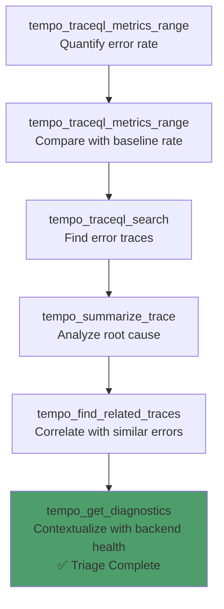
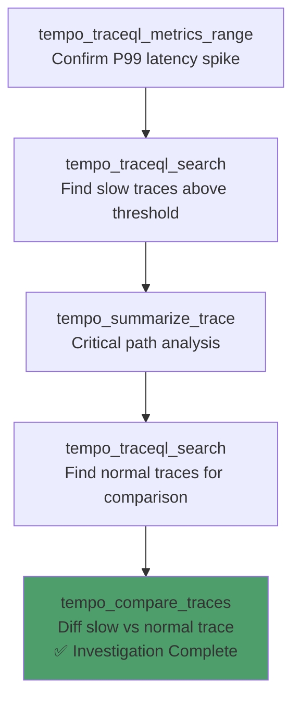
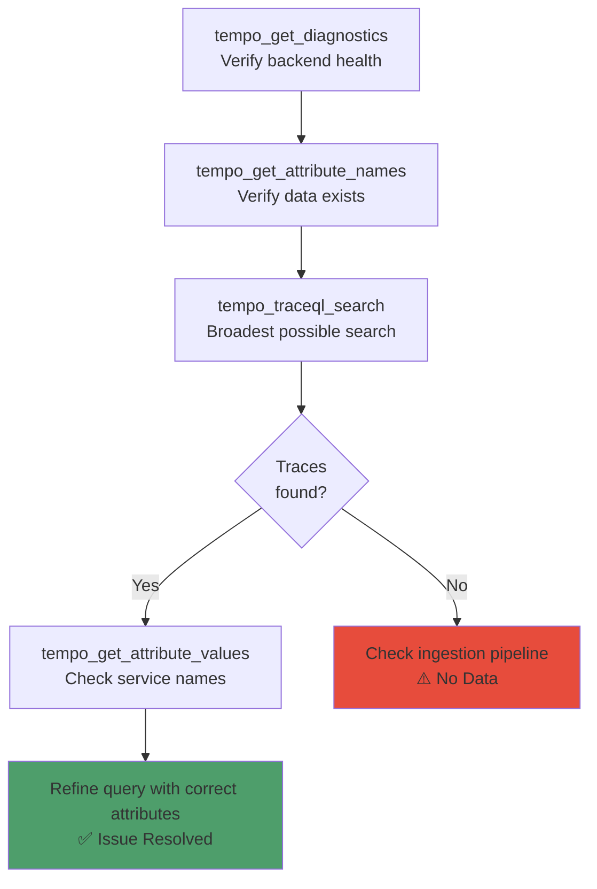
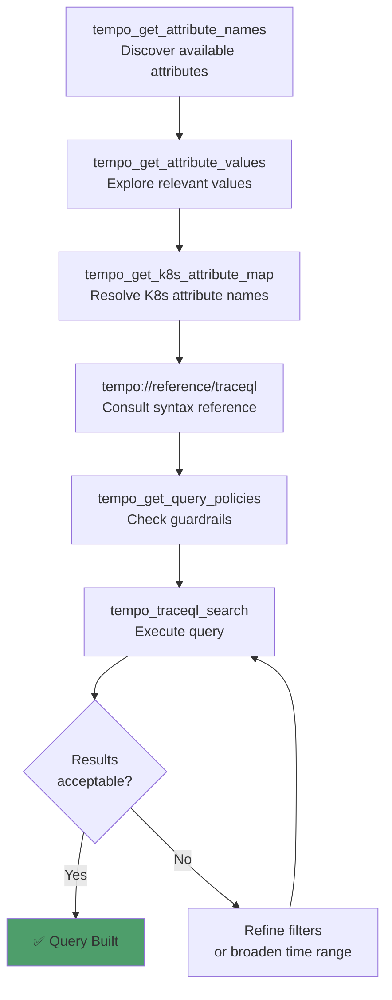
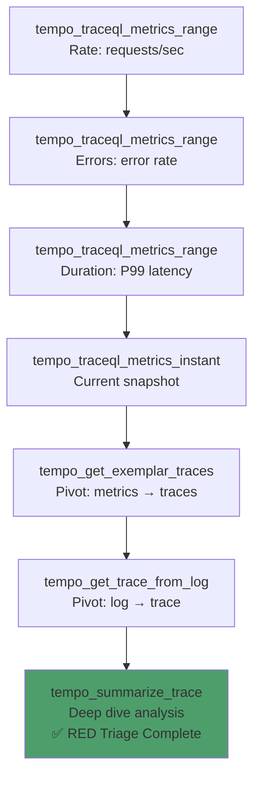
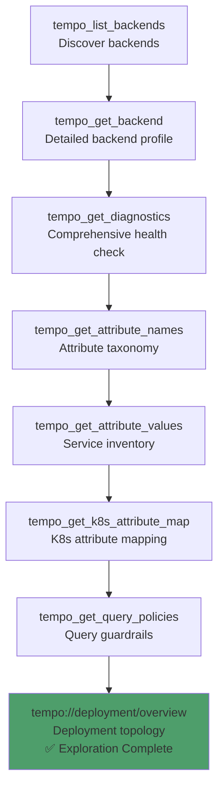
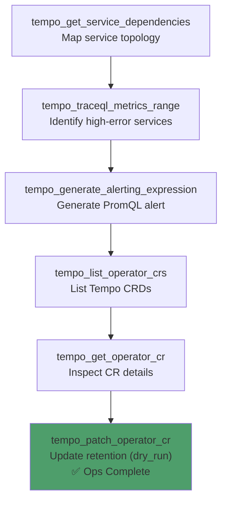

# Tempo MCP Server — Observability Journeys (OTel Demo)

**A comprehensive guide to how Tools, Resources, and Prompts coordinate across real-world Grafana Tempo distributed tracing workflows — tested against the [OpenTelemetry Demo](https://opentelemetry.io/docs/demo/) microservices.**

> 💬 **New to the tools?** See the companion **[PROMPT_REFERENCE.md](PROMPT_REFERENCE.md)** — natural language prompts for every tool call in this guide.

---

## Environment Tested

| Component | Version / Detail |
|-----------|-----------------|
| **Kubernetes** | v1.35.1 (Docker Desktop) |
| **Tempo** | v2.7+ (Helm chart, SingleBinary / Microservices mode) |
| **OTel Collector** | `otel-demo-collector` (DaemonSet, `otel-demo` namespace) |
| **OTel Demo** | 16 microservices across `otel-demo` namespace |
| **Ingestion** | OTLP (SDK traces) → OTel Collector → Tempo via `otlp/grpc` |
| **Metrics Generator** | `local-blocks` processor enabled for TraceQL metrics |
| **MCP Transport** | HTTP (`http://localhost:8768/mcp`) |
| **Backend ID** | `default` (auto-configured via `TEMPO_BASE_URL`) |

### OTel Demo Service Inventory

| Service | Language | Trace Characteristics | Key Span Patterns |
|---------|----------|-----------------------|-------------------|
| `frontend` | JavaScript | HTTP server spans, downstream calls | `GET /`, `GET /api/products`, DNS resolution errors |
| `frontend-proxy` | Envoy | HTTP proxy spans with full trace context | Access log spans with `http.method`, `http.status_code` |
| `checkout` | Go | Order processing, multi-service orchestration | `oteldemo.CheckoutService/PlaceOrder`, payment/shipping calls |
| `cart` | .NET | Valkey (Redis) operations | `oteldemo.CartService/AddItem`, `HSET`, `HGET` |
| `currency` | C++ | gRPC currency conversion | `oteldemo.CurrencyService/Convert`, OTLP export failures |
| `email` | Ruby | Email rendering | `oteldemo.EmailService/SendOrderConfirmation` |
| `payment` | JavaScript | Payment processing, charge validation | `oteldemo.PaymentService/Charge` |
| `product-catalog` | Go | Product listing, gRPC serving | `oteldemo.ProductCatalogService/ListProducts`, export timeouts |
| `recommendation` | Python | ML-based recommendations | `oteldemo.RecommendationService/ListRecommendations` |
| `shipping` | Rust | Shipping cost calculation | `oteldemo.ShippingService/GetQuote`, `ShipOrder` |
| `ad` | Java | Ad serving, feature flags | `oteldemo.AdService/GetAds`, flagd events |
| `quote` | PHP | Quote calculation | `oteldemo.QuoteService/GetQuote` |
| `kafka` | Java | Message broker | Producer/consumer spans, connection errors |
| `load-generator` | Python | Locust load test | HTTP client spans to frontend |

### Tempo Attribute Taxonomy

| Attribute | Scope | Description | Example Values |
|-----------|-------|-------------|----------------|
| `resource.service.name` | resource | OTel service name | `checkout`, `frontend`, `ad` |
| `resource.k8s.namespace.name` | resource | Kubernetes namespace | `otel-demo` |
| `resource.k8s.deployment.name` | resource | Kubernetes Deployment | `checkout`, `frontend` |
| `resource.k8s.pod.name` | resource | Pod name | `checkout-9d947d8d-ltj24` |
| `resource.k8s.container.name` | resource | Container name | `checkout` |
| `resource.k8s.node.name` | resource | Node name | `docker-desktop` |
| `span.http.method` | span | HTTP method | `GET`, `POST`, `PUT` |
| `span.http.status_code` | span | HTTP status code | `200`, `500`, `503` |
| `span.rpc.method` | span | gRPC method | `PlaceOrder`, `GetQuote` |
| `status` | intrinsic | Span status | `error`, `ok`, `unset` |
| `duration` | intrinsic | Span duration | `500ms`, `2s` |
| `name` | intrinsic | Span/operation name | `GET /api/products` |
| `kind` | intrinsic | Span kind | `server`, `client`, `internal` |

---

## Table of Contents

1. [Prerequisites & Environment Setup](#1-prerequisites--environment-setup)
2. [Workflow 1: Error Triage](#2-workflow-1-error-triage)
3. [Workflow 2: Latency Investigation](#3-workflow-2-latency-investigation)
4. [Workflow 3: Missing Traces Diagnostic](#4-workflow-3-missing-traces-diagnostic)
5. [Workflow 4: TraceQL Query Builder](#5-workflow-4-traceql-query-builder)
6. [Workflow 5: Metrics-First Triage (RED)](#6-workflow-5-metrics-first-triage-red)
7. [Workflow 6: Schema Exploration](#7-workflow-6-schema-exploration)
8. [Workflow 7: Service Topology & Alerting](#8-workflow-7-service-topology--alerting)

---

## 1. Prerequisites & Environment Setup

### Infrastructure Requirements

| Component | Requirement | Notes |
|-----------|-------------|-------|
| **Grafana Tempo** | v2.4+ accessible via HTTP | `allow_structured_metadata: true`, metrics-generator with `local-blocks` |
| **OTel Collector** | Deployed in `otel-demo` namespace | DaemonSet exporting traces to Tempo via `otlp/grpc` |
| **OTel Demo Apps** | 16 services in `otel-demo` namespace | Auto-instrumented via OTel Operator |
| **Python** | 3.12+ | For running the MCP server |
| **Metrics Generator** | Required for metrics tools | `local-blocks` processor for TraceQL metrics |
| **Tempo 2.4+** | Required for structural queries | `>>` operator for topology |
| **Tempo 2.9+** | Optional | LLM-optimized trace format (`application/vnd.grafana.llm`) |

### MCP Server Setup

```bash
git clone https://github.com/talkops-ai/talkops-mcp.git
cd talkops-mcp/src/tempo-mcp-server
uv venv && source .venv/bin/activate
uv pip install -e ".[dev]"

# Configure
export TEMPO_BASE_URL=http://localhost:3200
export MCP_TRANSPORT=http

# Run
uv run tempo-mcp-server
```

### MCP Client Configuration

```json
{
  "mcpServers": {
    "tempo": {
      "url": "http://localhost:8768/mcp",
      "description": "Grafana Tempo distributed tracing MCP server"
    }
  }
}
```

---

## 2. Workflow 1: Error Triage

### Scenario

The `checkout` service is producing errors during order processing. You need to quantify the error rate, find concrete error traces, analyze the root cause via trace summarization, and correlate with related error traces — using a metrics-first approach.

> **Guided Prompt**: Use `tempo-error-triage` for the full step-by-step flow.

### Journey Diagram



### Step-by-Step

| Step | Action | Tool / Resource | Key Parameters |
|------|--------|-----------------|----------------|
| 1 | Check error rate | **Tool**: `tempo_traceql_metrics_range(backend_id="default", query='{ resource.service.name = "checkout" && status = error } \| rate()', since="1h")` | Error rate time series |
| 2 | Compare with baseline | **Tool**: `tempo_traceql_metrics_range(backend_id="default", query='{ resource.service.name = "checkout" } \| rate()', since="1h")` | Total request rate |
| 3 | Find error traces | **Tool**: `tempo_traceql_search(backend_id="default", service="checkout", status="error", since="30m")` | Error traces with summaries |
| 4 | Analyze root cause | **Tool**: `tempo_summarize_trace(backend_id="default", trace_id="<from_step_3>")` | Critical path, errors, suspected root cause |
| 5 | Correlate errors | **Tool**: `tempo_find_related_traces(backend_id="default", trace_id="<from_step_3>", strategy="same_service_errors")` | Related error traces |
| 6 | Check backend health | **Tool**: `tempo_get_diagnostics(backend_id="default")` | Overall system health |

### Resources Used

| Resource | When | Purpose |
|----------|------|---------|
| `tempo://system/backends` | Before Step 1 | Verify Tempo is reachable |
| `tempo://reference/traceql` | Step 1 | TraceQL syntax for metric queries |
| `tempo://runbooks/error-burst` | After Step 4 | Error burst investigation runbook |

### Key Concepts

**Metrics-First Workflow:**
The recommended approach starts with aggregate metrics to quantify impact before drilling into individual traces.

| Step | Purpose | Tool |
|------|---------|------|
| Metrics first | Quantify error rate and compare with baseline | `tempo_traceql_metrics_range` |
| Search second | Find concrete error traces | `tempo_traceql_search` |
| Summarize third | Extract critical path, errors, root cause | `tempo_summarize_trace` |
| Correlate fourth | Find related traces with same error pattern | `tempo_find_related_traces` |
| Contextualize last | Check if backend itself is degraded | `tempo_get_diagnostics` |

---

## 3. Workflow 2: Latency Investigation

### Scenario

The `frontend` service is experiencing latency spikes above 500ms. You need to confirm the spike with P99 metrics, find slow traces, analyze the critical path, and compare a slow trace against a normal trace to understand the regression.

> **Guided Prompt**: Use `tempo-latency-investigation` for the full step-by-step flow.

### Journey Diagram



### Step-by-Step

| Step | Action | Tool / Resource | Key Parameters |
|------|--------|-----------------|----------------|
| 1 | Confirm spike | **Tool**: `tempo_traceql_metrics_range(backend_id="default", query='{ resource.service.name = "frontend" } \| quantile_over_time(duration, 0.99)', since="6h")` | P99 time series |
| 2 | Find slow traces | **Tool**: `tempo_traceql_search(backend_id="default", service="frontend", min_duration_ms=500, since="1h")` | Slow traces |
| 3 | Analyze critical path | **Tool**: `tempo_summarize_trace(backend_id="default", trace_id="<slowest_from_step_2>")` | Critical path, error spans, headline |
| 4 | Find normal traces | **Tool**: `tempo_traceql_search(backend_id="default", service="frontend", max_duration_ms=250, since="1h", limit=3)` | Normal traces for comparison |
| 5 | Compare traces | **Tool**: `tempo_compare_traces(backend_id="default", trace_id_a="<normal_trace>", trace_id_b="<slow_trace>")` | 5-dimensional diff: structure, spans, timing, errors, attributes |

### Latency Investigation Interpretation

| Metric | Meaning | Next Action |
|--------|---------|-------------|
| P99 spike visible in step 1 | ✅ Confirmed latency regression | Proceed to find slow traces |
| No spike visible | ⚠️ May be intermittent or resolved | Try broader time range or different percentile |
| Critical path shows downstream service | Root cause is in a dependency | Investigate that service with `tempo_summarize_trace` |
| Compare shows new service in slow trace | A new downstream call was added | Check recent deployments |
| Compare shows same structure but longer duration | Existing service became slower | Check resource constraints |

---

## 4. Workflow 3: Missing Traces Diagnostic

### Scenario

You're expecting to see traces from the `payment` service but `tempo_traceql_search` returns nothing. You need to diagnose whether the issue is with the Tempo backend, the data pipeline, or the query parameters.

> **Guided Prompt**: Use `tempo-missing-traces` for the full step-by-step flow.

### Journey Diagram



### Step-by-Step

| Step | Action | Tool / Resource | Key Parameters |
|------|--------|-----------------|----------------|
| 1 | Check backend health | **Tool**: `tempo_get_diagnostics(backend_id="default")` | Health, readiness, component status |
| 2 | Verify data exists | **Tool**: `tempo_get_attribute_names(backend_id="default", since="1h")` | Available attributes confirm ingestion |
| 3 | Broadest search | **Tool**: `tempo_traceql_search(backend_id="default", since="24h", limit=5)` | Any traces at all? |
| 4 | Check service names | **Tool**: `tempo_get_attribute_values(backend_id="default", attribute="resource.service.name", since="1h")` | Verify service name spelling |
| 5 | Consult runbook | **Resource**: `tempo://runbooks/no-traces-found` | Full diagnostic walkthrough |
| 6 | Check tenant (if multi-tenant) | **Resource**: `tempo://runbooks/cross-tenant-access` | Cross-tenant query configuration |

### Diagnostic Decision Tree

| Outcome | Meaning | Next Action |
|---------|---------|-------------|
| Backend unhealthy | ❌ Tempo is down | Check Tempo pods/logs |
| No attributes at all | ❌ No data ingested | Check OTel Collector → Tempo pipeline |
| Attributes exist, broadest search returns traces | ⚠️ Query too narrow | Check service name spelling in attribute values |
| Attributes exist, no traces at all | ⚠️ Retention expired or wrong tenant | Broaden time range or check tenant ID |
| Service name found but different spelling | ✅ Service name mismatch | Use correct service name from `tempo_get_attribute_values` |

---

## 5. Workflow 4: TraceQL Query Builder

### Scenario

You want to build a TraceQL query from natural language intent — for example, *"find all checkout traces that call the payment service and take longer than 1 second"* or *"find error traces with HTTP 500 status codes in the frontend namespace"*. The AI discovers available attributes, consults the reference, constructs the query, and executes.

> **Guided Prompt**: Use `tempo-traceql-builder` for the full step-by-step flow.

### Journey Diagram



### Step-by-Step

| Step | Action | Tool / Resource | Key Parameters |
|------|--------|-----------------|----------------|
| 1 | Discover attributes | **Tool**: `tempo_get_attribute_names(backend_id="default", scope="span", since="1h")` | Available span attributes |
| 2 | Explore values | **Tool**: `tempo_get_attribute_values(backend_id="default", attribute="resource.service.name", since="1h")` | Valid service names |
| 3 | K8s mapping | **Tool**: `tempo_get_k8s_attribute_map(backend_id="default")` | K8s concept → OTel attribute mapping |
| 4 | Load references | **Resource**: `tempo://reference/traceql`, `tempo://examples/common-queries` | Syntax and examples |
| 5 | Check policies | **Tool**: `tempo_get_query_policies(backend_id="default")` | Max lookback, limits, guardrails |
| 6 | Execute | **Tool**: `tempo_traceql_search(backend_id="default", query='{ resource.service.name = "checkout" && duration > 1s }', since="1h")` | Search results |

### TraceQL Quick Reference (OTel Demo)

| Concept | Syntax | OTel Demo Example |
|---------|--------|-------------------|
| Service filter | `resource.service.name = "value"` | `{ resource.service.name = "checkout" }` |
| Error filter | `status = error` | `{ resource.service.name = "checkout" && status = error }` |
| Duration filter | `duration > Nms` | `{ duration > 500ms }` |
| HTTP status | `span.http.status_code >= N` | `{ span.http.status_code >= 500 }` |
| Regex match | `name =~ "pattern"` | `{ name =~ ".*PlaceOrder.*" }` |
| Structural | `{ } >> { }` | `{ resource.service.name = "frontend" } >> { resource.service.name = "checkout" }` |
| Nil check | `.attr = nil` | `{ resource.service.name = "checkout" && span.http.status_code = nil }` |

### Resources Used

| Resource | When | Purpose |
|----------|------|---------|
| `tempo://reference/traceql` | Step 4 | Full TraceQL syntax reference |
| `tempo://reference/k8s-attributes` | Step 3 | K8s attribute names |
| `tempo://examples/common-queries` | Step 4 | Common query patterns |
| `tempo://reference/query-policies` | Step 5 | Current query guardrails |

---

## 6. Workflow 5: Metrics-First Triage (RED)

### Scenario

You want to perform a RED (Rate, Errors, Duration) analysis of the `checkout` service — measuring request rate, error rate, and P99 latency — then pivot from the metrics to specific exemplar traces for deep analysis. This workflow also demonstrates cross-pillar pivots (metrics→traces, logs→traces).

> **Guided Prompt**: Use `tempo-metrics-first-triage` for the full step-by-step flow.

### Journey Diagram



### Step-by-Step

| Step | Action | Tool / Resource | Key Parameters |
|------|--------|-----------------|----------------|
| 1 | Request rate | **Tool**: `tempo_traceql_metrics_range(backend_id="default", query='{ resource.service.name = "checkout" } \| rate()', since="6h")` | Rate time series |
| 2 | Error rate | **Tool**: `tempo_traceql_metrics_range(backend_id="default", query='{ resource.service.name = "checkout" && status = error } \| rate()', since="6h")` | Error rate time series |
| 3 | P99 latency | **Tool**: `tempo_traceql_metrics_range(backend_id="default", query='{ resource.service.name = "checkout" } \| quantile_over_time(duration, 0.99)', since="6h")` | P99 time series |
| 4 | Current snapshot | **Tool**: `tempo_traceql_metrics_instant(backend_id="default", query='{ resource.service.name = "checkout" && status = error } \| rate()', since="1h")` | Point-in-time error rate |
| 5 | Exemplar pivot | **Tool**: `tempo_get_exemplar_traces(backend_id="default", query='{ resource.service.name = "checkout" && status = error } \| rate()', since="1h")` | Trace IDs from metrics |
| 6 | Log pivot | **Tool**: `tempo_get_trace_from_log(backend_id="default", log_line="trace_id=abc123def456...")` | Extract trace ID from log line |
| 7 | Deep dive | **Tool**: `tempo_summarize_trace(backend_id="default", trace_id="<from_step_5_or_6>")` | Full trace analysis |

### RED Metrics Interpretation

| Metric | Normal | Anomalous | Next Action |
|--------|--------|-----------|-------------|
| **Rate** | Steady or gradual increase | Sudden drop or zero | Check ingestion pipeline |
| **Errors** | < 1% of total rate | Spike above baseline | Search error traces → summarize |
| **Duration** | P99 < SLO threshold | P99 spike above threshold | Find slow traces → compare |

### TraceQL Metrics Functions Reference

| Function | Purpose | OTel Demo Example |
|----------|---------|-------------------|
| `rate()` | Spans per second | `{ resource.service.name = "checkout" } \| rate()` |
| `count_over_time()` | Total spans in window | `{ status = error } \| count_over_time()` |
| `quantile_over_time(attr, q)` | Quantile of attribute | `{ resource.service.name = "frontend" } \| quantile_over_time(duration, 0.99)` |
| `avg_over_time(attr)` | Average of attribute | `{ resource.service.name = "checkout" } \| avg_over_time(duration)` |
| `histogram_over_time(attr)` | Distribution | `{ resource.service.name = "checkout" } \| histogram_over_time(duration)` |
| `\| by(attr)` | Group by attribute | `{ status = error } \| rate() \| by(resource.service.name)` |

---

## 7. Workflow 6: Schema Exploration

### Scenario

You're connecting to a Tempo backend for the first time and want a complete picture: backend health, deployment topology, available attributes, K8s mapping, and service inventory. This is the recommended starting workflow for new integrations — including when the k8s-autopilot connects to the Tempo MCP server.

### Journey Diagram



### Step-by-Step

| Step | Action | Tool / Resource | Key Parameters |
|------|--------|-----------------|----------------|
| 1 | Discover backends | **Tool**: `tempo_list_backends()` | All backends with health status |
| 2 | Backend profile | **Tool**: `tempo_get_backend(backend_id="default")` | Version, capabilities, deployment mode |
| 3 | Health check | **Tool**: `tempo_get_diagnostics(backend_id="default")` | Readiness, build info, components, rings |
| 4 | Attribute taxonomy | **Tool**: `tempo_get_attribute_names(backend_id="default", scope="all", since="1h")` | All attributes by scope |
| 5 | Service inventory | **Tool**: `tempo_get_attribute_values(backend_id="default", attribute="resource.service.name", since="1h")` | All services sending traces |
| 6 | Namespace inventory | **Tool**: `tempo_get_attribute_values(backend_id="default", attribute="resource.k8s.namespace.name", since="1h")` | All namespaces |
| 7 | K8s mapping | **Tool**: `tempo_get_k8s_attribute_map(backend_id="default")` | K8s concept → OTel attribute mapping with live validation |
| 8 | Query policies | **Tool**: `tempo_get_query_policies(backend_id="default")` | Max lookback, limits, guardrails |
| 9 | Deployment overview | **Resource**: `tempo://deployment/overview` | Backend topology, modes, tenants |

### Expected Attribute Scopes

| Scope | Expected Attributes | Assessment |
|-------|-------------------|------------|
| `resource` | `service.name`, `k8s.namespace.name`, `k8s.deployment.name`, `k8s.pod.name` | ✅ Core service identity attributes |
| `span` | `http.method`, `http.status_code`, `rpc.method`, `db.statement` | ✅ Request-level attributes |
| `intrinsic` | `duration`, `name`, `status`, `kind`, `traceDuration`, `rootName`, `rootServiceName` | ✅ Always present |

### Resources Used

| Resource | When | Purpose |
|----------|------|---------|
| `tempo://system/backends` | Step 1 | Quick backend health overview |
| `tempo://deployment/overview` | Step 9 | Deployment topology summary |
| `tempo://reference/k8s-attributes` | Step 7 | K8s attribute naming conventions |
| `tempo://reference/query-policies` | Step 8 | Current query guardrails |

---

## 8. Workflow 7: Service Topology & Alerting

### Scenario

You want to map the service dependency topology of the OTel Demo, then generate PromQL alerting expressions for high-error-rate services. This workflow also demonstrates Tempo Operator CRD management for Day 2 operations — listing, inspecting, and updating Tempo CRs.

### Journey Diagram



### Step-by-Step

| Step | Action | Tool / Resource | Key Parameters |
|------|--------|-----------------|----------------|
| 1 | Map topology | **Tool**: `tempo_get_service_dependencies(backend_id="default", since="1h")` | Nodes (services) and edges (call relationships) |
| 2 | Focused topology | **Tool**: `tempo_get_service_dependencies(backend_id="default", service="checkout", since="1h")` | Dependencies of a specific service |
| 3 | Identify hot services | **Tool**: `tempo_traceql_metrics_range(backend_id="default", query='{ status = error } \| rate() \| by(resource.service.name)', since="1h")` | Error rate per service |
| 4 | Generate alert | **Tool**: `tempo_generate_alerting_expression(backend_id="default", service="checkout", alert_type="error_rate", threshold=0.05)` | PromQL expression + YAML snippet |
| 5 | List Tempo CRs | **Tool**: `tempo_list_operator_crs()` | TempoStack / TempoMonolithic instances |
| 6 | Inspect CR | **Tool**: `tempo_get_operator_cr(namespace="monitoring", name="tempo", kind="TempoStack")` | Full spec, status, conditions |
| 7 | Update retention | **Tool**: `tempo_patch_operator_cr(namespace="monitoring", name="tempo", kind="TempoStack", retention="7d", dry_run=true)` | Preview patch before applying |

### Alerting Types Reference

| Alert Type | Threshold Meaning | PromQL Pattern |
|------------|-------------------|----------------|
| `error_rate` | Error ratio (0.05 = 5%) | `sum(rate(traces_spanmetrics_calls_total{status_code="STATUS_CODE_ERROR"}[5m])) / sum(rate(traces_spanmetrics_calls_total[5m]))` |
| `latency_p99` | P99 latency in ms | `histogram_quantile(0.99, sum(rate(traces_spanmetrics_duration_milliseconds_bucket[5m])) by (le))` |
| `throughput_drop` | Minimum requests/sec | `sum(rate(traces_spanmetrics_calls_total[5m]))` |

### Cross-MCP Workflow

```
tempo_generate_alerting_expression → generates PromQL + YAML snippet
→ AI agent passes yaml_snippet to prom_upsert_rule_group (Prometheus MCP server)
→ PrometheusRule CRD created in cluster
```

### Operator CRD Quick Reference

| Operation | Tool | Destructive? | Default |
|-----------|------|-------------|---------|
| List CRs | `tempo_list_operator_crs` | No | — |
| Get CR detail | `tempo_get_operator_cr` | No | — |
| Create CR | `tempo_create_operator_cr` | **Yes** | `dry_run=true` |
| Patch CR | `tempo_patch_operator_cr` | **Yes** | `dry_run=true` |

> **Safety**: Both `create` and `patch` default to `dry_run=true`. The generated manifest is returned for review. Set `dry_run=false` only after reviewing the output.

---

*Document Version: 1.0 | OTel Demo (`otel-demo` namespace) | Companion to [PROMPT_REFERENCE.md](PROMPT_REFERENCE.md)*
