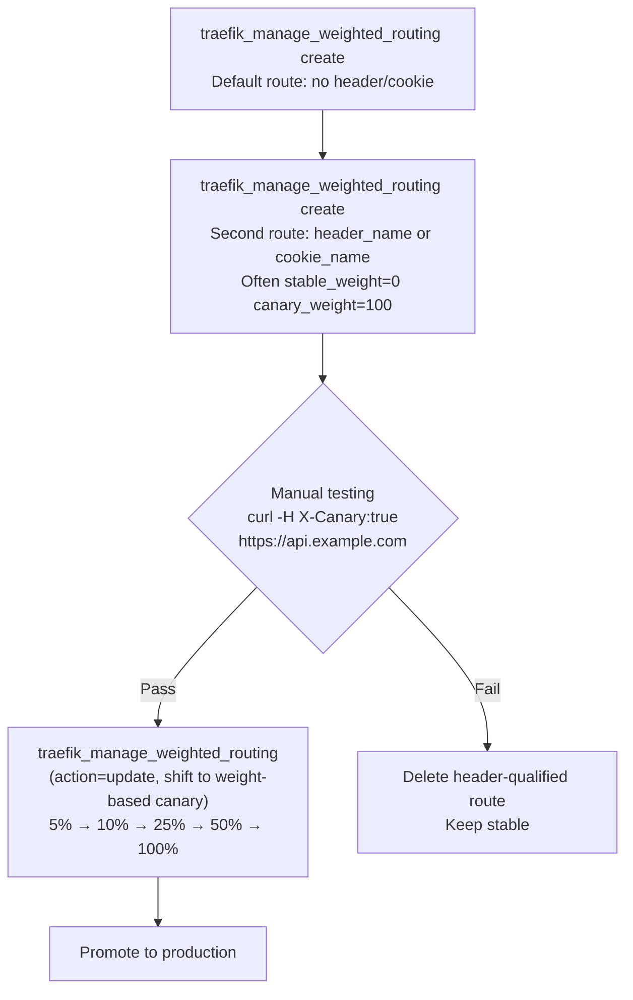
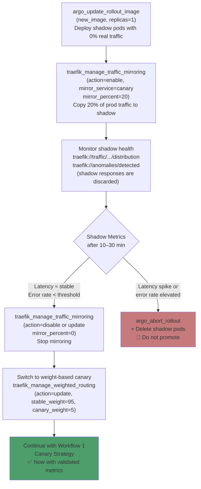

# Traefik MCP Server — Traffic Management Journeys

**A comprehensive guide to how Tools and Resources coordinate across real-world edge routing scenarios.**

> 💬 **New to the tools?** See the companion **[PROMPT_REFERENCE.md](PROMPT_REFERENCE.md)** — natural language prompts for every tool call in this guide.

---

## Table of Contents

1. [Prerequisites & Environment Setup](#1-prerequisites--environment-setup)
2. [Workflow 1: Traffic Handling via Traefik](#2-workflow-1-traffic-handling-via-traefik)
3. [Workflow 2: Header-Based Canary Routing](#3-workflow-2-header-based-canary-routing)
4. [Workflow 3: NGINX to Traefik Migration](#4-workflow-3-nginx-to-traefik-migration)
5. [Workflow 4: Shadow / Dark Launch (Traffic Mirroring)](#5-workflow-4-shadow--dark-launch-traffic-mirroring)
6. [Workflow 5: TCP Routing (PostgreSQL, Redis, etc.)](#6-workflow-5-tcp-routing-postgresql-redis-etc)

---

## 1. Prerequisites & Environment Setup

### Infrastructure Requirements

| Component | Requirement | Notes |
|-----------|-------------|-------|
| **Kubernetes Cluster** | v1.24+ | Any managed (EKS, GKE, AKS) or self-managed |
| **Argo Rollouts** | Installed as CRD + Controller | `kubectl apply -n argo-rollouts -f https://github.com/argoproj/argo-rollouts/releases/latest/download/install.yaml` |
| **Traefik** | Deployed as Ingress Controller | CRDs: `IngressRoute`, `TraefikService`, `Middleware` |
| **Prometheus** | For AnalysisTemplate metrics | Required for automated analysis (error rate, latency) |
| **kubectl** | Configured with cluster access | `KUBECONFIG=~/.kube/config` |
| **Python** | 3.10+ | For running the MCP server |

### Application Requirements

Before onboarding, the existing application **must have**:

| Requirement | Details | Validated By |
|-------------|---------|-------------|
| **Container Image** | Pushed to a registry (DockerHub, ECR, GCR, etc.) | Manual |
| **Kubernetes Deployment** | Standard Deployment YAML available | `validate_deployment_ready_for_rollout` |
| **Health Probes** | Readiness and liveness probes defined | `validate_deployment_ready_for_rollout` |
| **Resource Requests** | CPU/memory requests and limits configured | `validate_deployment_ready_for_rollout` |
| **Replicas ≥ 2** | Minimum 2 replicas for HA | `validate_deployment_ready_for_rollout` |
| **Namespace** | Application deployed in a known namespace | Manual |

### ArgoFlow MCP Server Setup

```bash
# 1. Clone and install
git clone <repository-url> && cd argoflow-mcp-server
python -m venv .venv && source .venv/bin/activate
pip install -e .

# 2. Configure environment
export KUBECONFIG=~/.kube/config
export ARGO_NAMESPACE=default

# 3. Run server
python -m argoflow_mcp_server
```

### MCP Client Configuration

```json
{
  "mcpServers": {
    "argoflow": {
      "command": "python",
      "args": ["-m", "argoflow_mcp_server"],
      "env": {
        "KUBECONFIG": "/path/to/.kube/config",
        "ARGO_NAMESPACE": "default"
      }
    }
  }
}
```

---

## 2. Workflow 1: Traffic Handling via Traefik

Traefik is the traffic orchestration layer. This section covers how traffic is managed through the deployment lifecycle.

### Traefik Resource Architecture

```
┌──────────────────────────────────────────────────────┐
│                  Traefik Ingress Controller           │
├──────────────────────────────────────────────────────┤
│                                                      │
│  ┌────────────────┐     ┌─────────────────────────┐  │
│  │  IngressRoute  │────▶│     TraefikService      │  │
│  │  (Host + Path) │     │  (Weighted Round-Robin)  │  │
│  └────────────────┘     └────────┬────────────────┘  │
│                                  │                   │
│                    ┌─────────────┼─────────────┐     │
│                    │                           │     │
│              ┌─────▼──────┐          ┌─────────▼──┐  │
│              │   Stable   │          │   Canary   │  │
│              │  Service   │          │  Service   │  │
│              │  (95%)     │          │   (5%)     │  │
│              └────────────┘          └────────────┘  │
│                                                      │
│  ┌────────────────────────────────────────────────┐  │
│  │              Middleware Chain                   │  │
│  │  Rate Limit → Circuit Breaker → Headers        │  │
│  └────────────────────────────────────────────────┘  │
└──────────────────────────────────────────────────────┘
```

### Generator vs Executor Pattern

The ArgoFlow MCP Server provides **two complementary approaches** for Traefik setup:

| Approach | Tool | Use Case |
|----------|------|----------|
| **Generator** (YAML output) | `traefik_generate_routing_manifest` (manifest_type=traefik_service, ingress_for_traefik_service, ingress_for_services, mirroring, ingress_route_tcp, middleware_tcp) | Review/audit before applying, GitOps workflows, dry-run |
| **Executor** (Direct apply) | `traefik_manage_weighted_routing` (action=create) | Immediate cluster modification, automation |

Use the **generator** during onboarding (review YAML before first-time setup) and the **executor** during deployments (fast, direct changes).

### Path-Based Routing, TLS, and Middlewares

`traefik_manage_weighted_routing` (action=create) supports path-based matching, TLS, and middleware attachment:

| Parameter | Description | Example |
|-----------|-------------|---------|
| `path_prefix` | Path match (e.g. `/api`) | Route only `/api/*` to canary |
| `path_match_type` | `PathPrefix` \| `Path` \| `PathRegexp` | Exact vs prefix vs regex |
| `header_name` / `header_value` | Optional HTTP header match (create) | Traefik `Header` matcher; value defaults to `true` if omitted |
| `cookie_name` / `cookie_regex` | Optional cookie match (create) | `HeaderRegexp` on `Cookie` header; `cookie_name` takes precedence over `header_name` |
| `tls_enabled` | Enable TLS on the route | Uses `websecure` entrypoint by default |
| `tls_secret_name` | TLS secret for termination | `api-tls` |
| `middlewares` | Middleware names to attach | `["rate-limit", "auth"]` |

### Traffic Lifecycle During Canary Deployment

#### Phase 1: Route Creation

```python
# Option A: Generator (for review)
traefik_generate_routing_manifest(
    manifest_type="traefik_service",
    name="api-service",
    stable_service="api-service-stable",
    canary_service="api-service-canary",
    namespace="production",
    initial_canary_weight=0,
    port=80
)
# Returns: TraefikService YAML for review

# Option B: Executor (direct apply)
traefik_manage_weighted_routing(
    route_name="api-service-route",
    namespace="production",
    action="create",
    hostname="api.example.com",
    stable_weight=100,
    canary_weight=0,
    # Optional: path_prefix="/api", path_match_type="PathPrefix",
    # tls_enabled=True, tls_secret_name="api-tls",
    # middlewares=["rate-limit", "auth"]
)
# Applies: TraefikService + IngressRoute directly to cluster

# Path-based canary (route only /api/* traffic):
traefik_manage_weighted_routing(..., path_prefix="/api", path_match_type="PathPrefix")

# TLS + middlewares:
traefik_manage_weighted_routing(..., tls_enabled=True, tls_secret_name="api-tls", middlewares=["rate-limit"])
```

#### Phase 2: Progressive Traffic Shifting

| Step | Tool Call | Stable % | Canary % | Monitoring Resource |
|------|----------|----------|----------|---------------------|
| Initial | `traefik_manage_weighted_routing(action="create", stable_weight=100, canary_weight=0)` | 100% | 0% | — |
| Shift 1 | `traefik_manage_weighted_routing(action="update", stable_weight=95, canary_weight=5)` | 95% | 5% | `traefik://traffic/{ns}/{route_name}/distribution` |
| Shift 2 | `traefik_manage_weighted_routing(action="update", stable_weight=90, canary_weight=10)` | 90% | 10% | `traefik://traffic/{ns}/{route_name}/distribution` |
| Shift 3 | `traefik_manage_weighted_routing(action="update", stable_weight=75, canary_weight=25)` | 75% | 25% | `traefik://traffic/{ns}/{route_name}/distribution` |
| Shift 4 | `traefik_manage_weighted_routing(action="update", stable_weight=50, canary_weight=50)` | 50% | 50% | `traefik://traffic/{ns}/{route_name}/distribution` |
| Complete | `traefik_manage_weighted_routing(action="update", stable_weight=0, canary_weight=100)` | 0% | 100% | `traefik://traffic/{ns}/{route_name}/distribution` |

#### Phase 3: Middleware Protection

Middlewares provide automatic safety guardrails during traffic shifts:

**Rate Limiting** — Protect canary from overwhelming traffic:
```python
traefik_manage_middleware(
    action="create",
    middleware_name="canary-rate-limit",
    namespace="production",
    middleware_type="rate_limit",
    average=100,    # 100 req/s sustained
    burst=200,      # 200 req/s burst
    period="1s"
)
```

**Circuit Breaker** — Auto-stop traffic if canary is unhealthy:
```python
traefik_manage_middleware(
    action="create",
    middleware_name="canary-circuit-breaker",
    namespace="production",
    middleware_type="circuit_breaker",
    trigger_type="error-rate",
    threshold=0.30,   # Trip at 30% error rate
    response_code=429 # Distinguish proxy CB rejection from backend 503
)
```

**Traffic Mirroring** — Shadow-test before real traffic:
```python
traefik_manage_traffic_mirroring(
    action="enable",
    route_name="api-service-route",
    namespace="production",
    mirror_percent=20,  # Copy 20% of traffic to canary
)
```

**Anomaly status (read-only)** — Use the MCP resource (no dedicated anomaly *tool*):
```text
read_resource traefik://anomalies/detected
```

> Use `traefik://anomalies/detected` (and related metrics resources) for anomaly-style signals. Full Prometheus-backed behavior depends on cluster metrics wiring.

#### Phase 4: Traffic Monitoring

```python
# Real-time distribution
traefik_get_traffic_distribution(
    route_name="api-service-route",
    namespace="production"
)
# Returns: { stable_weight: 75, canary_weight: 25, stable_pct: 72.0, canary_pct: 22.0 }

# Also available via resource (for dashboards / polling):
# Resource: traefik://traffic/production/api-service-route/distribution
```

#### Phase 5: Route Cleanup (Post-Deployment)

```python
# After rollout completes, clean up canary infrastructure
traefik_manage_weighted_routing(route_name="api-service-route", namespace="production", action="delete")
```

#### Phase 6: Simple IngressRoutes (Non-Weighted)

For standard direct routing bypassing the WRR/TraefikService Canary abstraction, the toolset provides simple mappings.

```python
# Create standard route directly to Kubernetes Services
traefik_manage_simple_route(
    action="create", 
    route_name="simple-api", 
    namespace="production", 
    entry_points=["web"], 
    routes=[
        {"match": "Host(`api.example.com`)", "service_name": "api-service", "service_port": 80}
    ]
)
```

### Traffic Handling: Emergency Scenarios

| Scenario | Action | Tools |
|----------|--------|-------|
| Error rate spike >30% | Circuit breaker trips automatically | Middleware auto-protection |
| Manual abort needed | Revert all traffic to stable | `traefik_manage_weighted_routing(action="update", stable_weight=100, canary_weight=0)` + `argo_abort_rollout` |
| DDoS on canary | Rate limiter activates | Middleware auto-protection + manual scale-down |
| Complete failure | Delete canary route + abort | `traefik_manage_weighted_routing(action="delete")` + `argo_abort_rollout` |

---

## 3. Workflow 2: Header-Based Canary Routing

### Scenario

You want to test a canary version by routing **specific users** (via HTTP header or cookie) to the canary, rather than using weight-based traffic splitting. This is common for internal testing, partner access, or opt-in beta programs.

> **Important**: Argo Rollouts' `setHeaderRoute` step is **Istio-only**. With Traefik, header/cookie routing is expressed on the IngressRoute `match` rule. Use `traefik_manage_weighted_routing` (create) so the same tool handles path-based and header/cookie-qualified traffic.

### Journey Diagram



> **Cookie-based variant**: Use `cookie_name` and `cookie_regex` on `traefik_manage_weighted_routing` (create); cookie constraints take precedence over `header_name` when both are set.

### Step-by-Step

| Step | Action | Tool | Key Parameters |
|------|--------|------|----------------|
| 1 | Create default weighted route (all traffic) | `traefik_manage_weighted_routing(action="create", route_name=..., hostname=..., stable_service=..., canary_service=..., stable_weight=..., canary_weight=...)` | No `header_name` / `cookie_name` |
| 2 | **Create header-qualified route** | `traefik_manage_weighted_routing(action="create", route_name="api-canary-header", hostname="api.example.com", stable_service="api-stable", canary_service="api-canary", stable_weight=0, canary_weight=100, header_name="X-Canary", header_value="true")` | Distinct `route_name`; weights often `0`/`100` for testers |
| 3 | *(Optional)* Cookie-based variant | Same tool with `cookie_name="canary"`, `cookie_regex=".*yes.*"` (omit header fields) | `cookie_name`, `cookie_regex` |
| 4 | Test manually | `curl -H "X-Canary: true" https://api.example.com/health` | — |
| 5 | Monitor canary health | Resource: `traefik://traffic/{ns}/{route_name}/distribution` | — |
| 6 | Promote to weight-based canary | `traefik_manage_weighted_routing(action="update")` on the default route; remove or narrow the header route when done | — |

**Example match** (header-qualified weighted route; Traefik v3 `Header` matcher):

```yaml
apiVersion: traefik.io/v1alpha1
kind: IngressRoute
metadata:
  name: api-canary-header
  namespace: production
spec:
  entryPoints: [web]
  routes:
    - match: Host(`api.example.com`) && Header(`X-Canary`, `true`)
      kind: Rule
      services:
        - name: api-canary-header-wrr
          kind: TraefikService
```

> **How it works**: Use a **separate** IngressRoute (distinct `route_name`) whose `match` is more specific (adds `Header` or `HeaderRegexp` on `Cookie`). Traefik’s default priority favors longer rules; verify ordering in your cluster if multiple routes share the same host.

---

## 4. Workflow 3: NGINX to Traefik Migration

For teams migrating from NGINX Ingress Controller to Traefik, ArgoFlow provides a dedicated set of programmatic tools to ensure zero-downtime cutovers.
> **Resource**: `traefik://migration/nginx-to-traefik` or `traefik://migration/nginx-to-traefik/{phase}`

### Phase 3: DNS Cutover Options

The functionality doc ([rollout-traefik-functionality.md](../references/rollout-traefik-functionality.md)) describes three cutover strategies. Use `nginx_to_traefik_migration_guide(phase="phase3")` for details:

| Option | Description | Risk |
|--------|--------------|------|
| **A: Progressive Shift (Weighted DNS)** | Add Traefik IP at 10% weight, increase gradually | Safest |
| **B: Blue/Green DNS Switch** | Lower TTL, swap A record from NGINX to Traefik IP | Medium |
| **C: In-Cluster Service Swap** | Patch LoadBalancer selectors to point at Traefik pods | Advanced |

### Traefik-Only vs. Traefik + Rollouts

| Scenario | Tools | When |
|----------|-------|------|
| **Traefik only** (no Rollouts) | `traefik_nginx_migration` (`action=generate` or `action=apply`), resources `traefik://migration/nginx-runbook/{namespace}`; optional `traefik_generate_routing_manifest` (manifest_type=ingress_for_services) only for **new** hand-authored route YAML | Full NGINX annotation → Traefik CRDs via migration scanner; generator manifest is not a substitute for that pipeline |
| **Traefik + Rollouts** | Same as above, then `traefik_generate_routing_manifest` (manifest_type=traefik_service, ingress_for_traefik_service) | Replace direct services with TraefikService for stable/canary |

### Combined Migration + Onboarding

When doing **both** nginx→Traefik and Deployment→Rollout:

1. Run `nginx_to_traefik_migration_guide(phase="overview")` first.
2. Complete Phases 1–4 to cutover DNS to Traefik.
3. Use `onboard_application_guided(..., migrating_from_nginx=True)` for Rollout onboarding — it will show migration-first guidance.

### Agentic Override Workflow (Supervised Autonomy)

If there are breaking NGINX annotations (like `auth-url` or unsupported cookie parameters), the migration generator will flag them. AI agents can dynamically "fix" the pipeline by explicitly targeting the breaking ingresses during the `action=apply` phase using a `migration_plan`:

1. **Discovery & Analysis**: The agent reads `traefik://migration/nginx-ingress-analyze` to identify unsupported/breaking metadata (e.g. `nginx.ingress.kubernetes.io/auth-url`).
2. **Dynamic Generation**: The agent prepares custom equivalent Traefik components (e.g., `traefik_manage_middleware(middleware_type="forward_auth", name="agent-custom-auth")`).
3. **Execution Override**: 
   ```python
   traefik_nginx_migration(
       action="apply", 
       namespace="production", 
       migration_plan={
           "my-breaking-ingress": {
               "ignore_annotations": ["auth-url"], # Prevent stripping/flagging
               "inject_middlewares": ["agent-custom-auth"] # Attach custom fixes
           }
       }
   )
   ```

### Tool & Resource Coordination

| Phase | Tools Used | Resources Polled | Decision Logic |
|-------|-----------|-----------------|----------------|
| Phase 1 | (Manual commands from runbook) | `traefik://migration/nginx-runbook/{namespace}` | Install Traefik with kubernetesIngressNginx provider |
| Phase 2 | `traefik_nginx_migration` | `traefik://migration/nginx-runbook/{namespace}` | Apply the migration bundle (`action=apply`, default) |
| Phase 3 | (Manual DNS per runbook) | `traefik://migration/nginx-runbook/{namespace}` | Follow guide for DNS cutover |
| Phase 4 | (Manual commands from runbook) | `traefik://migration/nginx-runbook/{namespace}` | Preserve class → Uninstall NGINX |

### Backend timeouts, TLS, and sticky sessions (outside or after migration)

The migration bundle may emit **ServersTransport** CRDs and **Service** sticky annotations. For day-2 operations without re-running migration, use:

- **`traefik_manage_servers_transport`** — `action=create` with `dial_timeout` / `response_header_timeout` (Go durations, e.g. `30s`) and/or `insecure_skip_verify=true` for HTTPS backends; `action=delete` to remove. Point the backend Service at the transport with  
  `traefik.ingress.kubernetes.io/service.serverstransport: <namespace>-<transport-name>@kubernetescrd`  
  (and `service.serversscheme: https` when needed), as in generated migration comments.

- **`traefik_configure_service_affinity`** — `action=enable` on the Kubernetes Service backing the route (optional cookie name, max age, SameSite, secure); `action=disable` strips Traefik sticky annotations.

---

## 5. Workflow 4: Shadow / Dark Launch (Traffic Mirroring)

### Scenario

You want to validate a new version against **real production traffic** without any user impact. The new version receives a copy of production requests but its responses are discarded — users always receive the stable version's response. This is the lowest-risk way to validate a new version before any traffic is shifted.

> **When to use**: Version has untested performance characteristics, or you want to compare response bodies/times before committing to even a 5% canary weight.

### Journey Diagram



### Step-by-Step

| Step | Action | Tool | Key Parameters |
|------|--------|------|----------------|
| 1 | Deploy new version (0% user traffic) | `argo_update_rollout_image(name, new_image)` | Canary pods start with 0 weight |
| 2 | **Enable traffic mirroring** | `traefik_manage_traffic_mirroring(action="enable", route_name="api-service-route", namespace="production", mirror_service="api-service-canary", mirror_percent=20)` | 20% of prod traffic copied to canary; responses discarded |
| 3 | Monitor shadow pod health | Resource: `traefik://traffic/{ns}/{route_name}/distribution` or `traefik://metrics/{ns}/{service}/summary` | Watch error rate, latency, pod resource usage |
| 4 | Check for anomalies | Resource: `traefik://anomalies/detected` | Detect error spikes in shadow pod logs |
| 5a | **Shadow passes** → stop mirroring | `traefik_manage_traffic_mirroring(action="disable", route_name=..., namespace=...)` or `action="update", mirror_percent=0` | Turn off mirroring |
| 5b | **Shadow fails** → abort | `argo_abort_rollout(name, namespace)` | Rollback shadow pods |
| 6 | *(Optional)* Adjust mirror percent | `traefik_manage_traffic_mirroring(action="update", route_name=..., mirror_percent=50)` | Ramp 20% → 50% before disabling |
| 7 | Promote to canary (after shadow passes) | `traefik_manage_weighted_routing(action="update", stable_weight=95, canary_weight=5)` | Begin real traffic shift |
| 8 | Continue with Workflow 1 canary strategy | Progressive 5% → 10% → 25% → 50% → 100% | Confidence from shadow results |

**What traffic mirroring generates:**

```yaml
# traefik_manage_traffic_mirroring(action=enable) → TraefikService with mirror
apiVersion: traefik.io/v1alpha1
kind: TraefikService
metadata:
  name: api-service-route-mirror
  namespace: production
spec:
  mirroring:
    name: api-service-stable   # Real traffic → stable (responses returned to users)
    port: 80
    mirrors:
      - name: api-service-canary  # Mirrored traffic → canary (responses discarded)
        port: 80
        percent: 20
```

### Monitoring Resources During Shadow Launch

| Resource | Poll Frequency | What to Watch |
|----------|---------------|---------------|
| `traefik://traffic/{ns}/{route_name}/distribution` | Every 30s | Route state, weights |
| `traefik://metrics/{ns}/{service}/summary` | Every 30s | Shadow pod error rate, latency |
| `traefik://anomalies/detected` | Every 60s | Error spikes, latency degradation |

### Shadow vs. Canary: When to Use Each

| Aspect | Shadow Launch | Canary Deployment |
|--------|--------------|-------------------|
| **User impact** | None (responses discarded) | 5–50% of users affected |
| **Risk** | Lowest | Low (with fast abort) |
| **Traffic needed** | Production traffic mirrored | Production traffic split |
| **Validation** | Performance, errors, resource usage | Real user experience |
| **Use when** | Untested version, latency-sensitive | Version pre-validated or low-risk update |

> ⚠️ **Side-effects warning**: Shadow traffic **does** reach your canary pods. If your new version writes to a database, sends emails, or has other side effects, shadow mode will trigger these for real. Use shadow launch only for read-heavy or idempotent services, or use a separate shadow namespace/database.

---

## 6. Workflow 5: TCP Routing (PostgreSQL, Redis, etc.)

### Scenario

You need to route non-HTTP protocols (PostgreSQL, Redis, MQTT, or custom TCP services) through Traefik, optionally with SNI-based routing, TLS passthrough, and IP allowlisting for security.

> **Prerequisite**: Traefik must be installed with `IngressRouteTCP` and `MiddlewareTCP` CRDs. These are included in standard Traefik Helm charts.

### Tools

| Tool | Purpose |
|------|---------|
| `traefik_manage_tcp_routing` | Create or delete IngressRouteTCP |
| `traefik_configure_tcp_middleware` | Create MiddlewareTCP with ipAllowList |
| `traefik_generate_routing_manifest` | Generate YAML for `ingress_route_tcp` or `middleware_tcp` |

### Step-by-Step: TCP Route with IP Allowlist

| Step | Action | Tool | Key Parameters |
|------|--------|------|----------------|
| 1 | Create IP allowlist middleware | `traefik_configure_tcp_middleware(middleware_name="db-allowlist", source_ranges='["192.168.1.0/24", "10.0.0.1"]', namespace="default")` | Restricts which IPs can connect |
| 2 | Create TCP route | `traefik_manage_tcp_routing(route_name="postgres-route", action="create", service_name="postgres", service_port=5432, entry_points=["postgresql"], middlewares=["db-allowlist"])` | Routes TCP traffic to backend |
| 3 | *(Optional)* TLS passthrough | `traefik_manage_tcp_routing(..., tls_passthrough=True)` | Forward TLS to backend without termination |
| 4 | Delete when done | `traefik_manage_tcp_routing(route_name="postgres-route", action="delete")` | Cleanup |

### Generator (YAML for GitOps)

```python
# IngressRouteTCP
traefik_generate_routing_manifest(
    manifest_type="ingress_route_tcp",
    name="postgres-route",
    service_name="postgres",
    service_port=5432,
    namespace="default",
    sni_match="*",  # or "postgres.example.com" for SNI
    tls_passthrough=False,
)

# MiddlewareTCP (ipAllowList)
traefik_generate_routing_manifest(
    manifest_type="middleware_tcp",
    name="db-allowlist",
    source_ranges='["192.168.1.0/24", "10.0.0.1"]',
    namespace="default",
)
```

### Common Use Cases

| Use Case | Entry Point | SNI | TLS |
|----------|-------------|-----|-----|
| PostgreSQL | `postgresql` (e.g. :5432) | `*` or hostname | Passthrough or secret |
| Redis | `redis` (e.g. :6379) | `*` or hostname | Optional |
| MQTT | Custom entry point | Hostname | Passthrough |

---

